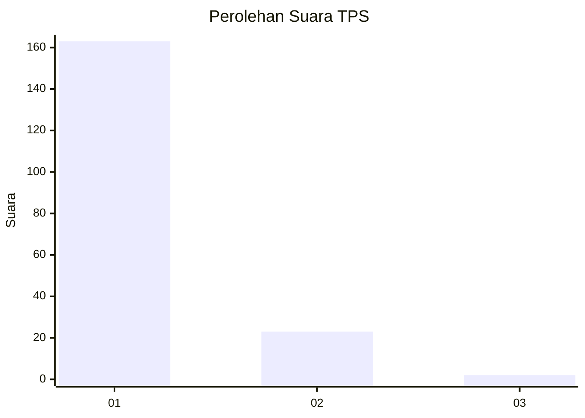
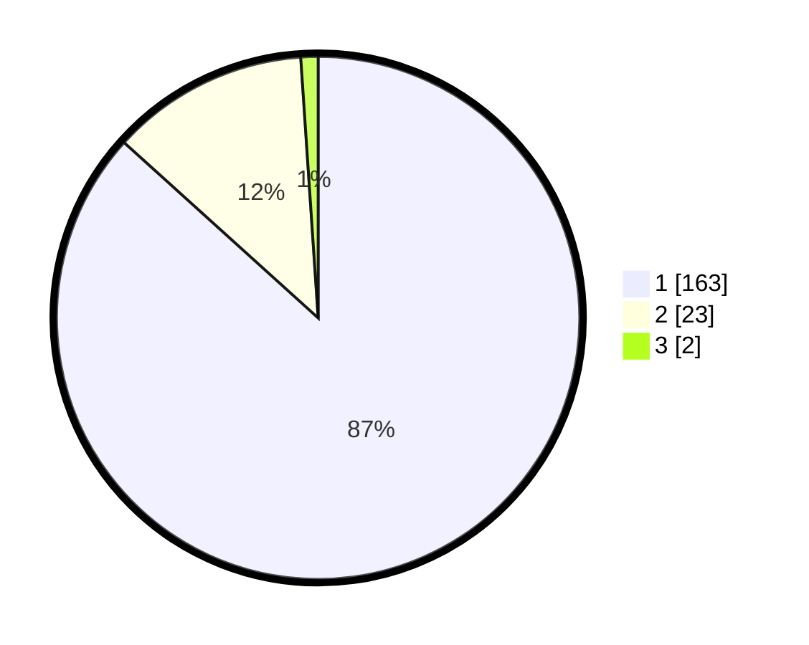

# Hasil

## Grafik

## Tabel

| No. | Nama Paslon    | Suara | Suara (raw) | Persentase |
|:--- |:-------------- | -----:| -----------:| ----------:|
| 1   | ANIES MUHAIMIN | 163   | [163][p-1]  | 86,70      |
| 2   | PRABOWO GIBRAN | 23    | [23][p-2]   | 12,23      |
| 3   | GANJAR MAHFUD  | 2     | [2][p-3]    | 1,06       |

[p-1]: https://github.com/gigit-pemilu/pemilu-2024-11-aceh/blob/main/pilpres/hitung-suara/sub/11-aceh/sub/18-pidie-jaya/sub/04-bandar-dua/sub/2004-pulo/sub/003-tps/sub/paslon-1.txt
[p-2]: https://github.com/gigit-pemilu/pemilu-2024-11-aceh/blob/main/pilpres/hitung-suara/sub/11-aceh/sub/18-pidie-jaya/sub/04-bandar-dua/sub/2004-pulo/sub/003-tps/sub/paslon-2.txt
[p-3]: https://github.com/gigit-pemilu/pemilu-2024-11-aceh/blob/main/pilpres/hitung-suara/sub/11-aceh/sub/18-pidie-jaya/sub/04-bandar-dua/sub/2004-pulo/sub/003-tps/sub/paslon-3.txt

## Foto C Plano

https://sirekap-obj-formc.kpu.go.id/3bc5/pemilu/ppwp/11/18/04/20/04/1118042004003-20240215-090941--e811284d-5fda-49f6-8c1d-e24f9cde487a.jpg

https://sirekap-obj-formc.kpu.go.id/3bc5/pemilu/ppwp/11/18/04/20/04/1118042004003-20240215-091042--c75c9b46-a8a3-4ff9-adf5-39f34d217f69.jpg

https://sirekap-obj-formc.kpu.go.id/3bc5/pemilu/ppwp/11/18/04/20/04/1118042004003-20240215-091128--6f7e48b2-d1a0-4210-b359-a9929389d168.jpg

## Metadata

| Key        | Value               |
| ---------- | ------------------- |
| Time Stamp | 2024-02-15 23:29:50 |

