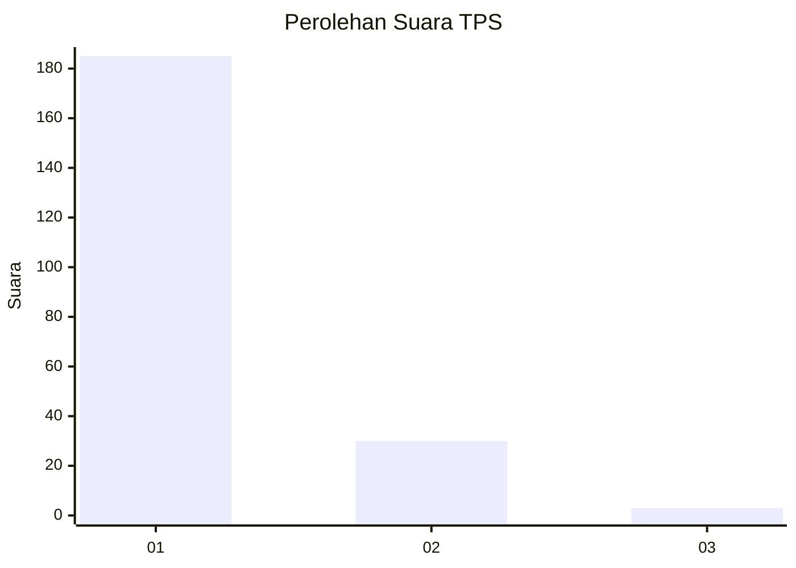
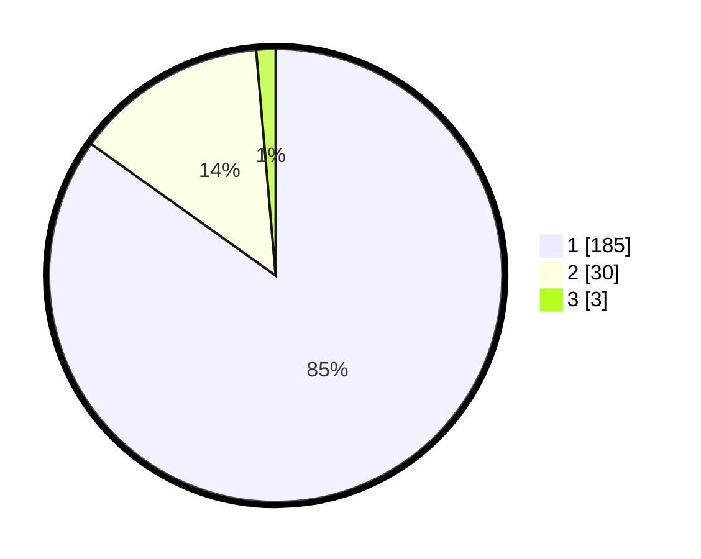

# Hasil

## Grafik

## Tabel

| No. | Nama Paslon    | Suara | Suara (raw) | Persentase |
|:--- |:-------------- | -----:| -----------:| ----------:|
| 1   | ANIES MUHAIMIN | 185   | [185][p-1]  | 84,86      |
| 2   | PRABOWO GIBRAN | 30    | [30][p-2]   | 13,76      |
| 3   | GANJAR MAHFUD  | 3     | [3][p-3]    | 1,38       |

[p-1]: https://github.com/gigit-pemilu/pemilu-2024-11-aceh/blob/main/pilpres/hitung-suara/sub/11-aceh/sub/18-pidie-jaya/sub/04-bandar-dua/sub/2006-meuko-kuthang/sub/001-tps/sub/paslon-1.txt
[p-2]: https://github.com/gigit-pemilu/pemilu-2024-11-aceh/blob/main/pilpres/hitung-suara/sub/11-aceh/sub/18-pidie-jaya/sub/04-bandar-dua/sub/2006-meuko-kuthang/sub/001-tps/sub/paslon-2.txt
[p-3]: https://github.com/gigit-pemilu/pemilu-2024-11-aceh/blob/main/pilpres/hitung-suara/sub/11-aceh/sub/18-pidie-jaya/sub/04-bandar-dua/sub/2006-meuko-kuthang/sub/001-tps/sub/paslon-3.txt

## Foto C Plano

https://sirekap-obj-formc.kpu.go.id/0a02/pemilu/ppwp/11/18/04/20/06/1118042006001-20240215-094943--a258e40f-84b3-44d7-ba08-ce2a4d1fbf32.jpg

https://sirekap-obj-formc.kpu.go.id/0a02/pemilu/ppwp/11/18/04/20/06/1118042006001-20240215-095045--8588335d-f6f7-426a-8efc-f0e5db7125a9.jpg

https://sirekap-obj-formc.kpu.go.id/0a02/pemilu/ppwp/11/18/04/20/06/1118042006001-20240215-095236--fe51f4d8-287b-4004-b933-d6f0468e379c.jpg

## Metadata

| Key        | Value               |
| ---------- | ------------------- |
| Time Stamp | 2024-02-15 23:29:50 |

