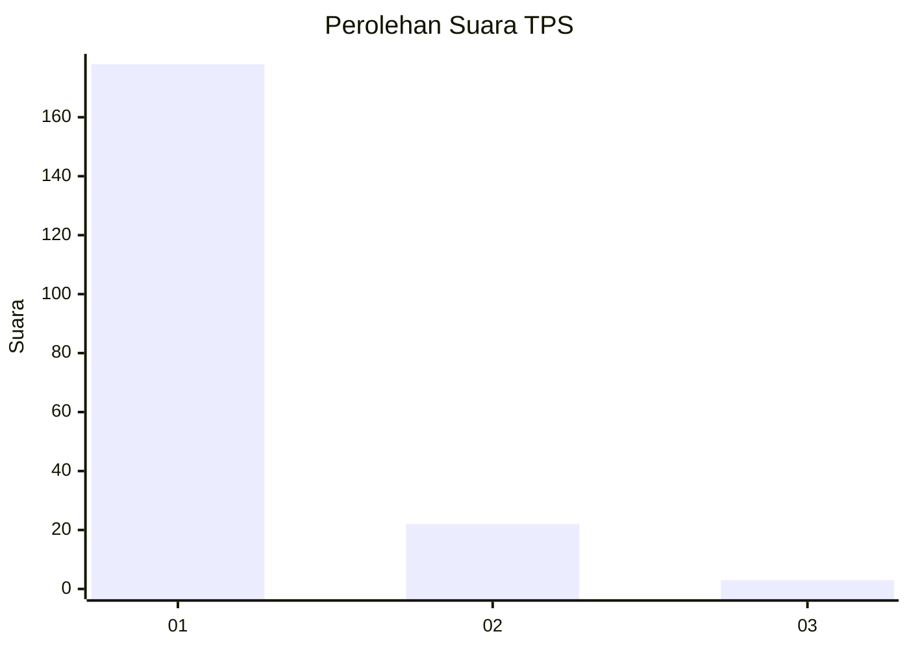
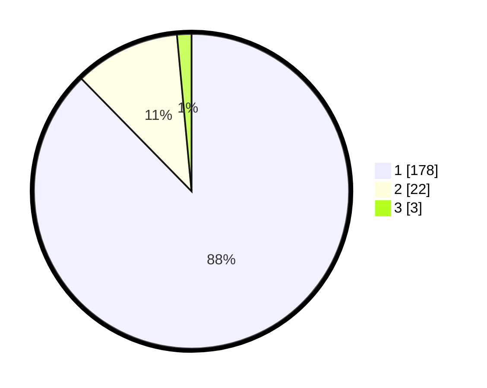

# Hasil

## Grafik

## Tabel

| No. | Nama Paslon    | Suara | Suara (raw) | Persentase |
|:--- |:-------------- | -----:| -----------:| ----------:|
| 1   | ANIES MUHAIMIN | 178   | [178][p-1]  | 87,68      |
| 2   | PRABOWO GIBRAN | 22    | [22][p-2]   | 10,84      |
| 3   | GANJAR MAHFUD  | 3     | [3][p-3]    | 1,48       |

[p-1]: https://github.com/gigit-pemilu/pemilu-2024-11-aceh/blob/main/pilpres/hitung-suara/sub/11-aceh/sub/18-pidie-jaya/sub/04-bandar-dua/sub/2008-alue-ketapang/sub/001-tps/sub/paslon-1.txt
[p-2]: https://github.com/gigit-pemilu/pemilu-2024-11-aceh/blob/main/pilpres/hitung-suara/sub/11-aceh/sub/18-pidie-jaya/sub/04-bandar-dua/sub/2008-alue-ketapang/sub/001-tps/sub/paslon-2.txt
[p-3]: https://github.com/gigit-pemilu/pemilu-2024-11-aceh/blob/main/pilpres/hitung-suara/sub/11-aceh/sub/18-pidie-jaya/sub/04-bandar-dua/sub/2008-alue-ketapang/sub/001-tps/sub/paslon-3.txt

## Foto C Plano

https://sirekap-obj-formc.kpu.go.id/a755/pemilu/ppwp/11/18/04/20/08/1118042008001-20240215-085744--4f72ea26-1bb3-4a44-8604-cd28b4fe8543.jpg

https://sirekap-obj-formc.kpu.go.id/a755/pemilu/ppwp/11/18/04/20/08/1118042008001-20240215-085011--8aa875f8-283f-4061-ad7f-ba3f910137de.jpg

https://sirekap-obj-formc.kpu.go.id/a755/pemilu/ppwp/11/18/04/20/08/1118042008001-20240215-085344--a8b0c37d-b765-48c8-a062-2f4adb59619d.jpg

## Metadata

| Key        | Value               |
| ---------- | ------------------- |
| Time Stamp | 2024-02-15 22:00:27 |

