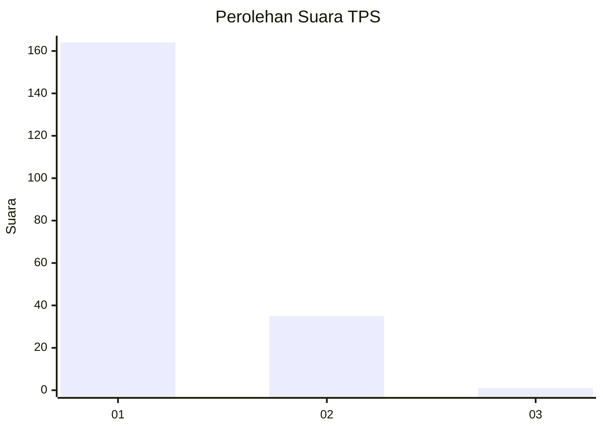
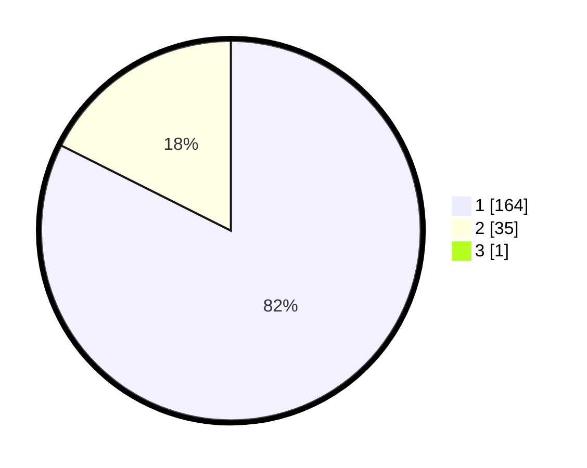

# Hasil

## Grafik

## Tabel

| No. | Nama Paslon    | Suara | Suara (raw) | Persentase |
|:--- |:-------------- | -----:| -----------:| ----------:|
| 1   | ANIES MUHAIMIN | 164   | [164][p-1]  | 82,00      |
| 2   | PRABOWO GIBRAN | 35    | [35][p-2]   | 17,50      |
| 3   | GANJAR MAHFUD  | 1     | [1][p-3]    | 0,50       |

[p-1]: https://github.com/gigit-pemilu/pemilu-2024-11-aceh/blob/main/pilpres/hitung-suara/sub/11-aceh/sub/18-pidie-jaya/sub/04-bandar-dua/sub/2008-alue-ketapang/sub/002-tps/sub/paslon-1.txt
[p-2]: https://github.com/gigit-pemilu/pemilu-2024-11-aceh/blob/main/pilpres/hitung-suara/sub/11-aceh/sub/18-pidie-jaya/sub/04-bandar-dua/sub/2008-alue-ketapang/sub/002-tps/sub/paslon-2.txt
[p-3]: https://github.com/gigit-pemilu/pemilu-2024-11-aceh/blob/main/pilpres/hitung-suara/sub/11-aceh/sub/18-pidie-jaya/sub/04-bandar-dua/sub/2008-alue-ketapang/sub/002-tps/sub/paslon-3.txt

## Foto C Plano

https://sirekap-obj-formc.kpu.go.id/837f/pemilu/ppwp/11/18/04/20/08/1118042008002-20240215-091158--e90c7c0c-7942-4376-8ad2-3f4256b5324c.jpg

https://sirekap-obj-formc.kpu.go.id/837f/pemilu/ppwp/11/18/04/20/08/1118042008002-20240215-091447--691bd549-6f83-4944-b4c0-18f71518707e.jpg

https://sirekap-obj-formc.kpu.go.id/837f/pemilu/ppwp/11/18/04/20/08/1118042008002-20240215-092331--5f244169-3cf0-4a4a-9abc-864c1857570a.jpg

## Metadata

| Key        | Value               |
| ---------- | ------------------- |
| Time Stamp | 2024-02-15 23:29:50 |

