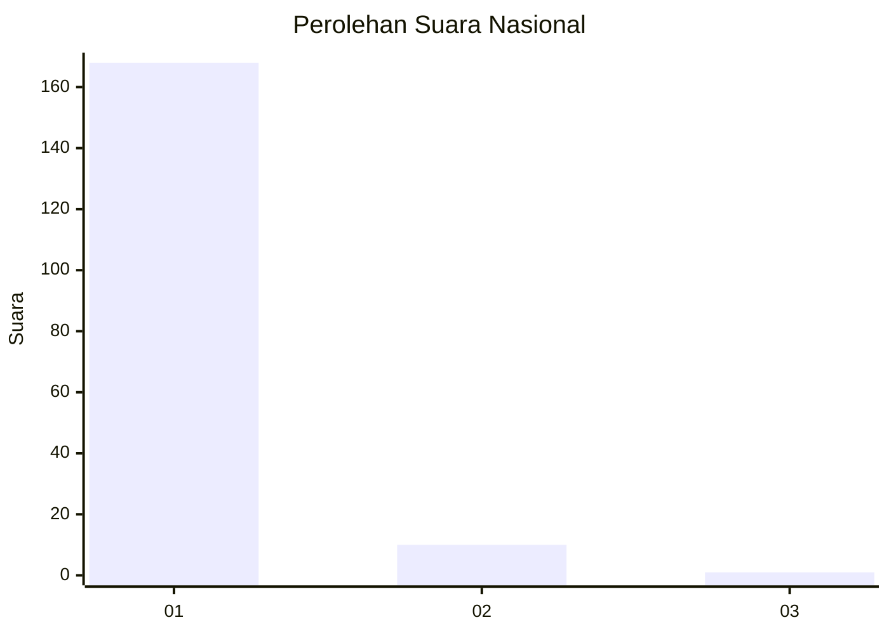
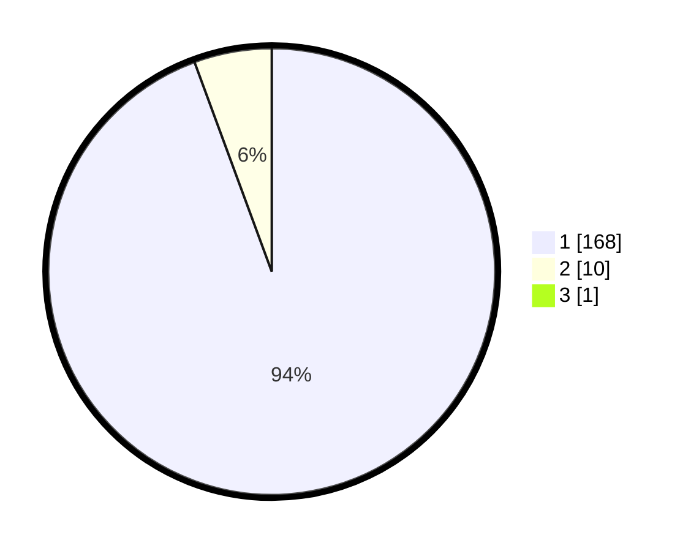

# Hasil

## Grafik

## Tabel

| No. | Nama Paslon    | Suara | Suara (raw) | Persentase |
|:--- |:-------------- | -----:| -----------:| ----------:|
| 1   | ANIES MUHAIMIN | 168   | [168][p-1]  | 93,85      |
| 2   | PRABOWO GIBRAN | 10    | [10][p-2]   | 5,59       |
| 3   | GANJAR MAHFUD  | 1     | [1][p-3]    | 0,56       |

[p-1]: https://github.com/gigit-pemilu/pemilu-2024/blob/main/pilpres/hitung-suara/sub/11-aceh/sub/18-pidie-jaya/sub/04-bandar-dua/sub/2009-jaulanga-barat/sub/002-tps/sub/paslon-1.txt
[p-2]: https://github.com/gigit-pemilu/pemilu-2024/blob/main/pilpres/hitung-suara/sub/11-aceh/sub/18-pidie-jaya/sub/04-bandar-dua/sub/2009-jaulanga-barat/sub/002-tps/sub/paslon-2.txt
[p-3]: https://github.com/gigit-pemilu/pemilu-2024/blob/main/pilpres/hitung-suara/sub/11-aceh/sub/18-pidie-jaya/sub/04-bandar-dua/sub/2009-jaulanga-barat/sub/002-tps/sub/paslon-3.txt

## Foto C Plano

https://sirekap-obj-formc.kpu.go.id/0984/pemilu/ppwp/11/18/04/20/09/1118042009002-20240215-103707--3affe63b-eb05-4315-bf17-3c2528ac96c3.jpg

https://sirekap-obj-formc.kpu.go.id/0984/pemilu/ppwp/11/18/04/20/09/1118042009002-20240215-104019--2162d1f0-19bf-409a-aa0b-8839f8244a84.jpg

https://sirekap-obj-formc.kpu.go.id/0984/pemilu/ppwp/11/18/04/20/09/1118042009002-20240215-104228--c60d4b5a-4d87-44bc-aff0-7c57958277ed.jpg

## Metadata

| Key        | Value               |
| ---------- | ------------------- |
| Time Stamp | 2024-02-15 22:00:27 |

