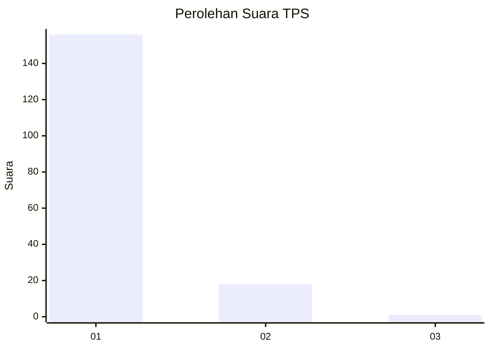
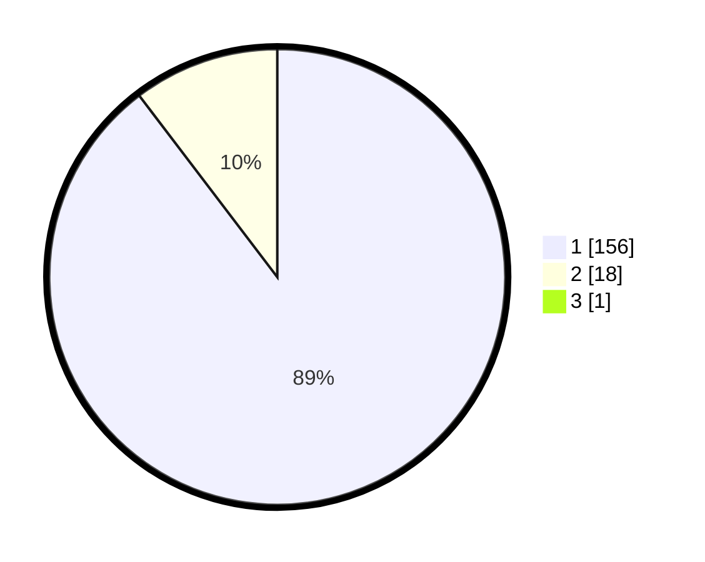

# Hasil

## Grafik

## Tabel

| No. | Nama Paslon    | Suara | Suara (raw) | Persentase |
|:--- |:-------------- | -----:| -----------:| ----------:|
| 1   | ANIES MUHAIMIN | 156   | [156][p-1]  | 89,14      |
| 2   | PRABOWO GIBRAN | 18    | [18][p-2]   | 10,29      |
| 3   | GANJAR MAHFUD  | 1     | [1][p-3]    | 0,57       |

[p-1]: https://github.com/gigit-pemilu/pemilu-2024-11-aceh/blob/main/pilpres/hitung-suara/sub/11-aceh/sub/18-pidie-jaya/sub/04-bandar-dua/sub/2010-kumba/sub/001-tps/sub/paslon-1.txt
[p-2]: https://github.com/gigit-pemilu/pemilu-2024-11-aceh/blob/main/pilpres/hitung-suara/sub/11-aceh/sub/18-pidie-jaya/sub/04-bandar-dua/sub/2010-kumba/sub/001-tps/sub/paslon-2.txt
[p-3]: https://github.com/gigit-pemilu/pemilu-2024-11-aceh/blob/main/pilpres/hitung-suara/sub/11-aceh/sub/18-pidie-jaya/sub/04-bandar-dua/sub/2010-kumba/sub/001-tps/sub/paslon-3.txt

## Foto C Plano

https://sirekap-obj-formc.kpu.go.id/39a5/pemilu/ppwp/11/18/04/20/10/1118042010001-20240218-135655--50db0762-cf23-4c54-b346-c239552c8a93.jpg

https://sirekap-obj-formc.kpu.go.id/39a5/pemilu/ppwp/11/18/04/20/10/1118042010001-20240218-135722--7712679b-d2e6-4a2d-adf2-7534a627c79f.jpg

https://sirekap-obj-formc.kpu.go.id/39a5/pemilu/ppwp/11/18/04/20/10/1118042010001-20240218-135832--8ec0ca0d-708d-44e4-99b8-04d84b632b5b.jpg

## Metadata

| Key        | Value               |
| ---------- | ------------------- |
| Time Stamp | 2024-02-24 22:31:28 |

