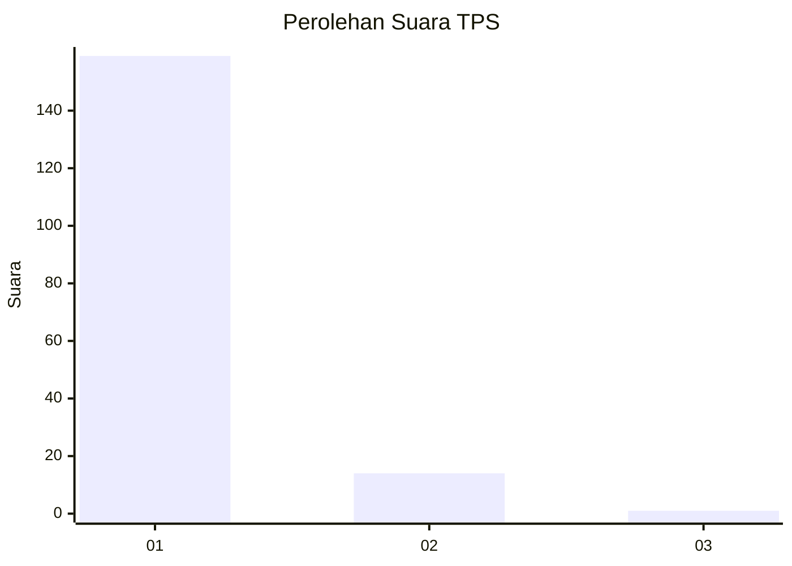
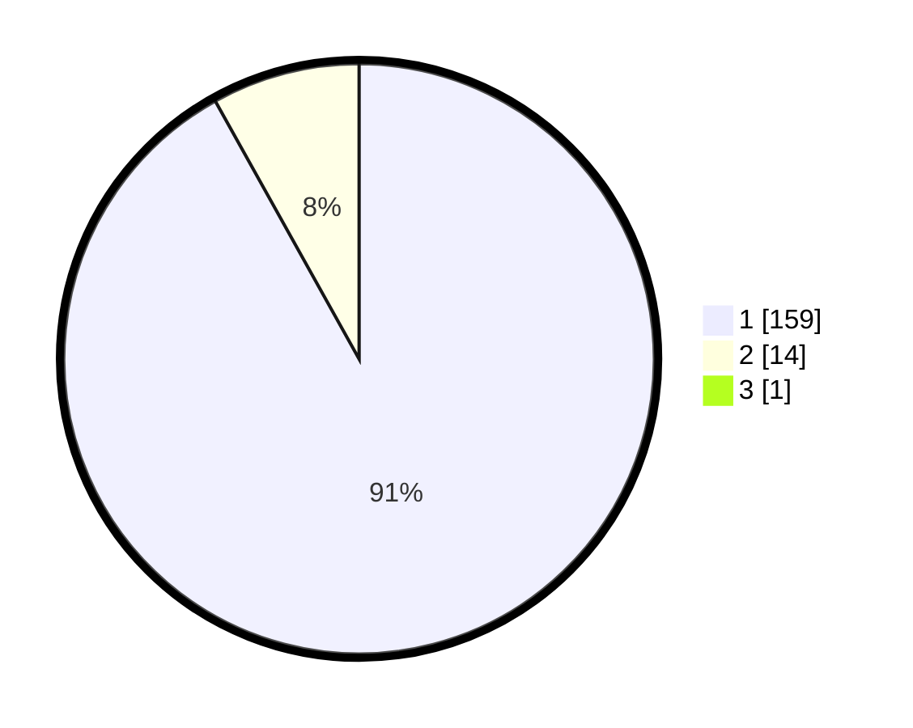

# Hasil

## Grafik

## Tabel

| No. | Nama Paslon    | Suara | Suara (raw) | Persentase |
|:--- |:-------------- | -----:| -----------:| ----------:|
| 1   | ANIES MUHAIMIN | 159   | [159][p-1]  | 91,38      |
| 2   | PRABOWO GIBRAN | 14    | [14][p-2]   | 8,05       |
| 3   | GANJAR MAHFUD  | 1     | [1][p-3]    | 0,57       |

[p-1]: https://github.com/gigit-pemilu/pemilu-2024-11-aceh/blob/main/pilpres/hitung-suara/sub/11-aceh/sub/18-pidie-jaya/sub/04-bandar-dua/sub/2010-kumba/sub/002-tps/sub/paslon-1.txt
[p-2]: https://github.com/gigit-pemilu/pemilu-2024-11-aceh/blob/main/pilpres/hitung-suara/sub/11-aceh/sub/18-pidie-jaya/sub/04-bandar-dua/sub/2010-kumba/sub/002-tps/sub/paslon-2.txt
[p-3]: https://github.com/gigit-pemilu/pemilu-2024-11-aceh/blob/main/pilpres/hitung-suara/sub/11-aceh/sub/18-pidie-jaya/sub/04-bandar-dua/sub/2010-kumba/sub/002-tps/sub/paslon-3.txt

## Foto C Plano

https://sirekap-obj-formc.kpu.go.id/4449/pemilu/ppwp/11/18/04/20/10/1118042010002-20240215-142330--e7999d53-61e2-4e04-b684-d8d0a2c4bc7b.jpg

https://sirekap-obj-formc.kpu.go.id/4449/pemilu/ppwp/11/18/04/20/10/1118042010002-20240214-231524--9f5f6af4-f321-4488-a87a-8687863027c2.jpg

https://sirekap-obj-formc.kpu.go.id/4449/pemilu/ppwp/11/18/04/20/10/1118042010002-20240215-074605--206489e8-12b7-447f-b88f-72809b456c42.jpg

## Metadata

| Key        | Value               |
| ---------- | ------------------- |
| Time Stamp | 2024-02-15 23:29:50 |

