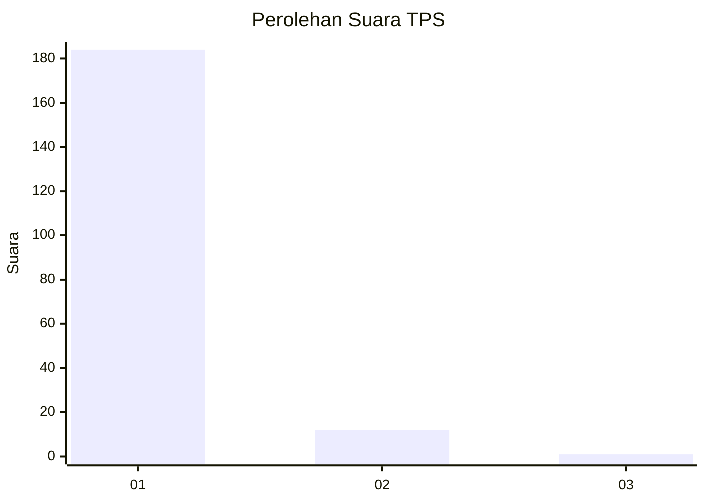
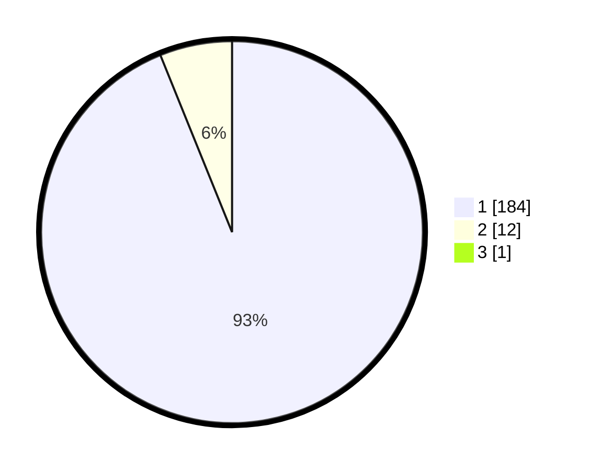

# Hasil

## Grafik

## Tabel

| No. | Nama Paslon    | Suara | Suara (raw) | Persentase |
|:--- |:-------------- | -----:| -----------:| ----------:|
| 1   | ANIES MUHAIMIN | 184   | [184][p-1]  | 93,40      |
| 2   | PRABOWO GIBRAN | 12    | [12][p-2]   | 6,09       |
| 3   | GANJAR MAHFUD  | 1     | [1][p-3]    | 0,51       |

[p-1]: https://github.com/gigit-pemilu/pemilu-2024-11-aceh/blob/main/pilpres/hitung-suara/sub/11-aceh/sub/18-pidie-jaya/sub/04-bandar-dua/sub/2010-kumba/sub/003-tps/sub/paslon-1.txt
[p-2]: https://github.com/gigit-pemilu/pemilu-2024-11-aceh/blob/main/pilpres/hitung-suara/sub/11-aceh/sub/18-pidie-jaya/sub/04-bandar-dua/sub/2010-kumba/sub/003-tps/sub/paslon-2.txt
[p-3]: https://github.com/gigit-pemilu/pemilu-2024-11-aceh/blob/main/pilpres/hitung-suara/sub/11-aceh/sub/18-pidie-jaya/sub/04-bandar-dua/sub/2010-kumba/sub/003-tps/sub/paslon-3.txt

## Foto C Plano

https://sirekap-obj-formc.kpu.go.id/265e/pemilu/ppwp/11/18/04/20/10/1118042010003-20240215-105100--6cf24bd2-1437-418c-9b5a-7c78ae29fc1d.jpg

https://sirekap-obj-formc.kpu.go.id/265e/pemilu/ppwp/11/18/04/20/10/1118042010003-20240215-105201--1540f91a-c7ea-4e51-b3e8-7cecf2bc1224.jpg

https://sirekap-obj-formc.kpu.go.id/265e/pemilu/ppwp/11/18/04/20/10/1118042010003-20240215-093142--666c9b0e-3255-4c7f-937f-e3510e4f6963.jpg

## Metadata

| Key        | Value               |
| ---------- | ------------------- |
| Time Stamp | 2024-02-15 22:00:27 |

