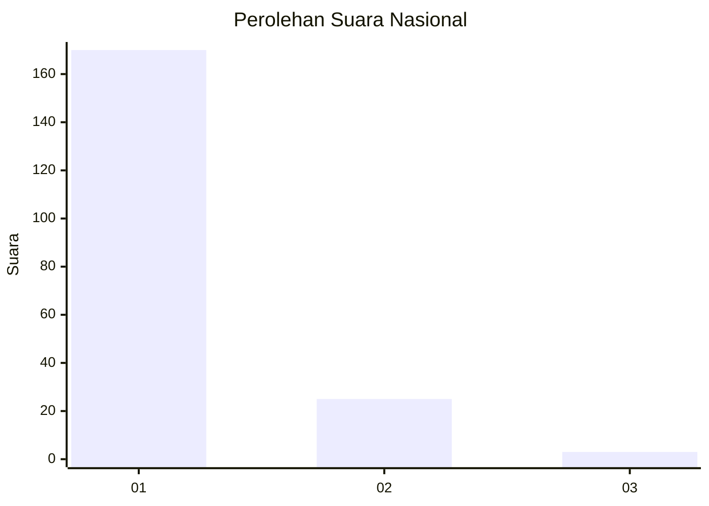
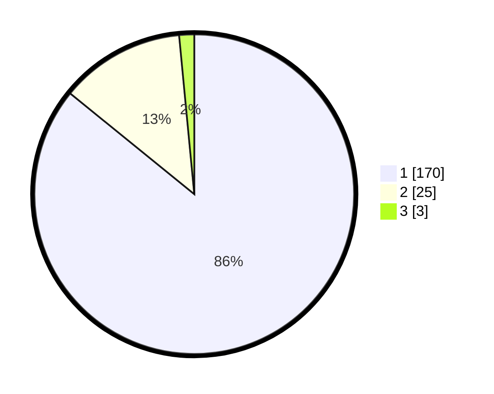

# Hasil

## Grafik

## Tabel

| No. | Nama Paslon    | Suara | Suara (raw) | Persentase |
|:--- |:-------------- | -----:| -----------:| ----------:|
| 1   | ANIES MUHAIMIN | 170   | [170][p-1]  | 85,86      |
| 2   | PRABOWO GIBRAN | 25    | [25][p-2]   | 12,63      |
| 3   | GANJAR MAHFUD  | 3     | [3][p-3]    | 1,52       |

[p-1]: https://github.com/gigit-pemilu/pemilu-2024/blob/main/pilpres/hitung-suara/sub/11-aceh/sub/18-pidie-jaya/sub/04-bandar-dua/sub/2011-babah-krueng/sub/001-tps/sub/paslon-1.txt
[p-2]: https://github.com/gigit-pemilu/pemilu-2024/blob/main/pilpres/hitung-suara/sub/11-aceh/sub/18-pidie-jaya/sub/04-bandar-dua/sub/2011-babah-krueng/sub/001-tps/sub/paslon-2.txt
[p-3]: https://github.com/gigit-pemilu/pemilu-2024/blob/main/pilpres/hitung-suara/sub/11-aceh/sub/18-pidie-jaya/sub/04-bandar-dua/sub/2011-babah-krueng/sub/001-tps/sub/paslon-3.txt

## Foto C Plano

https://sirekap-obj-formc.kpu.go.id/b1ec/pemilu/ppwp/11/18/04/20/11/1118042011001-20240215-112028--43232c36-3d4c-4bdf-8104-35657135ce5f.jpg

https://sirekap-obj-formc.kpu.go.id/b1ec/pemilu/ppwp/11/18/04/20/11/1118042011001-20240215-093736--92f8ccb0-192f-44bb-9cae-4f2c2cac3f23.jpg

https://sirekap-obj-formc.kpu.go.id/b1ec/pemilu/ppwp/11/18/04/20/11/1118042011001-20240215-084007--20274f56-e3f2-494a-a1ef-b6b0c3172778.jpg

## Metadata

| Key        | Value               |
| ---------- | ------------------- |
| Time Stamp | 2024-02-15 22:00:27 |

