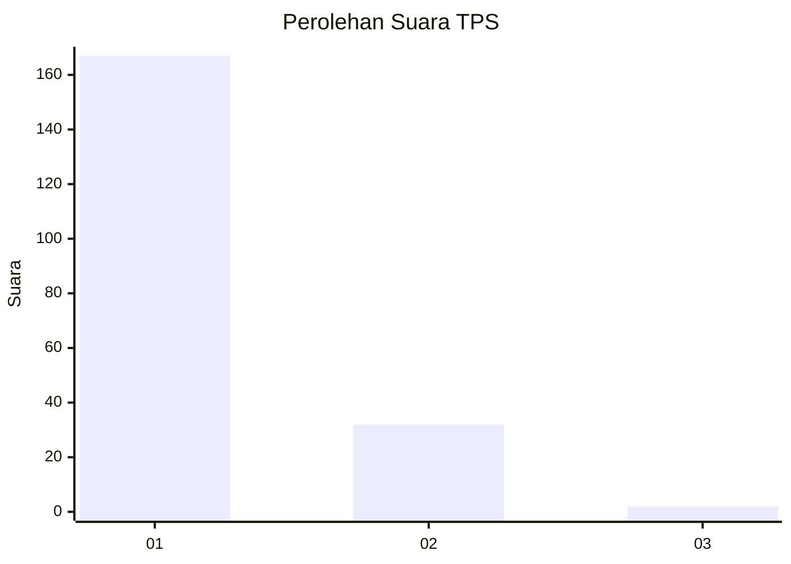
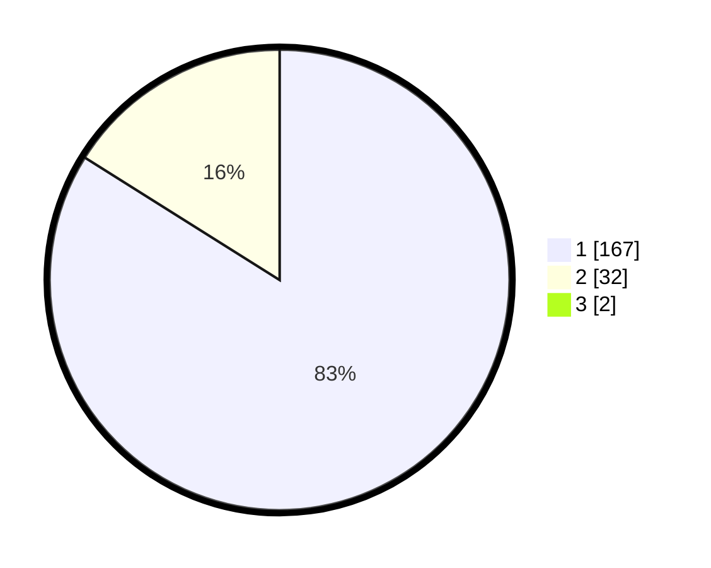

# Hasil

## Grafik

## Tabel

| No. | Nama Paslon    | Suara | Suara (raw) | Persentase |
|:--- |:-------------- | -----:| -----------:| ----------:|
| 1   | ANIES MUHAIMIN | 167   | [167][p-1]  | 83,08      |
| 2   | PRABOWO GIBRAN | 32    | [32][p-2]   | 15,92      |
| 3   | GANJAR MAHFUD  | 2     | [2][p-3]    | 1,00       |

[p-1]: https://github.com/gigit-pemilu/pemilu-2024-11-aceh/blob/main/pilpres/hitung-suara/sub/11-aceh/sub/18-pidie-jaya/sub/04-bandar-dua/sub/2011-babah-krueng/sub/002-tps/sub/paslon-1.txt
[p-2]: https://github.com/gigit-pemilu/pemilu-2024-11-aceh/blob/main/pilpres/hitung-suara/sub/11-aceh/sub/18-pidie-jaya/sub/04-bandar-dua/sub/2011-babah-krueng/sub/002-tps/sub/paslon-2.txt
[p-3]: https://github.com/gigit-pemilu/pemilu-2024-11-aceh/blob/main/pilpres/hitung-suara/sub/11-aceh/sub/18-pidie-jaya/sub/04-bandar-dua/sub/2011-babah-krueng/sub/002-tps/sub/paslon-3.txt

## Foto C Plano

https://sirekap-obj-formc.kpu.go.id/f2b3/pemilu/ppwp/11/18/04/20/11/1118042011002-20240215-075615--30bd465e-6a0f-4a40-90a2-900f26cfac1a.jpg

https://sirekap-obj-formc.kpu.go.id/f2b3/pemilu/ppwp/11/18/04/20/11/1118042011002-20240215-075841--74f44cb9-dfc5-4bd5-af5b-da00ae3e63f4.jpg

https://sirekap-obj-formc.kpu.go.id/f2b3/pemilu/ppwp/11/18/04/20/11/1118042011002-20240215-080051--806ca581-ab8a-4a93-b18d-8388ad73dbc1.jpg

## Metadata

| Key        | Value               |
| ---------- | ------------------- |
| Time Stamp | 2024-02-15 23:29:50 |

