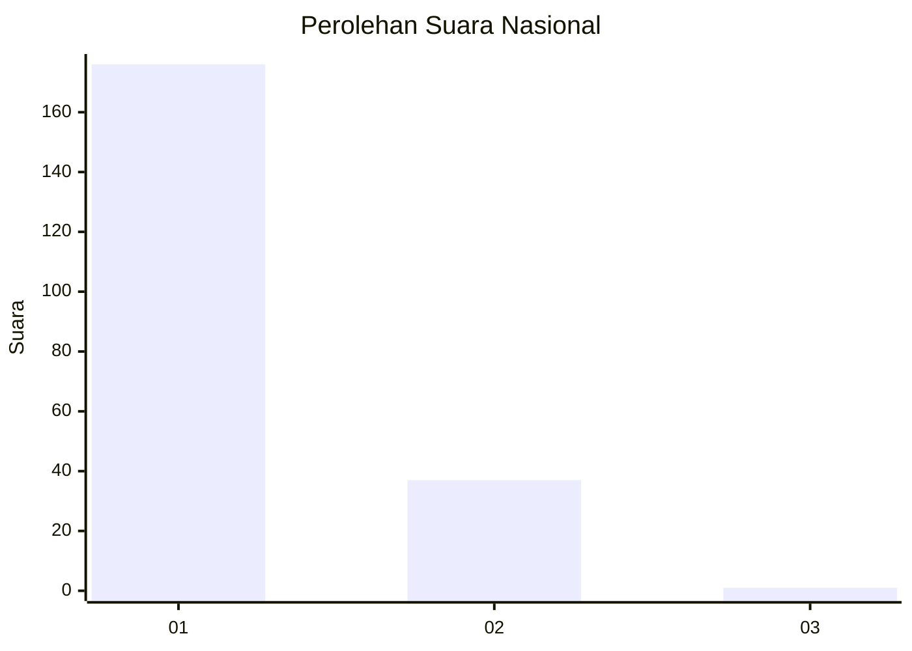
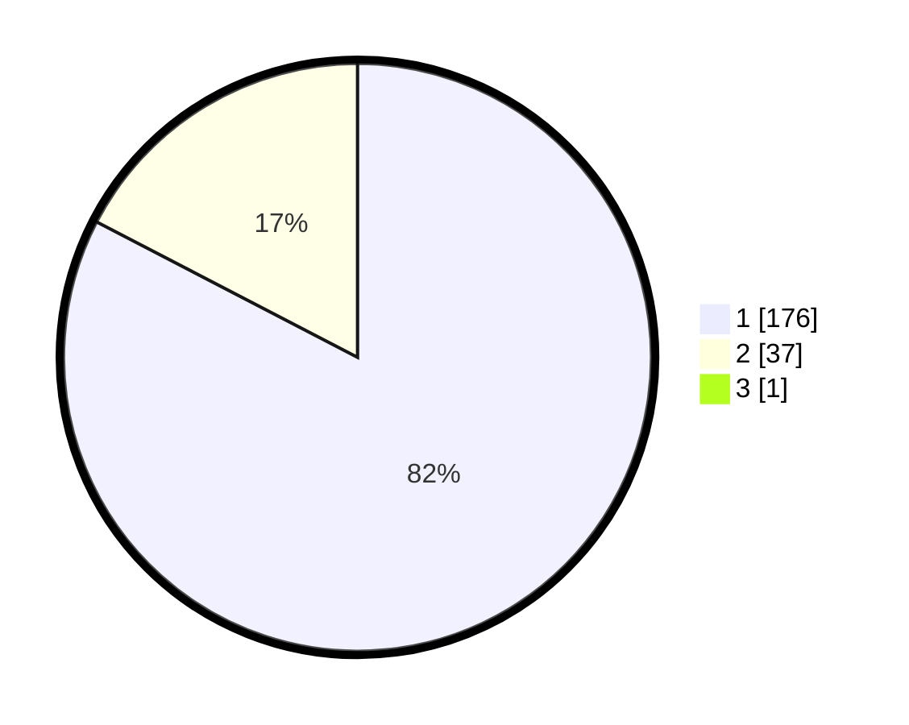

# Hasil

## Grafik

## Tabel

| No. | Nama Paslon    | Suara | Suara (raw) | Persentase |
|:--- |:-------------- | -----:| -----------:| ----------:|
| 1   | ANIES MUHAIMIN | 176   | [176][p-1]  | 82,24      |
| 2   | PRABOWO GIBRAN | 37    | [37][p-2]   | 17,29      |
| 3   | GANJAR MAHFUD  | 1     | [1][p-3]    | 0,47       |

[p-1]: https://github.com/gigit-pemilu/pemilu-2024/blob/main/pilpres/hitung-suara/sub/11-aceh/sub/18-pidie-jaya/sub/04-bandar-dua/sub/2011-babah-krueng/sub/003-tps/sub/paslon-1.txt
[p-2]: https://github.com/gigit-pemilu/pemilu-2024/blob/main/pilpres/hitung-suara/sub/11-aceh/sub/18-pidie-jaya/sub/04-bandar-dua/sub/2011-babah-krueng/sub/003-tps/sub/paslon-2.txt
[p-3]: https://github.com/gigit-pemilu/pemilu-2024/blob/main/pilpres/hitung-suara/sub/11-aceh/sub/18-pidie-jaya/sub/04-bandar-dua/sub/2011-babah-krueng/sub/003-tps/sub/paslon-3.txt

## Foto C Plano

https://sirekap-obj-formc.kpu.go.id/30c8/pemilu/ppwp/11/18/04/20/11/1118042011003-20240215-105757--05c46227-9bad-4409-afe5-e72f90004fa6.jpg

https://sirekap-obj-formc.kpu.go.id/30c8/pemilu/ppwp/11/18/04/20/11/1118042011003-20240215-110007--2ba7a9e6-f91e-4466-9fe4-0ff6082ddce7.jpg

https://sirekap-obj-formc.kpu.go.id/30c8/pemilu/ppwp/11/18/04/20/11/1118042011003-20240215-110141--aef0c5de-f543-49e8-bdcd-57723e375b05.jpg

## Metadata

| Key        | Value               |
| ---------- | ------------------- |
| Time Stamp | 2024-02-15 23:29:50 |

