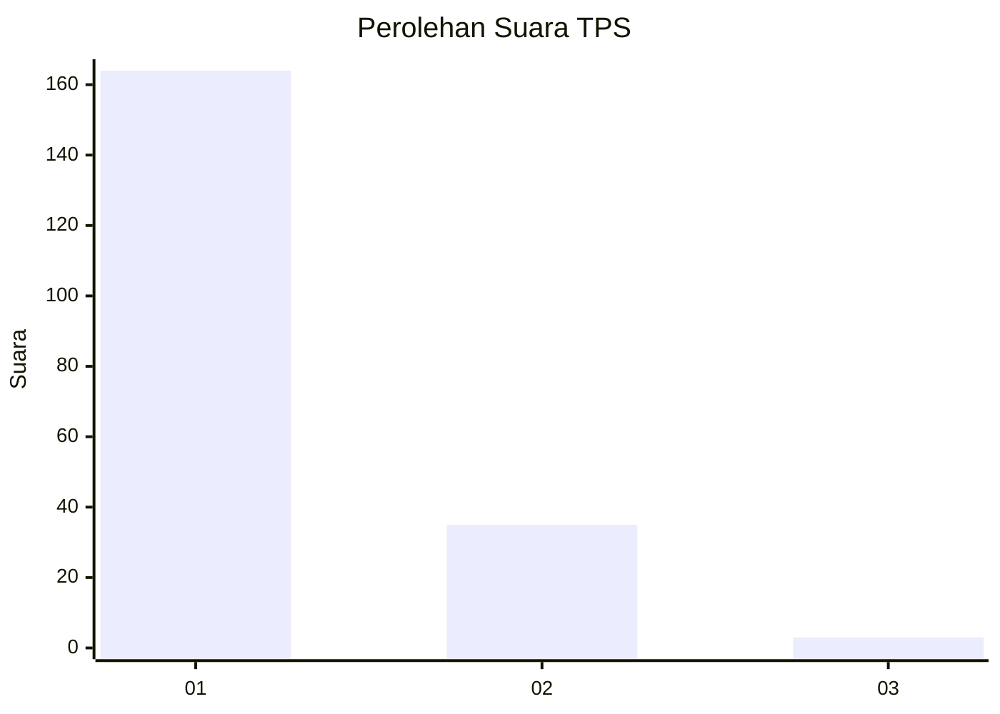
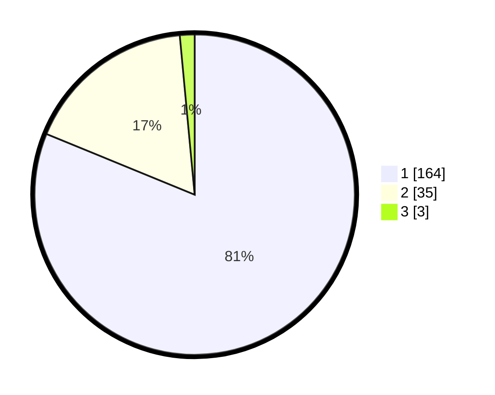

# Hasil

## Grafik

## Tabel

| No. | Nama Paslon    | Suara | Suara (raw) | Persentase |
|:--- |:-------------- | -----:| -----------:| ----------:|
| 1   | ANIES MUHAIMIN | 164   | [164][p-1]  | 81,19      |
| 2   | PRABOWO GIBRAN | 35    | [35][p-2]   | 17,33      |
| 3   | GANJAR MAHFUD  | 3     | [3][p-3]    | 1,49       |

[p-1]: https://github.com/gigit-pemilu/pemilu-2024-11-aceh/blob/main/pilpres/hitung-suara/sub/11-aceh/sub/18-pidie-jaya/sub/04-bandar-dua/sub/2013-seunong/sub/001-tps/sub/paslon-1.txt
[p-2]: https://github.com/gigit-pemilu/pemilu-2024-11-aceh/blob/main/pilpres/hitung-suara/sub/11-aceh/sub/18-pidie-jaya/sub/04-bandar-dua/sub/2013-seunong/sub/001-tps/sub/paslon-2.txt
[p-3]: https://github.com/gigit-pemilu/pemilu-2024-11-aceh/blob/main/pilpres/hitung-suara/sub/11-aceh/sub/18-pidie-jaya/sub/04-bandar-dua/sub/2013-seunong/sub/001-tps/sub/paslon-3.txt

## Foto C Plano

https://sirekap-obj-formc.kpu.go.id/5165/pemilu/ppwp/11/18/04/20/13/1118042013001-20240215-080402--94e740f0-1196-4a50-837b-f9c610654706.jpg

https://sirekap-obj-formc.kpu.go.id/5165/pemilu/ppwp/11/18/04/20/13/1118042013001-20240215-080456--71873a6f-e5e3-4374-b7fd-11ea8d5fafe4.jpg

https://sirekap-obj-formc.kpu.go.id/5165/pemilu/ppwp/11/18/04/20/13/1118042013001-20240215-080407--01cdb21b-1ffd-48f1-9194-996e4c2cb479.jpg

## Metadata

| Key        | Value               |
| ---------- | ------------------- |
| Time Stamp | 2024-02-15 22:00:27 |

