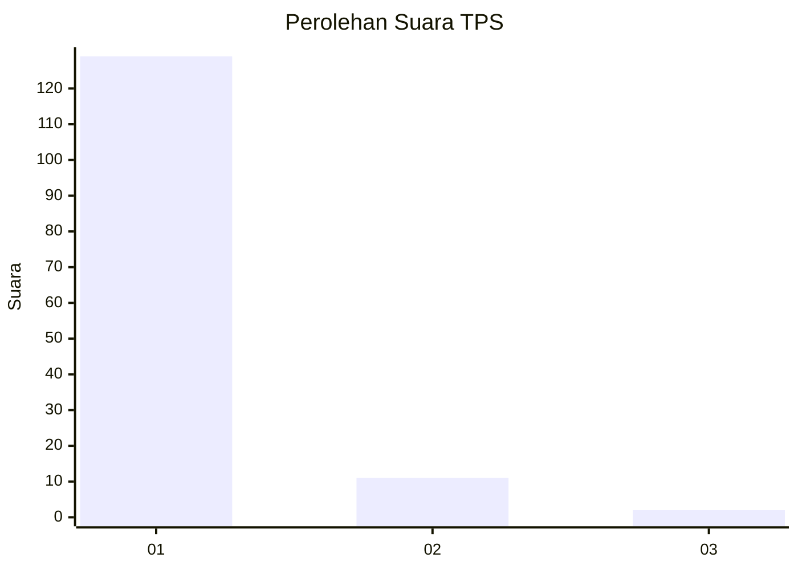
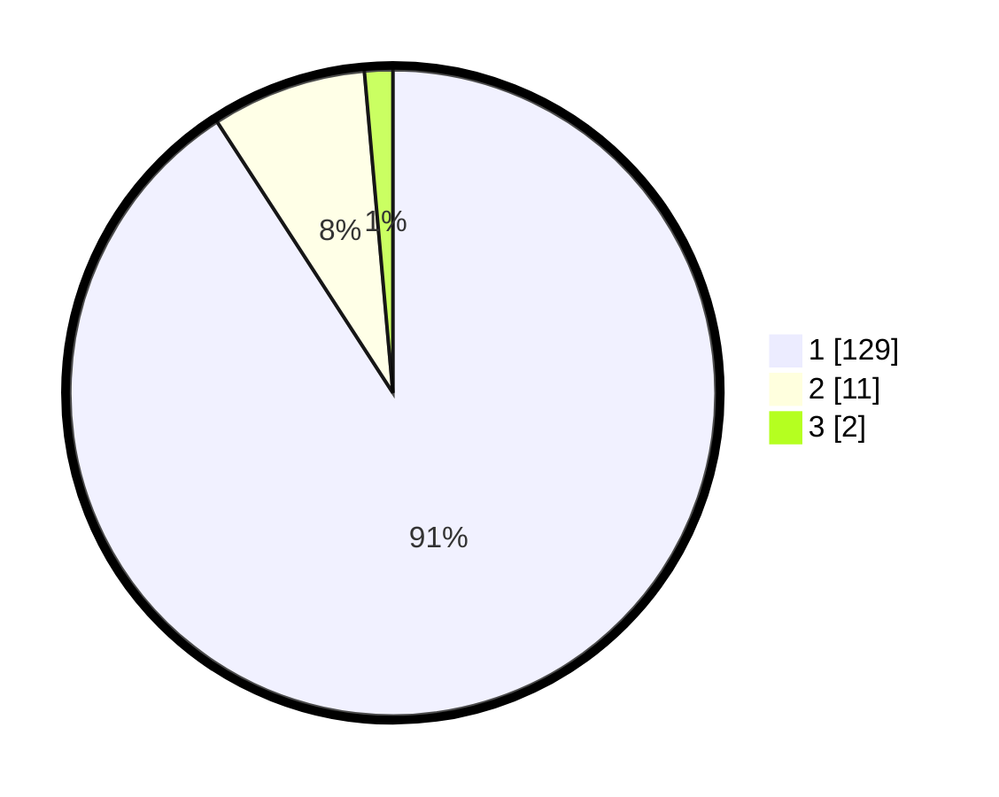

# Hasil

## Grafik

## Tabel

| No. | Nama Paslon    | Suara | Suara (raw) | Persentase |
|:--- |:-------------- | -----:| -----------:| ----------:|
| 1   | ANIES MUHAIMIN | 129   | [129][p-1]  | 90,85      |
| 2   | PRABOWO GIBRAN | 11    | [11][p-2]   | 7,75       |
| 3   | GANJAR MAHFUD  | 2     | [2][p-3]    | 1,41       |

[p-1]: https://github.com/gigit-pemilu/pemilu-2024-11-aceh/blob/main/pilpres/hitung-suara/sub/11-aceh/sub/18-pidie-jaya/sub/04-bandar-dua/sub/2015-blang-kuta/sub/001-tps/sub/paslon-1.txt
[p-2]: https://github.com/gigit-pemilu/pemilu-2024-11-aceh/blob/main/pilpres/hitung-suara/sub/11-aceh/sub/18-pidie-jaya/sub/04-bandar-dua/sub/2015-blang-kuta/sub/001-tps/sub/paslon-2.txt
[p-3]: https://github.com/gigit-pemilu/pemilu-2024-11-aceh/blob/main/pilpres/hitung-suara/sub/11-aceh/sub/18-pidie-jaya/sub/04-bandar-dua/sub/2015-blang-kuta/sub/001-tps/sub/paslon-3.txt

## Foto C Plano

https://sirekap-obj-formc.kpu.go.id/2b43/pemilu/ppwp/11/18/04/20/15/1118042015001-20240215-101025--c599dfc0-4085-43ab-a63b-2c5e0b266d22.jpg

https://sirekap-obj-formc.kpu.go.id/2b43/pemilu/ppwp/11/18/04/20/15/1118042015001-20240215-101549--0bf76888-1d9d-4e73-9189-05ed65a4e427.jpg

https://sirekap-obj-formc.kpu.go.id/2b43/pemilu/ppwp/11/18/04/20/15/1118042015001-20240215-101818--aa8c696b-d74b-4ae4-85bc-814467a7048b.jpg

## Metadata

| Key        | Value               |
| ---------- | ------------------- |
| Time Stamp | 2024-02-15 23:29:50 |

