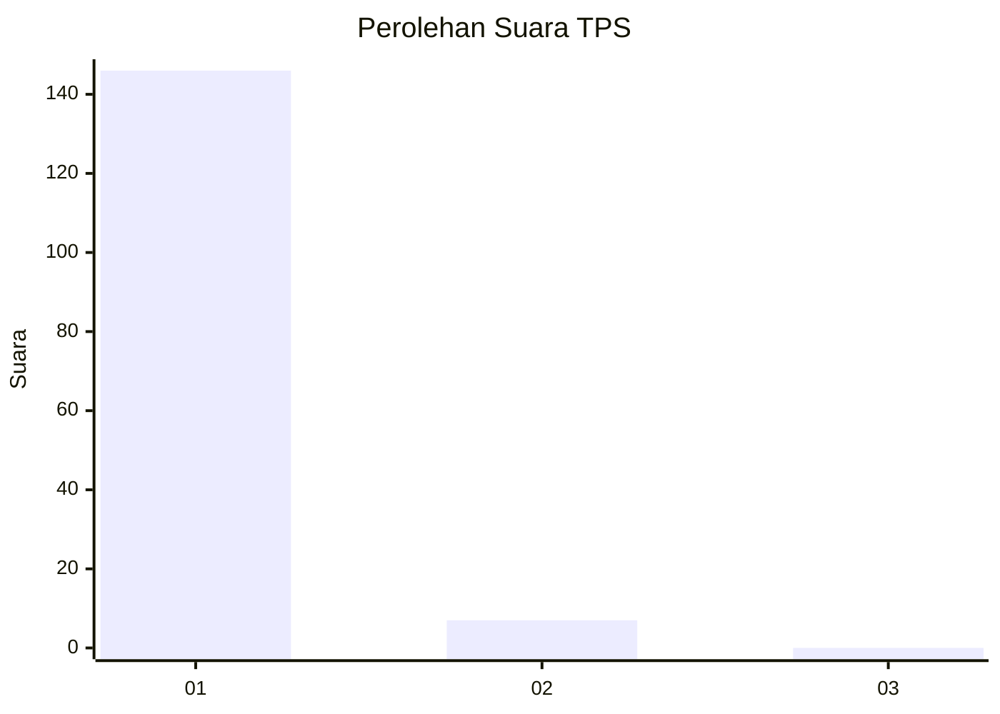
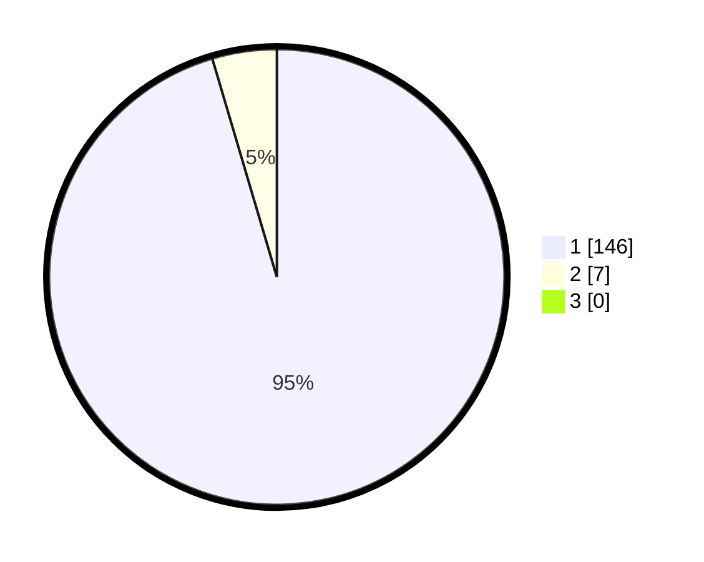

# Hasil

## Grafik

## Tabel

| No. | Nama Paslon    | Suara | Suara (raw) | Persentase |
|:--- |:-------------- | -----:| -----------:| ----------:|
| 1   | ANIES MUHAIMIN | 146   | [146][p-1]  | 95,42      |
| 2   | PRABOWO GIBRAN | 7     | [7][p-2]    | 4,58       |
| 3   | GANJAR MAHFUD  | 0     | [0][p-3]    | 0,00       |

[p-1]: https://github.com/gigit-pemilu/pemilu-2024-11-aceh/blob/main/pilpres/hitung-suara/sub/11-aceh/sub/18-pidie-jaya/sub/04-bandar-dua/sub/2015-blang-kuta/sub/002-tps/sub/paslon-1.txt
[p-2]: https://github.com/gigit-pemilu/pemilu-2024-11-aceh/blob/main/pilpres/hitung-suara/sub/11-aceh/sub/18-pidie-jaya/sub/04-bandar-dua/sub/2015-blang-kuta/sub/002-tps/sub/paslon-2.txt
[p-3]: https://github.com/gigit-pemilu/pemilu-2024-11-aceh/blob/main/pilpres/hitung-suara/sub/11-aceh/sub/18-pidie-jaya/sub/04-bandar-dua/sub/2015-blang-kuta/sub/002-tps/sub/paslon-3.txt

## Foto C Plano

https://sirekap-obj-formc.kpu.go.id/645d/pemilu/ppwp/11/18/04/20/15/1118042015002-20240215-012520--91d42026-a6f5-4c28-b6ce-08435dbb9233.jpg

https://sirekap-obj-formc.kpu.go.id/645d/pemilu/ppwp/11/18/04/20/15/1118042015002-20240215-012748--409844d1-1773-49df-9acd-cab9f4eef738.jpg

https://sirekap-obj-formc.kpu.go.id/645d/pemilu/ppwp/11/18/04/20/15/1118042015002-20240215-012828--04915dfd-fcd0-42f1-97b6-fff33aae6860.jpg

## Metadata

| Key        | Value               |
| ---------- | ------------------- |
| Time Stamp | 2024-02-15 22:00:27 |

