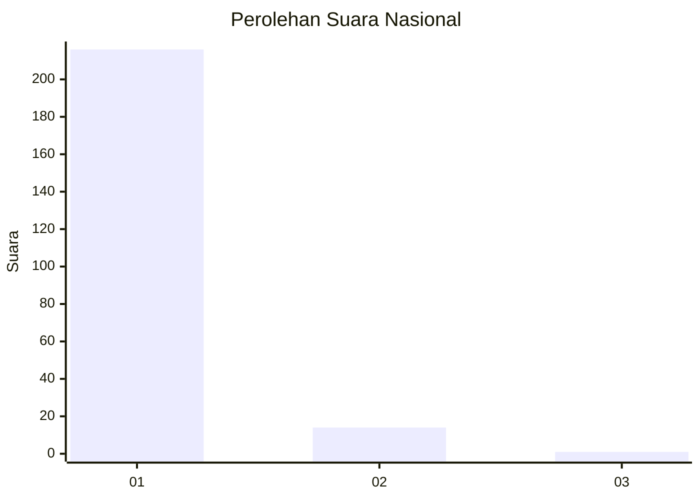
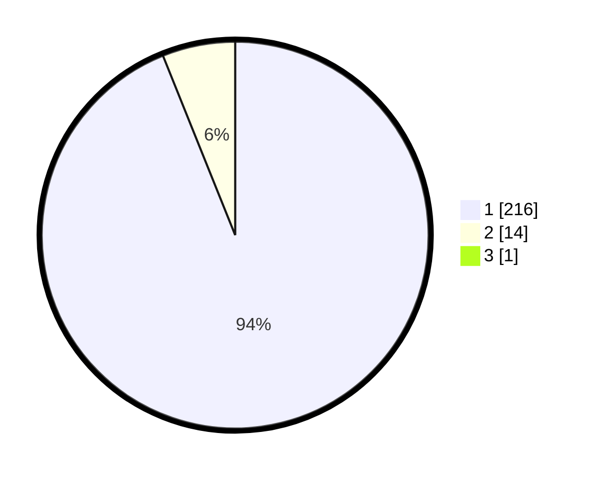

# Hasil

## Grafik

## Tabel

| No. | Nama Paslon    | Suara | Suara (raw) | Persentase |
|:--- |:-------------- | -----:| -----------:| ----------:|
| 1   | ANIES MUHAIMIN | 216   | [216][p-1]  | 93,51      |
| 2   | PRABOWO GIBRAN | 14    | [14][p-2]   | 6,06       |
| 3   | GANJAR MAHFUD  | 1     | [1][p-3]    | 0,43       |

[p-1]: https://github.com/gigit-pemilu/pemilu-2024/blob/main/pilpres/hitung-suara/sub/11-aceh/sub/18-pidie-jaya/sub/04-bandar-dua/sub/2017-alue-sane/sub/002-tps/sub/paslon-1.txt
[p-2]: https://github.com/gigit-pemilu/pemilu-2024/blob/main/pilpres/hitung-suara/sub/11-aceh/sub/18-pidie-jaya/sub/04-bandar-dua/sub/2017-alue-sane/sub/002-tps/sub/paslon-2.txt
[p-3]: https://github.com/gigit-pemilu/pemilu-2024/blob/main/pilpres/hitung-suara/sub/11-aceh/sub/18-pidie-jaya/sub/04-bandar-dua/sub/2017-alue-sane/sub/002-tps/sub/paslon-3.txt

## Foto C Plano

https://sirekap-obj-formc.kpu.go.id/bb6f/pemilu/ppwp/11/18/04/20/17/1118042017002-20240215-125053--c5da2232-9684-429e-8e2d-19f3380a7aa9.jpg

https://sirekap-obj-formc.kpu.go.id/bb6f/pemilu/ppwp/11/18/04/20/17/1118042017002-20240215-124831--0e79de29-9f7a-4173-8a5c-b96aa258b9d1.jpg

https://sirekap-obj-formc.kpu.go.id/bb6f/pemilu/ppwp/11/18/04/20/17/1118042017002-20240215-125323--517578da-2014-4162-b129-e949e576d5a1.jpg

## Metadata

| Key        | Value               |
| ---------- | ------------------- |
| Time Stamp | 2024-02-15 23:29:50 |

