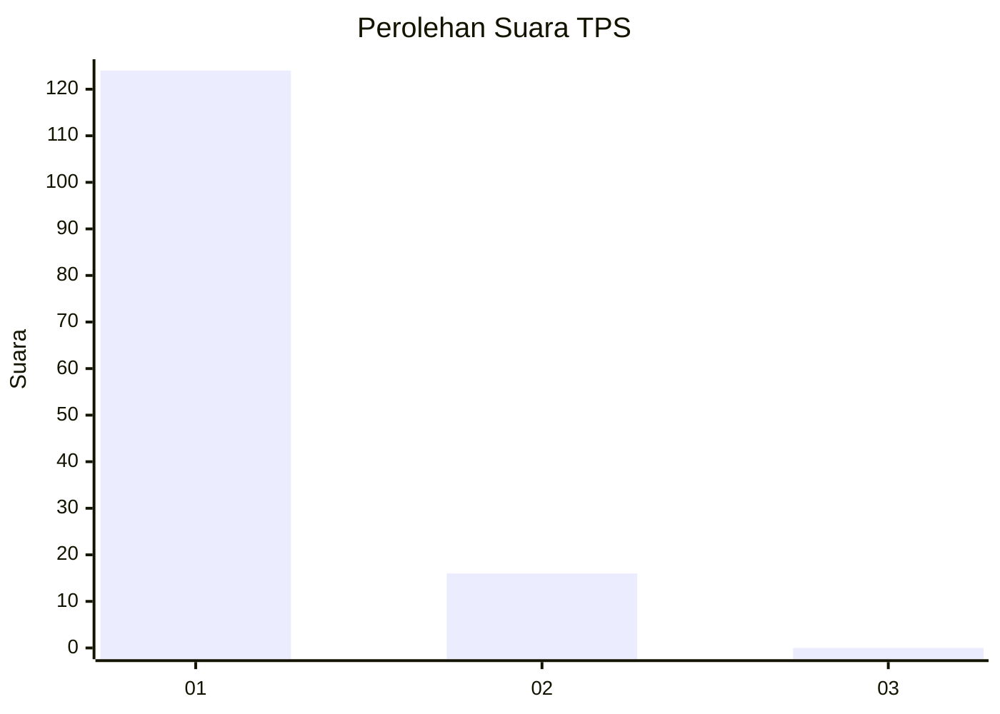
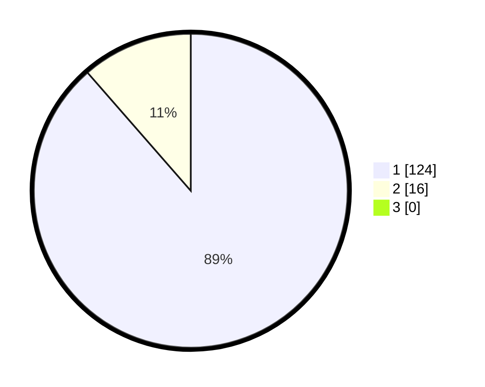

# Hasil

## Grafik

## Tabel

| No. | Nama Paslon    | Suara | Suara (raw) | Persentase |
|:--- |:-------------- | -----:| -----------:| ----------:|
| 1   | ANIES MUHAIMIN | 124   | [124][p-1]  | 88,57      |
| 2   | PRABOWO GIBRAN | 16    | [16][p-2]   | 11,43      |
| 3   | GANJAR MAHFUD  | 0     | [0][p-3]    | 0,00       |

[p-1]: https://github.com/gigit-pemilu/pemilu-2024-11-aceh/blob/main/pilpres/hitung-suara/sub/11-aceh/sub/18-pidie-jaya/sub/04-bandar-dua/sub/2019-lhok-pusong/sub/001-tps/sub/paslon-1.txt
[p-2]: https://github.com/gigit-pemilu/pemilu-2024-11-aceh/blob/main/pilpres/hitung-suara/sub/11-aceh/sub/18-pidie-jaya/sub/04-bandar-dua/sub/2019-lhok-pusong/sub/001-tps/sub/paslon-2.txt
[p-3]: https://github.com/gigit-pemilu/pemilu-2024-11-aceh/blob/main/pilpres/hitung-suara/sub/11-aceh/sub/18-pidie-jaya/sub/04-bandar-dua/sub/2019-lhok-pusong/sub/001-tps/sub/paslon-3.txt

## Foto C Plano

https://sirekap-obj-formc.kpu.go.id/7702/pemilu/ppwp/11/18/04/20/19/1118042019001-20240215-184511--50db86bb-2469-4649-b29c-3cfff38708a7.jpg

https://sirekap-obj-formc.kpu.go.id/7702/pemilu/ppwp/11/18/04/20/19/1118042019001-20240215-184542--0d4131e1-9523-4284-aaaf-be1d07f2de75.jpg

https://sirekap-obj-formc.kpu.go.id/7702/pemilu/ppwp/11/18/04/20/19/1118042019001-20240215-184620--1fb04dad-b724-486f-8b9c-84287ea13e86.jpg

## Metadata

| Key        | Value               |
| ---------- | ------------------- |
| Time Stamp | 2024-02-16 00:00:26 |

