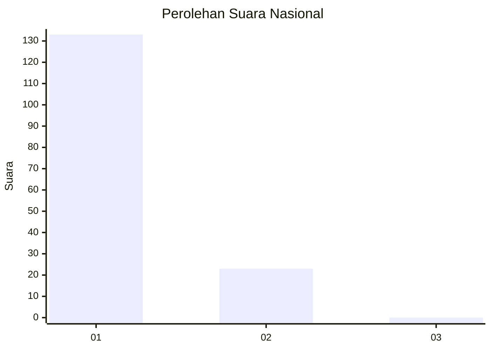
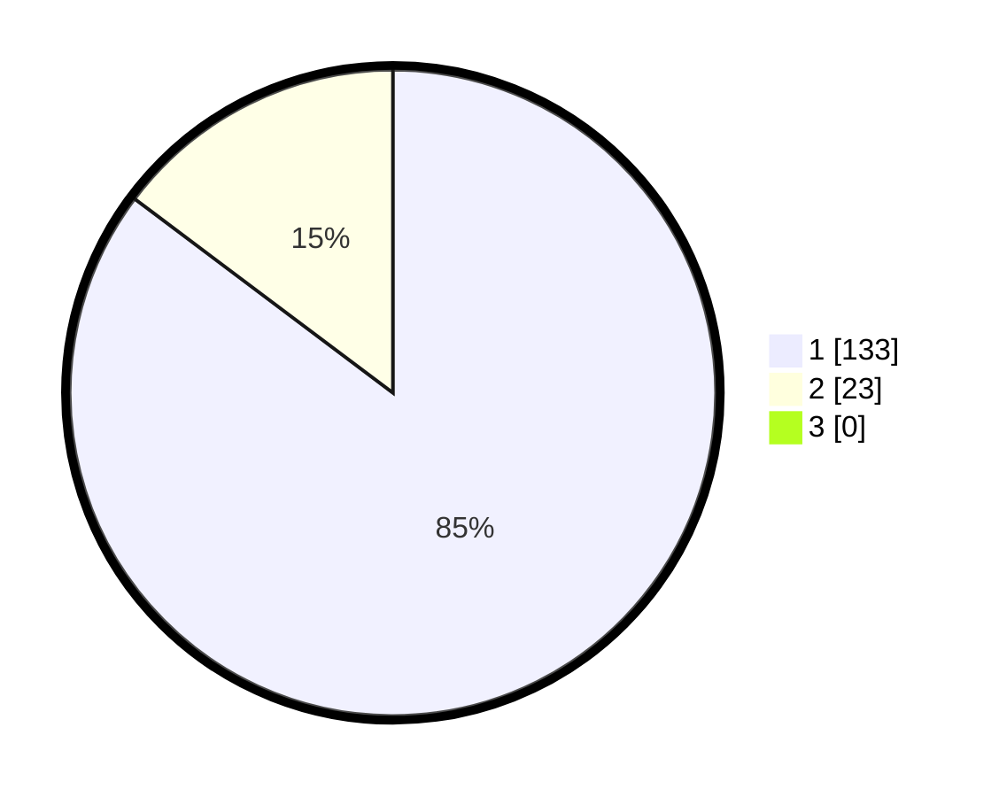

# Hasil

## Grafik

## Tabel

| No. | Nama Paslon    | Suara | Suara (raw) | Persentase |
|:--- |:-------------- | -----:| -----------:| ----------:|
| 1   | ANIES MUHAIMIN | 133   | [133][p-1]  | 85,26      |
| 2   | PRABOWO GIBRAN | 23    | [23][p-2]   | 14,74      |
| 3   | GANJAR MAHFUD  | 0     | [0][p-3]    | 0,00       |

[p-1]: https://github.com/gigit-pemilu/pemilu-2024/blob/main/pilpres/hitung-suara/sub/11-aceh/sub/18-pidie-jaya/sub/04-bandar-dua/sub/2019-lhok-pusong/sub/002-tps/sub/paslon-1.txt
[p-2]: https://github.com/gigit-pemilu/pemilu-2024/blob/main/pilpres/hitung-suara/sub/11-aceh/sub/18-pidie-jaya/sub/04-bandar-dua/sub/2019-lhok-pusong/sub/002-tps/sub/paslon-2.txt
[p-3]: https://github.com/gigit-pemilu/pemilu-2024/blob/main/pilpres/hitung-suara/sub/11-aceh/sub/18-pidie-jaya/sub/04-bandar-dua/sub/2019-lhok-pusong/sub/002-tps/sub/paslon-3.txt

## Foto C Plano

https://sirekap-obj-formc.kpu.go.id/75e7/pemilu/ppwp/11/18/04/20/19/1118042019002-20240215-104734--cf0c18e1-3f8d-45bf-b90e-e97ad9f19923.jpg

https://sirekap-obj-formc.kpu.go.id/75e7/pemilu/ppwp/11/18/04/20/19/1118042019002-20240215-104816--afa873da-89ec-4786-a0af-e1b5876d9aa1.jpg

https://sirekap-obj-formc.kpu.go.id/75e7/pemilu/ppwp/11/18/04/20/19/1118042019002-20240215-104838--12a3132b-0365-4a6f-950a-a13d13db8dc3.jpg

## Metadata

| Key        | Value               |
| ---------- | ------------------- |
| Time Stamp | 2024-02-15 23:29:50 |

