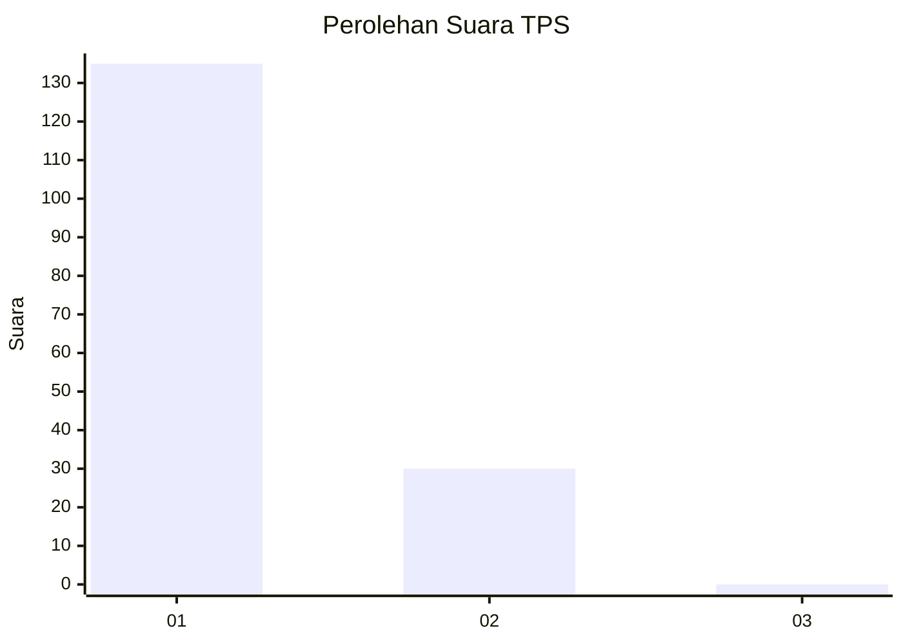
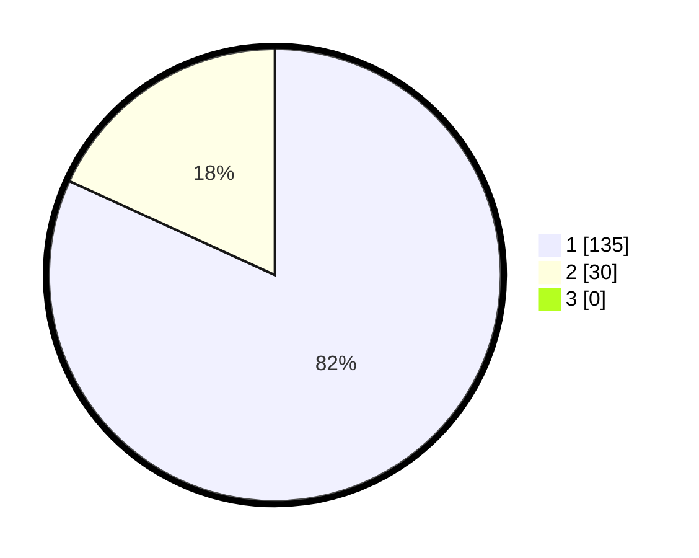

# Hasil

## Grafik

## Tabel

| No. | Nama Paslon    | Suara | Suara (raw) | Persentase |
|:--- |:-------------- | -----:| -----------:| ----------:|
| 1   | ANIES MUHAIMIN | 135   | [135][p-1]  | 81,82      |
| 2   | PRABOWO GIBRAN | 30    | [30][p-2]   | 18,18      |
| 3   | GANJAR MAHFUD  | 0     | [0][p-3]    | 0,00       |

[p-1]: https://github.com/gigit-pemilu/pemilu-2024-11-aceh/blob/main/pilpres/hitung-suara/sub/11-aceh/sub/18-pidie-jaya/sub/04-bandar-dua/sub/2023-meuko-buloh/sub/001-tps/sub/paslon-1.txt
[p-2]: https://github.com/gigit-pemilu/pemilu-2024-11-aceh/blob/main/pilpres/hitung-suara/sub/11-aceh/sub/18-pidie-jaya/sub/04-bandar-dua/sub/2023-meuko-buloh/sub/001-tps/sub/paslon-2.txt
[p-3]: https://github.com/gigit-pemilu/pemilu-2024-11-aceh/blob/main/pilpres/hitung-suara/sub/11-aceh/sub/18-pidie-jaya/sub/04-bandar-dua/sub/2023-meuko-buloh/sub/001-tps/sub/paslon-3.txt

## Foto C Plano

https://sirekap-obj-formc.kpu.go.id/3bae/pemilu/ppwp/11/18/04/20/23/1118042023001-20240215-052422--c12db24d-feb2-4b45-88ff-5a9cc4748f13.jpg

https://sirekap-obj-formc.kpu.go.id/3bae/pemilu/ppwp/11/18/04/20/23/1118042023001-20240215-052655--e143758a-6f5e-483a-b52a-f9ef13f9b7c7.jpg

https://sirekap-obj-formc.kpu.go.id/3bae/pemilu/ppwp/11/18/04/20/23/1118042023001-20240215-052826--e22d8ced-d0ce-421c-b632-85137fde3315.jpg

## Metadata

| Key        | Value               |
| ---------- | ------------------- |
| Time Stamp | 2024-02-15 22:00:27 |

