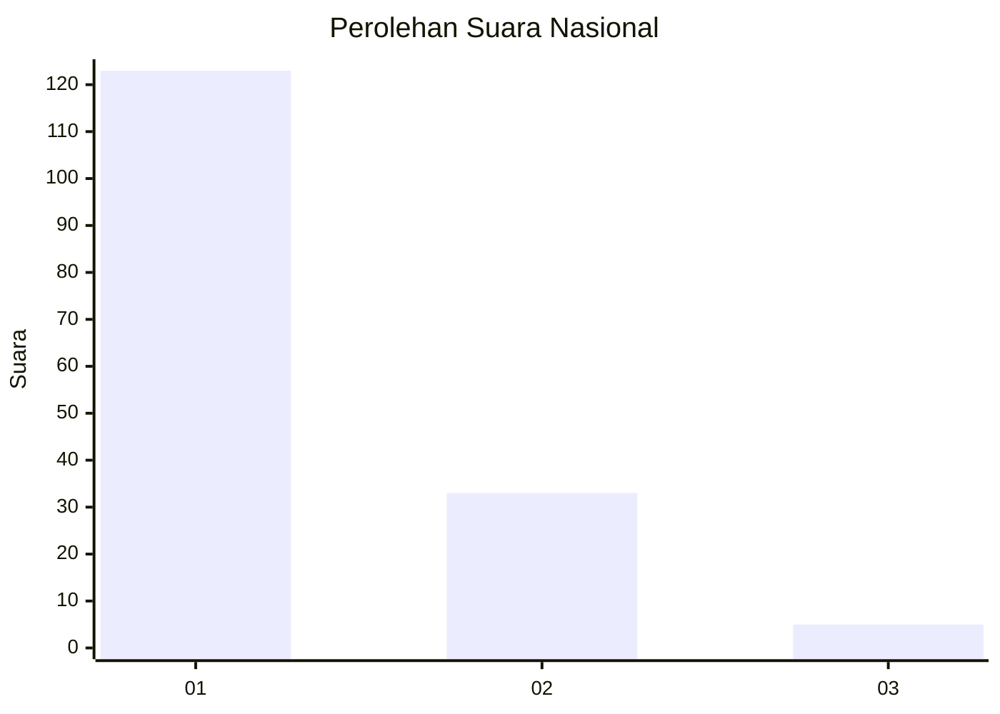
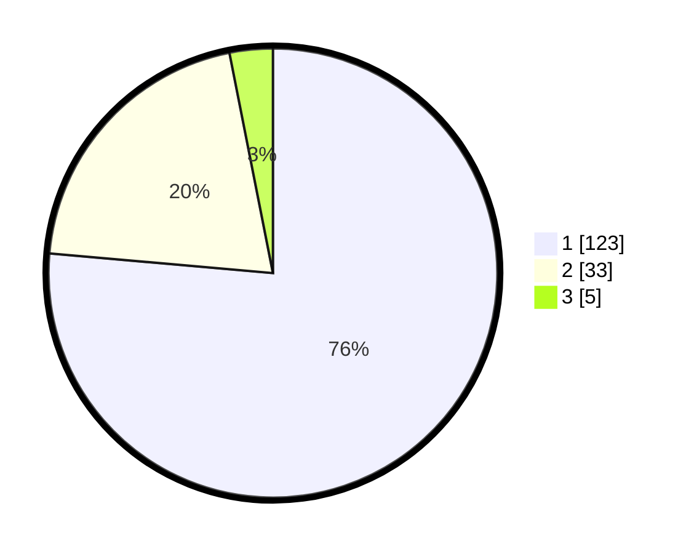

# Hasil

## Grafik

## Tabel

| No. | Nama Paslon    | Suara | Suara (raw) | Persentase |
|:--- |:-------------- | -----:| -----------:| ----------:|
| 1   | ANIES MUHAIMIN | 123   | [123][p-1]  | 76,40      |
| 2   | PRABOWO GIBRAN | 33    | [33][p-2]   | 20,50      |
| 3   | GANJAR MAHFUD  | 5     | [5][p-3]    | 3,11       |

[p-1]: https://github.com/gigit-pemilu/pemilu-2024/blob/main/pilpres/hitung-suara/sub/11-aceh/sub/18-pidie-jaya/sub/04-bandar-dua/sub/2027-meugit-sagoe/sub/001-tps/sub/paslon-1.txt
[p-2]: https://github.com/gigit-pemilu/pemilu-2024/blob/main/pilpres/hitung-suara/sub/11-aceh/sub/18-pidie-jaya/sub/04-bandar-dua/sub/2027-meugit-sagoe/sub/001-tps/sub/paslon-2.txt
[p-3]: https://github.com/gigit-pemilu/pemilu-2024/blob/main/pilpres/hitung-suara/sub/11-aceh/sub/18-pidie-jaya/sub/04-bandar-dua/sub/2027-meugit-sagoe/sub/001-tps/sub/paslon-3.txt

## Foto C Plano

https://sirekap-obj-formc.kpu.go.id/4a9d/pemilu/ppwp/11/18/04/20/27/1118042027001-20240216-154849--cbd0a13a-2d97-486d-8427-2d36ad13c89c.jpg

https://sirekap-obj-formc.kpu.go.id/4a9d/pemilu/ppwp/11/18/04/20/27/1118042027001-20240216-154930--0058c758-7b64-47f1-aef0-352547c3e65b.jpg

https://sirekap-obj-formc.kpu.go.id/4a9d/pemilu/ppwp/11/18/04/20/27/1118042027001-20240216-155020--845d77dc-c2a5-4555-b08e-24416bea290a.jpg

## Metadata

| Key        | Value               |
| ---------- | ------------------- |
| Time Stamp | 2024-02-19 06:16:00 |

