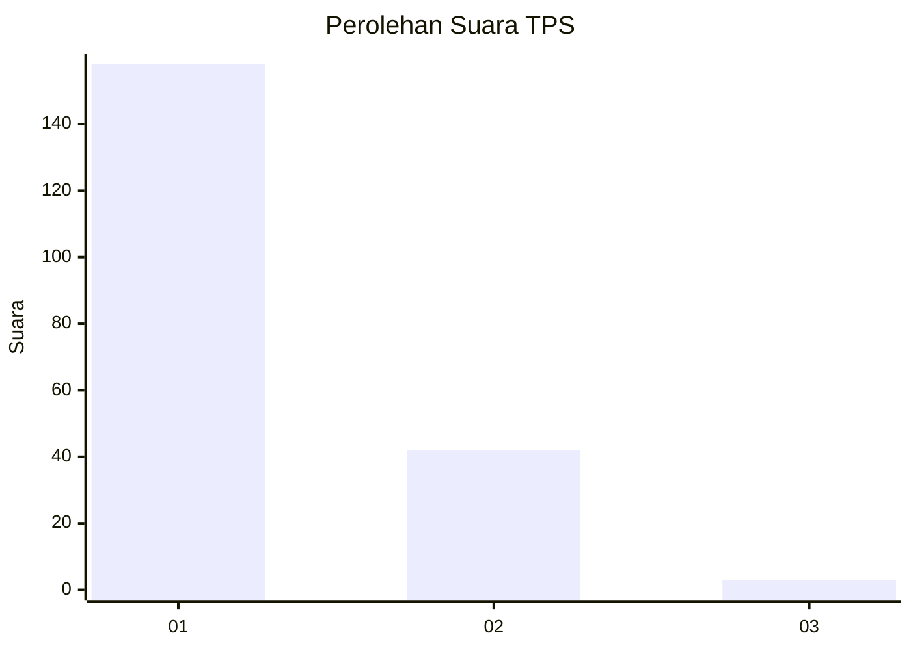
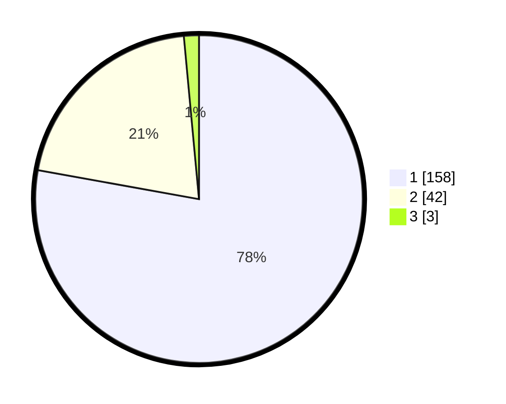

# Hasil

## Grafik

## Tabel

| No. | Nama Paslon    | Suara | Suara (raw) | Persentase |
|:--- |:-------------- | -----:| -----------:| ----------:|
| 1   | ANIES MUHAIMIN | 158   | [158][p-1]  | 77,83      |
| 2   | PRABOWO GIBRAN | 42    | [42][p-2]   | 20,69      |
| 3   | GANJAR MAHFUD  | 3     | [3][p-3]    | 1,48       |

[p-1]: https://github.com/gigit-pemilu/pemilu-2024-11-aceh/blob/main/pilpres/hitung-suara/sub/11-aceh/sub/18-pidie-jaya/sub/04-bandar-dua/sub/2027-meugit-sagoe/sub/002-tps/sub/paslon-1.txt
[p-2]: https://github.com/gigit-pemilu/pemilu-2024-11-aceh/blob/main/pilpres/hitung-suara/sub/11-aceh/sub/18-pidie-jaya/sub/04-bandar-dua/sub/2027-meugit-sagoe/sub/002-tps/sub/paslon-2.txt
[p-3]: https://github.com/gigit-pemilu/pemilu-2024-11-aceh/blob/main/pilpres/hitung-suara/sub/11-aceh/sub/18-pidie-jaya/sub/04-bandar-dua/sub/2027-meugit-sagoe/sub/002-tps/sub/paslon-3.txt

## Foto C Plano

https://sirekap-obj-formc.kpu.go.id/6bfb/pemilu/ppwp/11/18/04/20/27/1118042027002-20240216-153812--e7f7262e-0b48-4fe0-bb1a-066c58207a34.jpg

https://sirekap-obj-formc.kpu.go.id/6bfb/pemilu/ppwp/11/18/04/20/27/1118042027002-20240216-163917--960d6505-b867-4b4b-a9a9-279ab88d0d4c.jpg

https://sirekap-obj-formc.kpu.go.id/6bfb/pemilu/ppwp/11/18/04/20/27/1118042027002-20240216-192724--c69c0188-379b-4827-b3f0-7f6b6e763b93.jpg

## Metadata

| Key        | Value               |
| ---------- | ------------------- |
| Time Stamp | 2024-02-24 22:31:28 |

