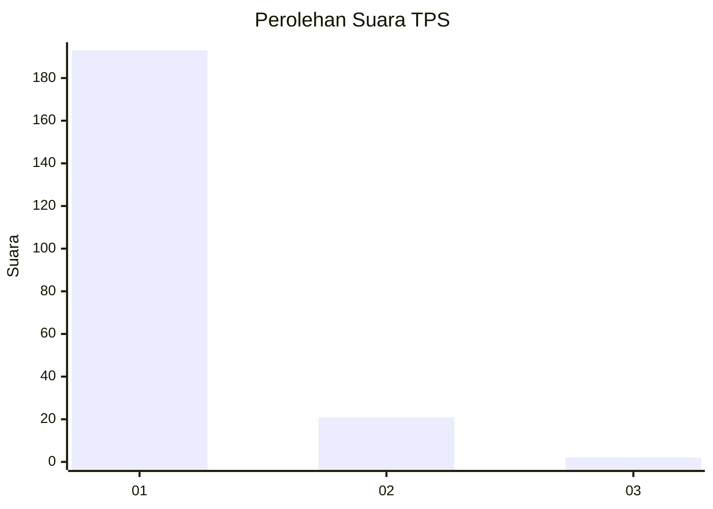
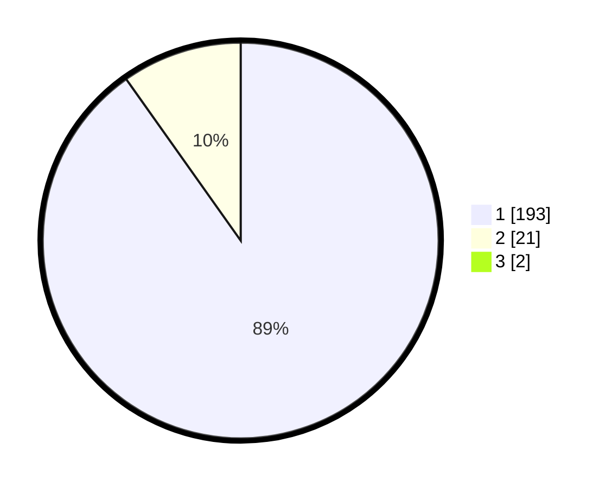

# Hasil

## Grafik

## Tabel

| No. | Nama Paslon    | Suara | Suara (raw) | Persentase |
|:--- |:-------------- | -----:| -----------:| ----------:|
| 1   | ANIES MUHAIMIN | 193   | [193][p-1]  | 89,35      |
| 2   | PRABOWO GIBRAN | 21    | [21][p-2]   | 9,72       |
| 3   | GANJAR MAHFUD  | 2     | [2][p-3]    | 0,93       |

[p-1]: https://github.com/gigit-pemilu/pemilu-2024-11-aceh/blob/main/pilpres/hitung-suara/sub/11-aceh/sub/18-pidie-jaya/sub/04-bandar-dua/sub/2030-meunasah-paku/sub/001-tps/sub/paslon-1.txt
[p-2]: https://github.com/gigit-pemilu/pemilu-2024-11-aceh/blob/main/pilpres/hitung-suara/sub/11-aceh/sub/18-pidie-jaya/sub/04-bandar-dua/sub/2030-meunasah-paku/sub/001-tps/sub/paslon-2.txt
[p-3]: https://github.com/gigit-pemilu/pemilu-2024-11-aceh/blob/main/pilpres/hitung-suara/sub/11-aceh/sub/18-pidie-jaya/sub/04-bandar-dua/sub/2030-meunasah-paku/sub/001-tps/sub/paslon-3.txt

## Foto C Plano

https://sirekap-obj-formc.kpu.go.id/537d/pemilu/ppwp/11/18/04/20/30/1118042030001-20240214-194724--e6a491f9-5eb4-4431-a940-79f89cd52d10.jpg

https://sirekap-obj-formc.kpu.go.id/537d/pemilu/ppwp/11/18/04/20/30/1118042030001-20240214-191131--34f8d8b6-66d3-46fa-b4c6-7c3aa06b9175.jpg

https://sirekap-obj-formc.kpu.go.id/537d/pemilu/ppwp/11/18/04/20/30/1118042030001-20240214-191253--e9ca45cc-679d-434d-9f10-849d9706cb3a.jpg

## Metadata

| Key        | Value               |
| ---------- | ------------------- |
| Time Stamp | 2024-02-15 23:29:50 |

