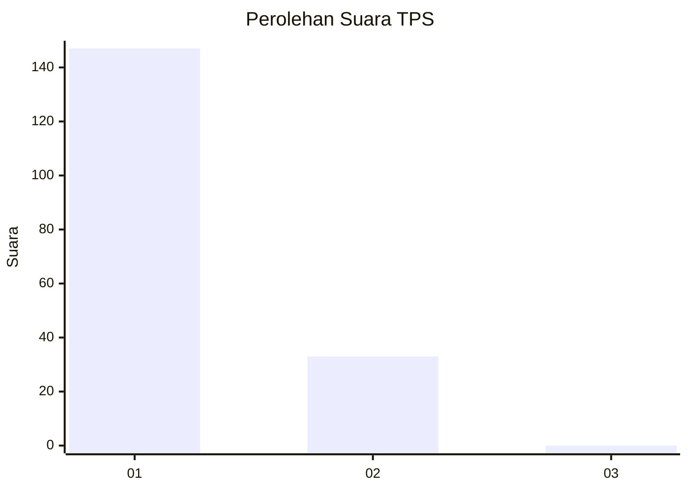
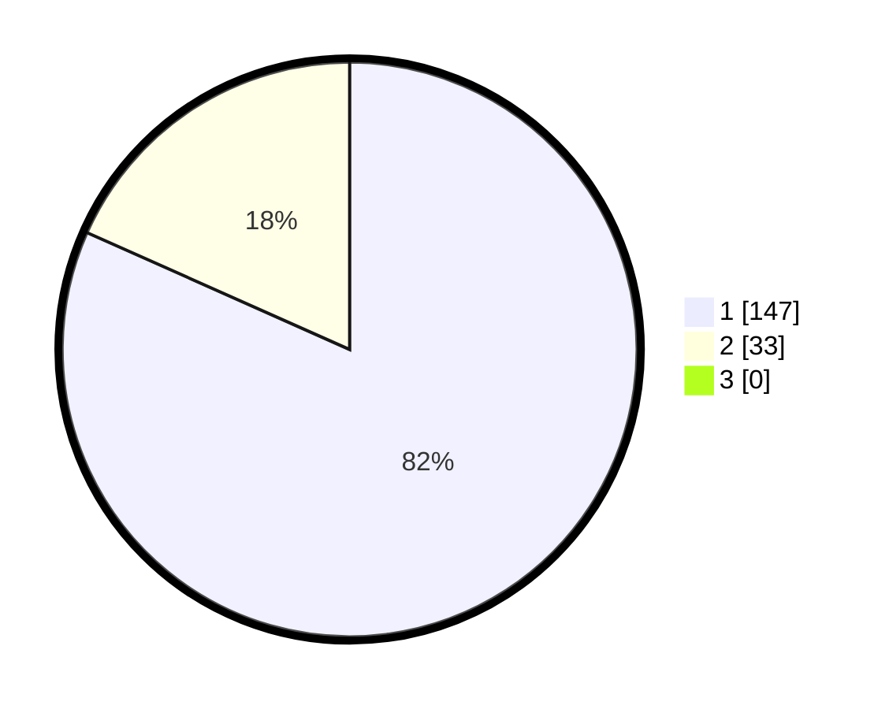

# Hasil

## Grafik

## Tabel

| No. | Nama Paslon    | Suara | Suara (raw) | Persentase |
|:--- |:-------------- | -----:| -----------:| ----------:|
| 1   | ANIES MUHAIMIN | 147   | [147][p-1]  | 81,67      |
| 2   | PRABOWO GIBRAN | 33    | [33][p-2]   | 18,33      |
| 3   | GANJAR MAHFUD  | 0     | [0][p-3]    | 0,00       |

[p-1]: https://github.com/gigit-pemilu/pemilu-2024-11-aceh/blob/main/pilpres/hitung-suara/sub/11-aceh/sub/18-pidie-jaya/sub/04-bandar-dua/sub/2031-jeulanga-mata-ie/sub/001-tps/sub/paslon-1.txt
[p-2]: https://github.com/gigit-pemilu/pemilu-2024-11-aceh/blob/main/pilpres/hitung-suara/sub/11-aceh/sub/18-pidie-jaya/sub/04-bandar-dua/sub/2031-jeulanga-mata-ie/sub/001-tps/sub/paslon-2.txt
[p-3]: https://github.com/gigit-pemilu/pemilu-2024-11-aceh/blob/main/pilpres/hitung-suara/sub/11-aceh/sub/18-pidie-jaya/sub/04-bandar-dua/sub/2031-jeulanga-mata-ie/sub/001-tps/sub/paslon-3.txt

## Foto C Plano

https://sirekap-obj-formc.kpu.go.id/f754/pemilu/ppwp/11/18/04/20/31/1118042031001-20240215-091131--98f7dbb9-938e-434b-ba05-a09ce4c2cc4a.jpg

https://sirekap-obj-formc.kpu.go.id/f754/pemilu/ppwp/11/18/04/20/31/1118042031001-20240215-091326--5483d809-801c-47b3-a487-4c9c5dbeb03e.jpg

https://sirekap-obj-formc.kpu.go.id/f754/pemilu/ppwp/11/18/04/20/31/1118042031001-20240215-091602--3ed3289f-970e-4d82-8f9a-837fd5bfb9da.jpg

## Metadata

| Key        | Value               |
| ---------- | ------------------- |
| Time Stamp | 2024-02-15 21:30:27 |

