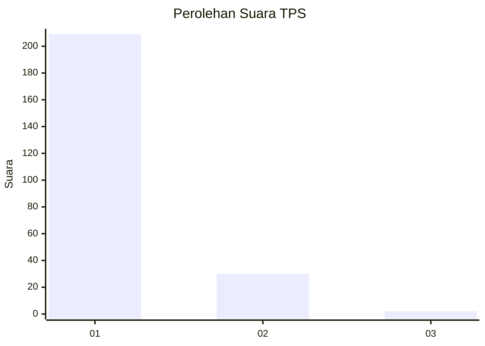
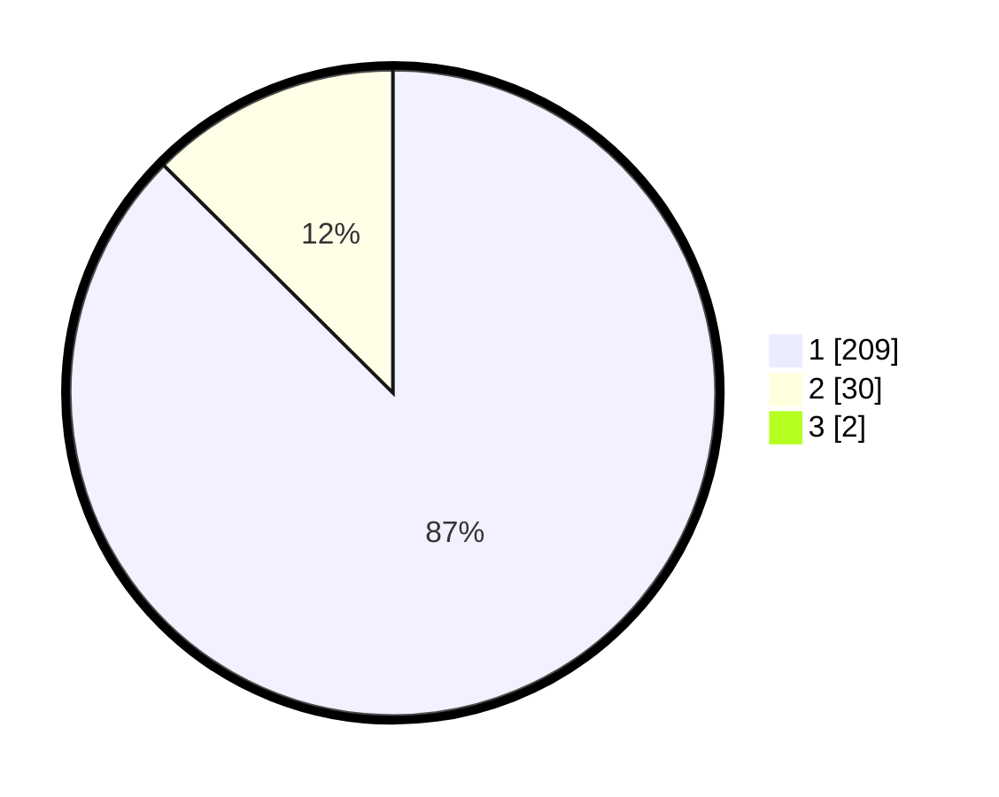

# Hasil

## Grafik

## Tabel

| No. | Nama Paslon    | Suara | Suara (raw) | Persentase |
|:--- |:-------------- | -----:| -----------:| ----------:|
| 1   | ANIES MUHAIMIN | 209   | [209][p-1]  | 86,72      |
| 2   | PRABOWO GIBRAN | 30    | [30][p-2]   | 12,45      |
| 3   | GANJAR MAHFUD  | 2     | [2][p-3]    | 0,83       |

[p-1]: https://github.com/gigit-pemilu/pemilu-2024-11-aceh/blob/main/pilpres/hitung-suara/sub/11-aceh/sub/18-pidie-jaya/sub/04-bandar-dua/sub/2032-jeulanga-mesjid/sub/001-tps/sub/paslon-1.txt
[p-2]: https://github.com/gigit-pemilu/pemilu-2024-11-aceh/blob/main/pilpres/hitung-suara/sub/11-aceh/sub/18-pidie-jaya/sub/04-bandar-dua/sub/2032-jeulanga-mesjid/sub/001-tps/sub/paslon-2.txt
[p-3]: https://github.com/gigit-pemilu/pemilu-2024-11-aceh/blob/main/pilpres/hitung-suara/sub/11-aceh/sub/18-pidie-jaya/sub/04-bandar-dua/sub/2032-jeulanga-mesjid/sub/001-tps/sub/paslon-3.txt

## Foto C Plano

https://sirekap-obj-formc.kpu.go.id/781d/pemilu/ppwp/11/18/04/20/32/1118042032001-20240215-080726--9629cd11-2957-40cf-b81c-82796f7473f9.jpg

https://sirekap-obj-formc.kpu.go.id/781d/pemilu/ppwp/11/18/04/20/32/1118042032001-20240215-080843--b294d49b-fbc1-4680-a46d-c48360d4839c.jpg

https://sirekap-obj-formc.kpu.go.id/781d/pemilu/ppwp/11/18/04/20/32/1118042032001-20240215-065402--700b085a-e8e1-42c3-bf38-7a359a0b0080.jpg

## Metadata

| Key        | Value               |
| ---------- | ------------------- |
| Time Stamp | 2024-02-15 23:30:25 |

