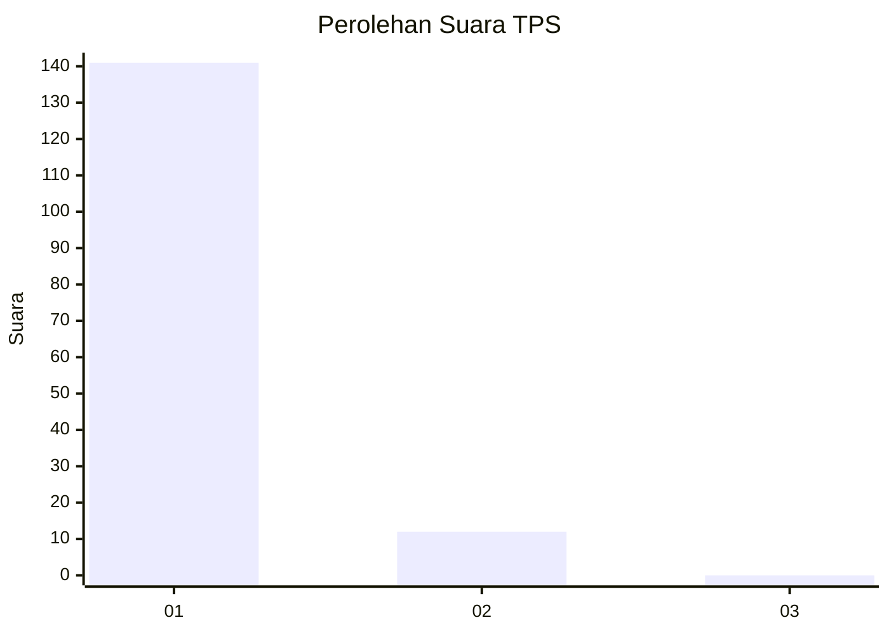
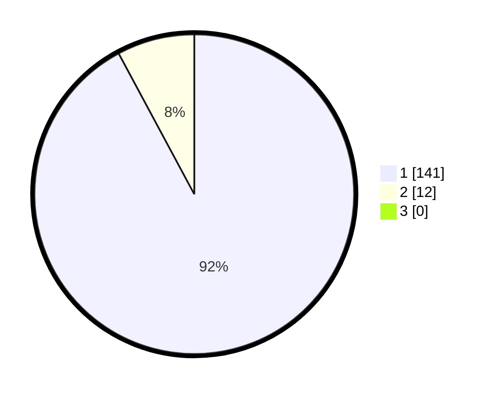

# Hasil

## Grafik

## Tabel

| No. | Nama Paslon    | Suara | Suara (raw) | Persentase |
|:--- |:-------------- | -----:| -----------:| ----------:|
| 1   | ANIES MUHAIMIN | 141   | [141][p-1]  | 92,16      |
| 2   | PRABOWO GIBRAN | 12    | [12][p-2]   | 7,84       |
| 3   | GANJAR MAHFUD  | 0     | [0][p-3]    | 0,00       |

[p-1]: https://github.com/gigit-pemilu/pemilu-2024-11-aceh/blob/main/pilpres/hitung-suara/sub/11-aceh/sub/18-pidie-jaya/sub/04-bandar-dua/sub/2034-blang-miroe/sub/001-tps/sub/paslon-1.txt
[p-2]: https://github.com/gigit-pemilu/pemilu-2024-11-aceh/blob/main/pilpres/hitung-suara/sub/11-aceh/sub/18-pidie-jaya/sub/04-bandar-dua/sub/2034-blang-miroe/sub/001-tps/sub/paslon-2.txt
[p-3]: https://github.com/gigit-pemilu/pemilu-2024-11-aceh/blob/main/pilpres/hitung-suara/sub/11-aceh/sub/18-pidie-jaya/sub/04-bandar-dua/sub/2034-blang-miroe/sub/001-tps/sub/paslon-3.txt

## Foto C Plano

https://sirekap-obj-formc.kpu.go.id/7381/pemilu/ppwp/11/18/04/20/34/1118042034001-20240215-092036--eeb1aae9-57ee-4ac0-a344-e93ce4aebfac.jpg

https://sirekap-obj-formc.kpu.go.id/7381/pemilu/ppwp/11/18/04/20/34/1118042034001-20240215-011601--f37a627a-8251-4ffd-b5b1-e257b1b22a03.jpg

https://sirekap-obj-formc.kpu.go.id/7381/pemilu/ppwp/11/18/04/20/34/1118042034001-20240215-092619--47cb3c4f-07ae-43ec-a00e-7285cb949689.jpg

## Metadata

| Key        | Value               |
| ---------- | ------------------- |
| Time Stamp | 2024-02-15 15:30:25 |

