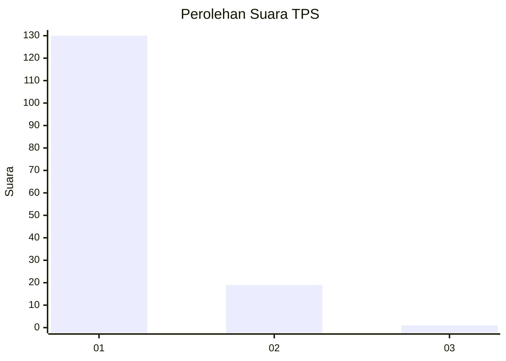
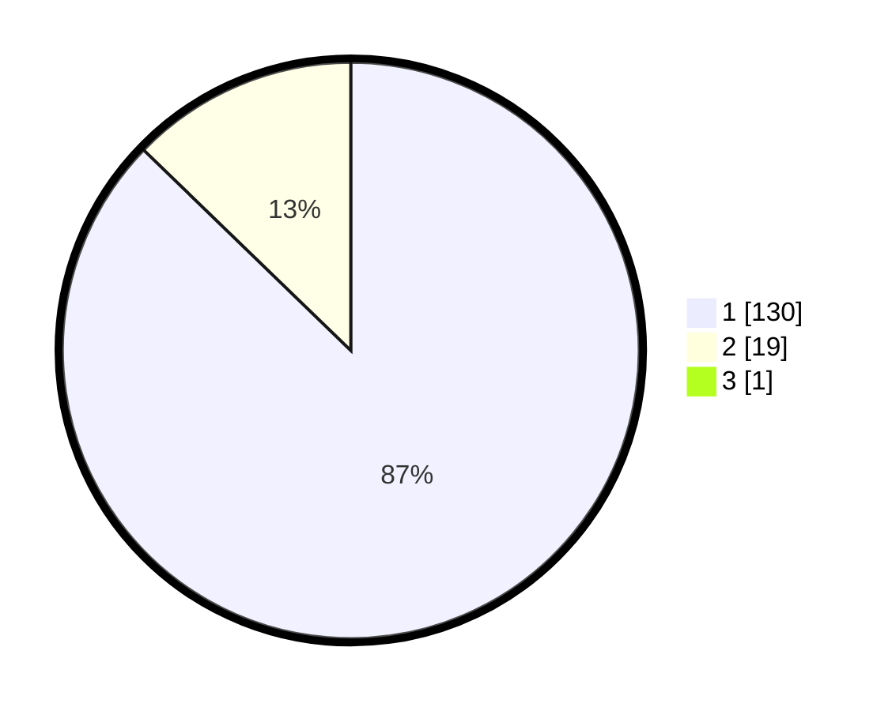

# Hasil

## Grafik

## Tabel

| No. | Nama Paslon    | Suara | Suara (raw) | Persentase |
|:--- |:-------------- | -----:| -----------:| ----------:|
| 1   | ANIES MUHAIMIN | 130   | [130][p-1]  | 86,67      |
| 2   | PRABOWO GIBRAN | 19    | [19][p-2]   | 12,67      |
| 3   | GANJAR MAHFUD  | 1     | [1][p-3]    | 0,67       |

[p-1]: https://github.com/gigit-pemilu/pemilu-2024-11-aceh/blob/main/pilpres/hitung-suara/sub/11-aceh/sub/18-pidie-jaya/sub/04-bandar-dua/sub/2037-krueng-kiran/sub/002-tps/sub/paslon-1.txt
[p-2]: https://github.com/gigit-pemilu/pemilu-2024-11-aceh/blob/main/pilpres/hitung-suara/sub/11-aceh/sub/18-pidie-jaya/sub/04-bandar-dua/sub/2037-krueng-kiran/sub/002-tps/sub/paslon-2.txt
[p-3]: https://github.com/gigit-pemilu/pemilu-2024-11-aceh/blob/main/pilpres/hitung-suara/sub/11-aceh/sub/18-pidie-jaya/sub/04-bandar-dua/sub/2037-krueng-kiran/sub/002-tps/sub/paslon-3.txt

## Foto C Plano

https://sirekap-obj-formc.kpu.go.id/87a6/pemilu/ppwp/11/18/04/20/37/1118042037002-20240215-065620--a9be0c20-fe13-43c5-ae96-f1e86ce831ba.jpg

https://sirekap-obj-formc.kpu.go.id/87a6/pemilu/ppwp/11/18/04/20/37/1118042037002-20240215-070238--ffb8fb03-75ec-4695-8ea2-7455c79a29ce.jpg

https://sirekap-obj-formc.kpu.go.id/87a6/pemilu/ppwp/11/18/04/20/37/1118042037002-20240215-070446--fc2f2b49-1cd6-4335-b684-326826a97809.jpg

## Metadata

| Key        | Value               |
| ---------- | ------------------- |
| Time Stamp | 2024-02-15 23:29:50 |

