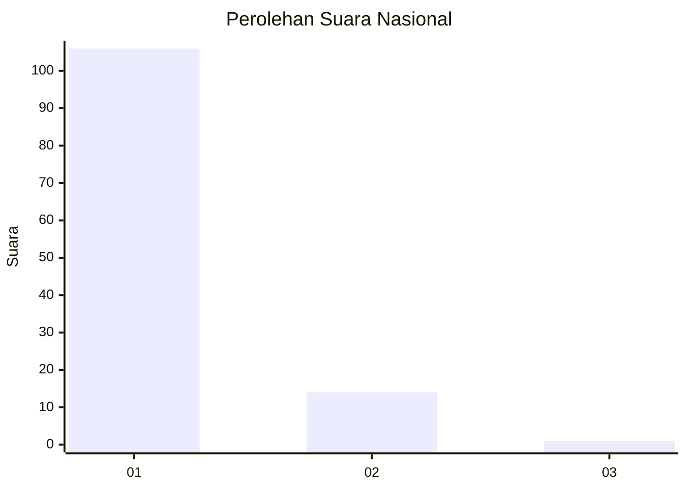
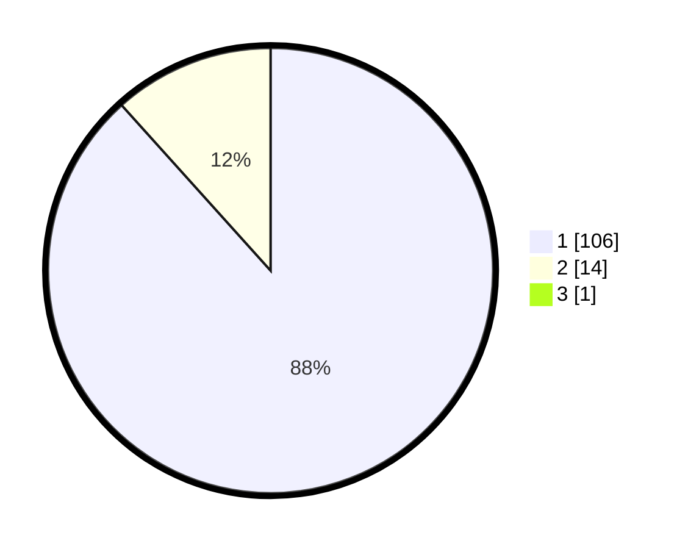

# Hasil

## Grafik

## Tabel

| No. | Nama Paslon    | Suara | Suara (raw) | Persentase |
|:--- |:-------------- | -----:| -----------:| ----------:|
| 1   | ANIES MUHAIMIN | 106   | [106][p-1]  | 87,60      |
| 2   | PRABOWO GIBRAN | 14    | [14][p-2]   | 11,57      |
| 3   | GANJAR MAHFUD  | 1     | [1][p-3]    | 0,83       |

[p-1]: https://github.com/gigit-pemilu/pemilu-2024/blob/main/pilpres/hitung-suara/sub/11-aceh/sub/18-pidie-jaya/sub/04-bandar-dua/sub/2043-paya-baroh/sub/001-tps/sub/paslon-1.txt
[p-2]: https://github.com/gigit-pemilu/pemilu-2024/blob/main/pilpres/hitung-suara/sub/11-aceh/sub/18-pidie-jaya/sub/04-bandar-dua/sub/2043-paya-baroh/sub/001-tps/sub/paslon-2.txt
[p-3]: https://github.com/gigit-pemilu/pemilu-2024/blob/main/pilpres/hitung-suara/sub/11-aceh/sub/18-pidie-jaya/sub/04-bandar-dua/sub/2043-paya-baroh/sub/001-tps/sub/paslon-3.txt

## Foto C Plano

https://sirekap-obj-formc.kpu.go.id/f79c/pemilu/ppwp/11/18/04/20/43/1118042043001-20240214-160132--61c8760f-e859-476e-8c97-080d0e287972.jpg

https://sirekap-obj-formc.kpu.go.id/f79c/pemilu/ppwp/11/18/04/20/43/1118042043001-20240214-184927--ccf3cbe9-4b99-4900-8726-70fea566537a.jpg

https://sirekap-obj-formc.kpu.go.id/f79c/pemilu/ppwp/11/18/04/20/43/1118042043001-20240214-184934--6f0f4ec9-290a-4b96-a32c-f9732f282f93.jpg

## Metadata

| Key        | Value               |
| ---------- | ------------------- |
| Time Stamp | 2024-02-15 23:29:50 |

