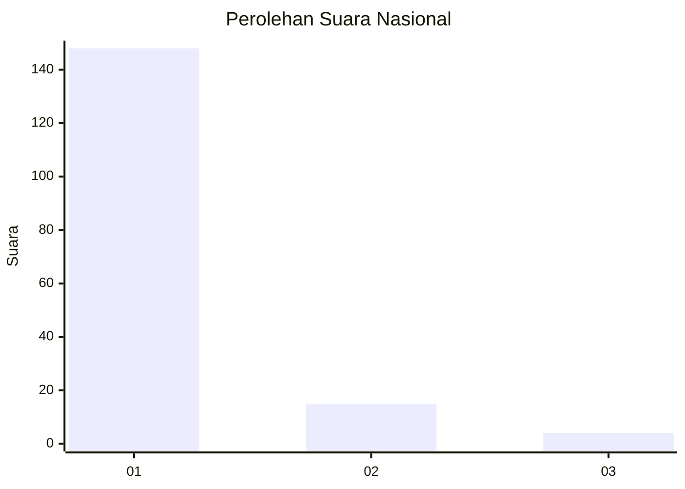
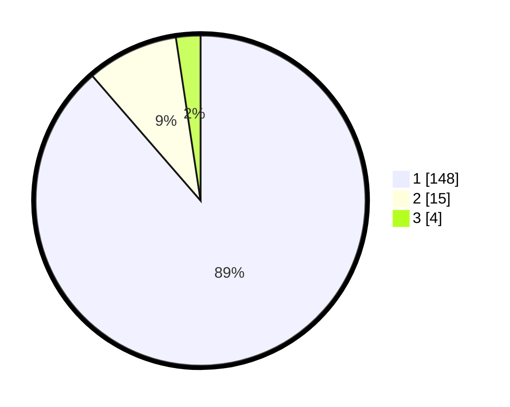

# Hasil

## Grafik

## Tabel

| No. | Nama Paslon    | Suara | Suara (raw) | Persentase |
|:--- |:-------------- | -----:| -----------:| ----------:|
| 1   | ANIES MUHAIMIN | 148   | [148][p-1]  | 88,62      |
| 2   | PRABOWO GIBRAN | 15    | [15][p-2]   | 8,98       |
| 3   | GANJAR MAHFUD  | 4     | [4][p-3]    | 2,40       |

[p-1]: https://github.com/gigit-pemilu/pemilu-2024/blob/main/pilpres/hitung-suara/sub/11-aceh/sub/18-pidie-jaya/sub/04-bandar-dua/sub/2044-meuko-baroh/sub/001-tps/sub/paslon-1.txt
[p-2]: https://github.com/gigit-pemilu/pemilu-2024/blob/main/pilpres/hitung-suara/sub/11-aceh/sub/18-pidie-jaya/sub/04-bandar-dua/sub/2044-meuko-baroh/sub/001-tps/sub/paslon-2.txt
[p-3]: https://github.com/gigit-pemilu/pemilu-2024/blob/main/pilpres/hitung-suara/sub/11-aceh/sub/18-pidie-jaya/sub/04-bandar-dua/sub/2044-meuko-baroh/sub/001-tps/sub/paslon-3.txt

## Foto C Plano

https://sirekap-obj-formc.kpu.go.id/a0af/pemilu/ppwp/11/18/04/20/44/1118042044001-20240222-112525--dd2711cd-7bb0-4dc0-b779-6a2603666d28.jpg

https://sirekap-obj-formc.kpu.go.id/a0af/pemilu/ppwp/11/18/04/20/44/1118042044001-20240222-112703--7ff2783b-839d-42cb-bb98-cc924b275451.jpg

https://sirekap-obj-formc.kpu.go.id/a0af/pemilu/ppwp/11/18/04/20/44/1118042044001-20240222-112829--6a957e54-1dbb-4286-8018-a9fd857d82ae.jpg

## Metadata

| Key        | Value               |
| ---------- | ------------------- |
| Time Stamp | 2024-02-24 22:31:28 |

