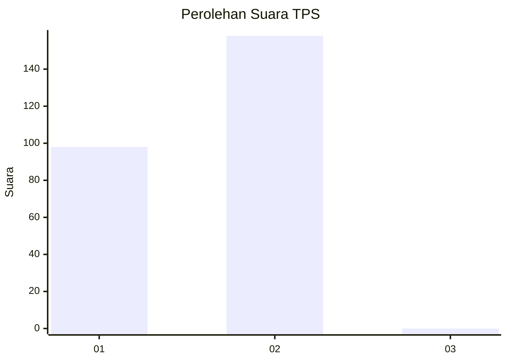
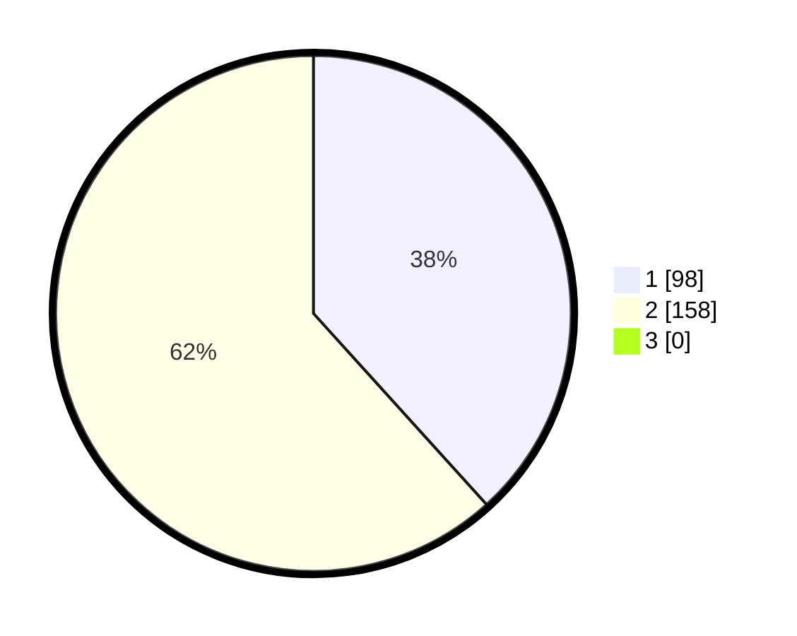

# Hasil

## Grafik

## Tabel

| No. | Nama Paslon    | Suara | Suara (raw) | Persentase |
|:--- |:-------------- | -----:| -----------:| ----------:|
| 1   | ANIES MUHAIMIN | 98    | [98][p-1]   | 38,28      |
| 2   | PRABOWO GIBRAN | 158   | [158][p-2]  | 61,72      |
| 3   | GANJAR MAHFUD  | 0     | [0][p-3]    | 0,00       |

[p-1]: https://github.com/gigit-pemilu/pemilu-2024-11-aceh/blob/main/pilpres/hitung-suara/sub/11-aceh/sub/18-pidie-jaya/sub/05-meurah-dua/sub/2003-seunong/sub/001-tps/sub/paslon-1.txt
[p-2]: https://github.com/gigit-pemilu/pemilu-2024-11-aceh/blob/main/pilpres/hitung-suara/sub/11-aceh/sub/18-pidie-jaya/sub/05-meurah-dua/sub/2003-seunong/sub/001-tps/sub/paslon-2.txt
[p-3]: https://github.com/gigit-pemilu/pemilu-2024-11-aceh/blob/main/pilpres/hitung-suara/sub/11-aceh/sub/18-pidie-jaya/sub/05-meurah-dua/sub/2003-seunong/sub/001-tps/sub/paslon-3.txt

## Foto C Plano

https://sirekap-obj-formc.kpu.go.id/e930/pemilu/ppwp/11/18/05/20/03/1118052003001-20240214-200131--a6b7bd67-42d3-48cb-bc8e-9df5057411b6.jpg

https://sirekap-obj-formc.kpu.go.id/e930/pemilu/ppwp/11/18/05/20/03/1118052003001-20240214-200404--396e7ca4-0665-4925-9527-06e87fa5621e.jpg

https://sirekap-obj-formc.kpu.go.id/e930/pemilu/ppwp/11/18/05/20/03/1118052003001-20240214-200516--1e9ed8ef-2d51-4ce1-a3bb-3a4f865a72b8.jpg

## Metadata

| Key        | Value               |
| ---------- | ------------------- |
| Time Stamp | 2024-02-15 23:29:50 |

