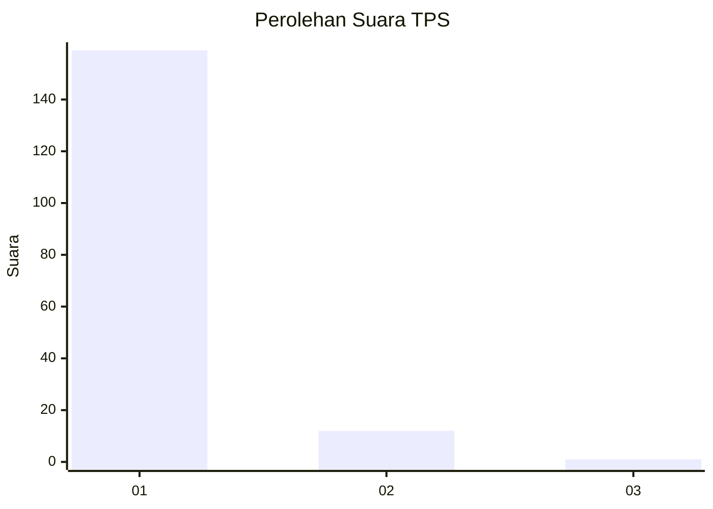
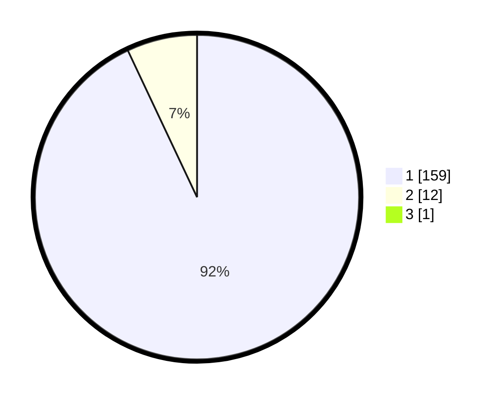

# Hasil

## Grafik

## Tabel

| No. | Nama Paslon    | Suara | Suara (raw) | Persentase |
|:--- |:-------------- | -----:| -----------:| ----------:|
| 1   | ANIES MUHAIMIN | 159   | [159][p-1]  | 92,44      |
| 2   | PRABOWO GIBRAN | 12    | [12][p-2]   | 6,98       |
| 3   | GANJAR MAHFUD  | 1     | [1][p-3]    | 0,58       |

[p-1]: https://github.com/gigit-pemilu/pemilu-2024-11-aceh/blob/main/pilpres/hitung-suara/sub/11-aceh/sub/18-pidie-jaya/sub/05-meurah-dua/sub/2005-meunasah-kulam/sub/001-tps/sub/paslon-1.txt
[p-2]: https://github.com/gigit-pemilu/pemilu-2024-11-aceh/blob/main/pilpres/hitung-suara/sub/11-aceh/sub/18-pidie-jaya/sub/05-meurah-dua/sub/2005-meunasah-kulam/sub/001-tps/sub/paslon-2.txt
[p-3]: https://github.com/gigit-pemilu/pemilu-2024-11-aceh/blob/main/pilpres/hitung-suara/sub/11-aceh/sub/18-pidie-jaya/sub/05-meurah-dua/sub/2005-meunasah-kulam/sub/001-tps/sub/paslon-3.txt

## Foto C Plano

https://sirekap-obj-formc.kpu.go.id/0bc4/pemilu/ppwp/11/18/05/20/05/1118052005001-20240215-091356--1b05ca28-18ce-4fce-9764-eb30c05c8c23.jpg

https://sirekap-obj-formc.kpu.go.id/0bc4/pemilu/ppwp/11/18/05/20/05/1118052005001-20240215-091437--7f1d31df-f966-489a-aa9b-c0e38ae19265.jpg

https://sirekap-obj-formc.kpu.go.id/0bc4/pemilu/ppwp/11/18/05/20/05/1118052005001-20240215-091528--d4475d84-c690-4900-bd7e-3a8932b44af3.jpg

## Metadata

| Key        | Value               |
| ---------- | ------------------- |
| Time Stamp | 2024-02-15 21:30:27 |

