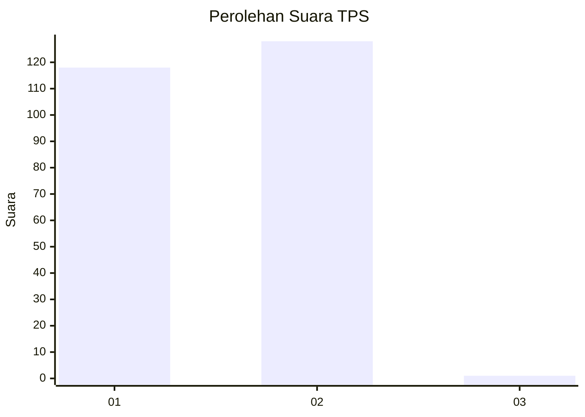
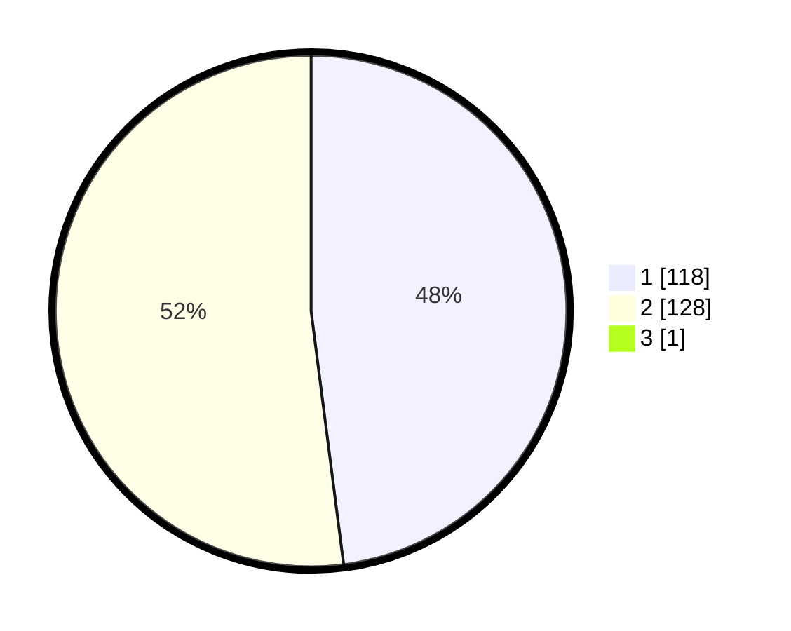

# Hasil

## Grafik

## Tabel

| No. | Nama Paslon    | Suara | Suara (raw) | Persentase |
|:--- |:-------------- | -----:| -----------:| ----------:|
| 1   | ANIES MUHAIMIN | 118   | [118][p-1]  | 47,77      |
| 2   | PRABOWO GIBRAN | 128   | [128][p-2]  | 51,82      |
| 3   | GANJAR MAHFUD  | 1     | [1][p-3]    | 0,40       |

[p-1]: https://github.com/gigit-pemilu/pemilu-2024-11-aceh/blob/main/pilpres/hitung-suara/sub/11-aceh/sub/18-pidie-jaya/sub/05-meurah-dua/sub/2007-meunasah-bie/sub/002-tps/sub/paslon-1.txt
[p-2]: https://github.com/gigit-pemilu/pemilu-2024-11-aceh/blob/main/pilpres/hitung-suara/sub/11-aceh/sub/18-pidie-jaya/sub/05-meurah-dua/sub/2007-meunasah-bie/sub/002-tps/sub/paslon-2.txt
[p-3]: https://github.com/gigit-pemilu/pemilu-2024-11-aceh/blob/main/pilpres/hitung-suara/sub/11-aceh/sub/18-pidie-jaya/sub/05-meurah-dua/sub/2007-meunasah-bie/sub/002-tps/sub/paslon-3.txt

## Foto C Plano

https://sirekap-obj-formc.kpu.go.id/644f/pemilu/ppwp/11/18/05/20/07/1118052007002-20240215-081224--3aa5e29d-608a-44e6-b1de-829b4442666e.jpg

https://sirekap-obj-formc.kpu.go.id/644f/pemilu/ppwp/11/18/05/20/07/1118052007002-20240215-073637--87e06463-d630-4e37-8a70-5ef9969db8ab.jpg

https://sirekap-obj-formc.kpu.go.id/644f/pemilu/ppwp/11/18/05/20/07/1118052007002-20240215-075022--dc938445-e06a-4063-9b71-2d1eed7449ad.jpg

## Metadata

| Key        | Value               |
| ---------- | ------------------- |
| Time Stamp | 2024-02-15 21:30:27 |

