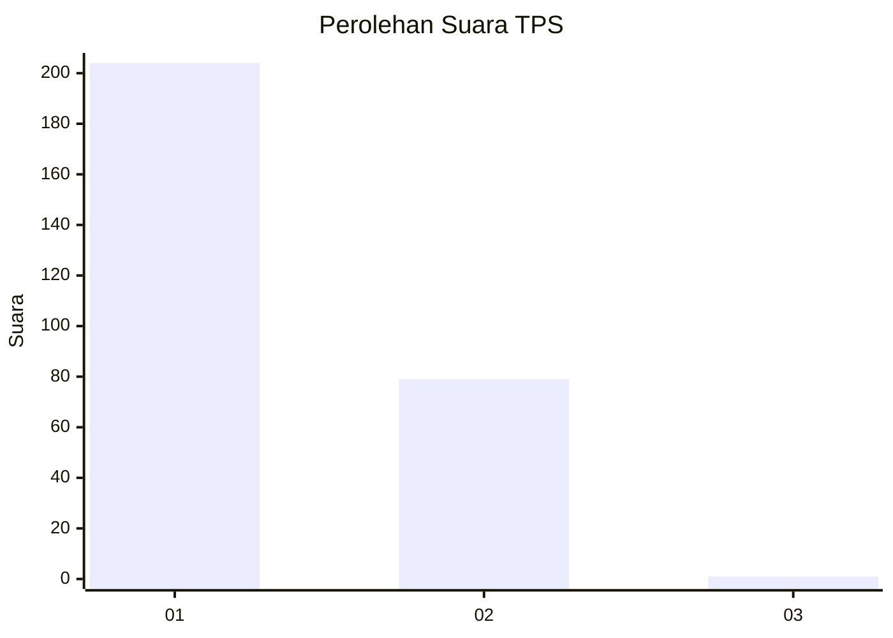
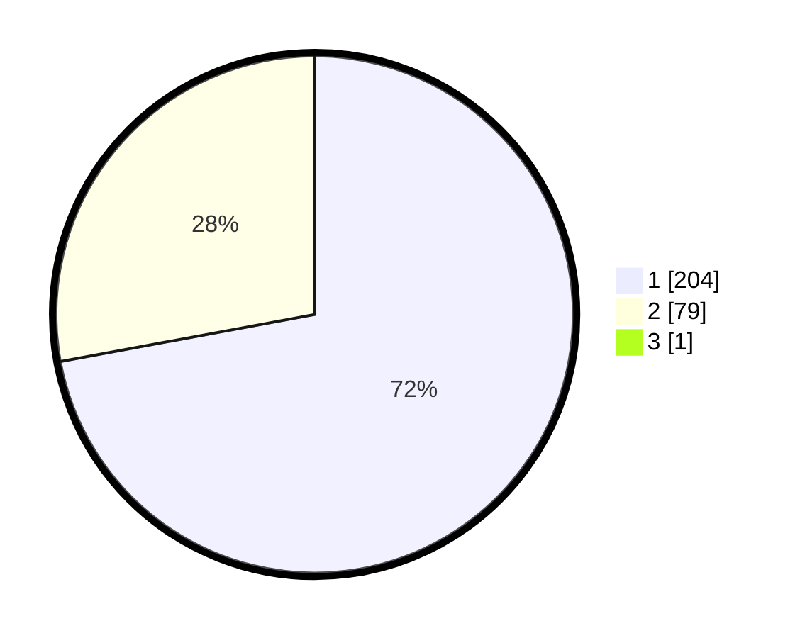

# Hasil

## Grafik

## Tabel

| No. | Nama Paslon    | Suara | Suara (raw) | Persentase |
|:--- |:-------------- | -----:| -----------:| ----------:|
| 1   | ANIES MUHAIMIN | 204   | [204][p-1]  | 71,83      |
| 2   | PRABOWO GIBRAN | 79    | [79][p-2]   | 27,82      |
| 3   | GANJAR MAHFUD  | 1     | [1][p-3]    | 0,35       |

[p-1]: https://github.com/gigit-pemilu/pemilu-2024-11-aceh/blob/main/pilpres/hitung-suara/sub/11-aceh/sub/18-pidie-jaya/sub/05-meurah-dua/sub/2007-meunasah-bie/sub/003-tps/sub/paslon-1.txt
[p-2]: https://github.com/gigit-pemilu/pemilu-2024-11-aceh/blob/main/pilpres/hitung-suara/sub/11-aceh/sub/18-pidie-jaya/sub/05-meurah-dua/sub/2007-meunasah-bie/sub/003-tps/sub/paslon-2.txt
[p-3]: https://github.com/gigit-pemilu/pemilu-2024-11-aceh/blob/main/pilpres/hitung-suara/sub/11-aceh/sub/18-pidie-jaya/sub/05-meurah-dua/sub/2007-meunasah-bie/sub/003-tps/sub/paslon-3.txt

## Foto C Plano

https://sirekap-obj-formc.kpu.go.id/7105/pemilu/ppwp/11/18/05/20/07/1118052007003-20240215-055616--f8ffcbf4-9107-4048-827e-0c1dcc648489.jpg

https://sirekap-obj-formc.kpu.go.id/7105/pemilu/ppwp/11/18/05/20/07/1118052007003-20240215-055756--cb791bb8-7411-46a9-951d-acc7b8e486b8.jpg

https://sirekap-obj-formc.kpu.go.id/7105/pemilu/ppwp/11/18/05/20/07/1118052007003-20240215-162352--84e1c0fe-9819-48d3-a12f-1cff0467db4b.jpg

## Metadata

| Key        | Value               |
| ---------- | ------------------- |
| Time Stamp | 2024-02-15 16:30:25 |

