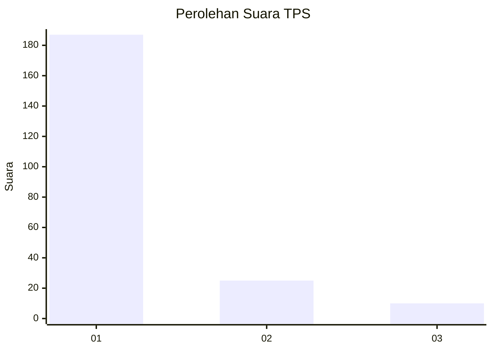
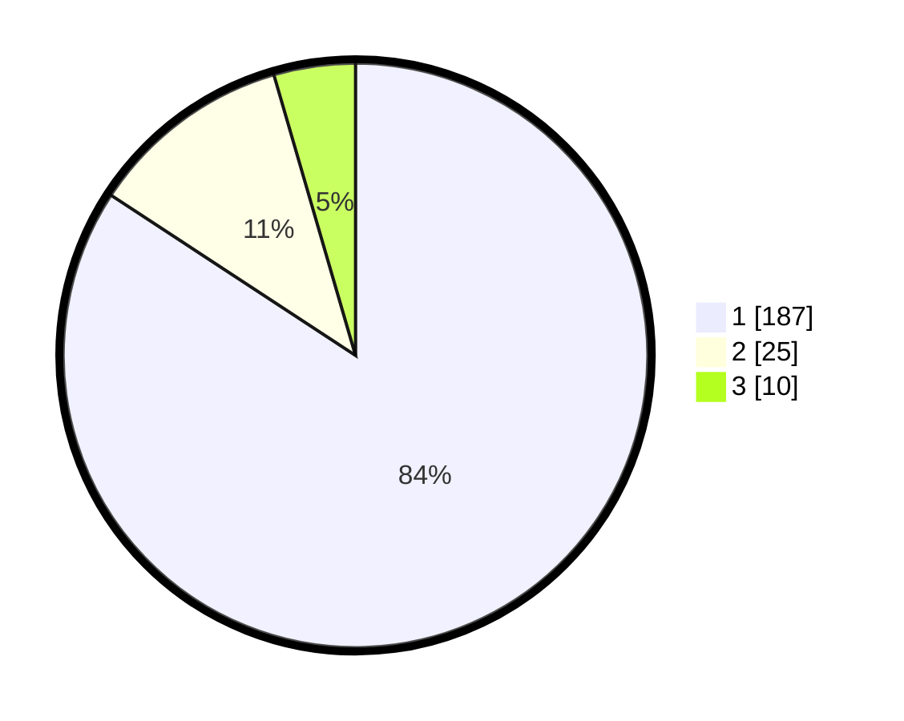

# Hasil

## Grafik

## Tabel

| No. | Nama Paslon    | Suara | Suara (raw) | Persentase |
|:--- |:-------------- | -----:| -----------:| ----------:|
| 1   | ANIES MUHAIMIN | 187   | [187][p-1]  | 84,23      |
| 2   | PRABOWO GIBRAN | 25    | [25][p-2]   | 11,26      |
| 3   | GANJAR MAHFUD  | 10    | [10][p-3]   | 4,50       |

[p-1]: https://github.com/gigit-pemilu/pemilu-2024-11-aceh/blob/main/pilpres/hitung-suara/sub/11-aceh/sub/18-pidie-jaya/sub/05-meurah-dua/sub/2008-meunasah-raya/sub/002-tps/sub/paslon-1.txt
[p-2]: https://github.com/gigit-pemilu/pemilu-2024-11-aceh/blob/main/pilpres/hitung-suara/sub/11-aceh/sub/18-pidie-jaya/sub/05-meurah-dua/sub/2008-meunasah-raya/sub/002-tps/sub/paslon-2.txt
[p-3]: https://github.com/gigit-pemilu/pemilu-2024-11-aceh/blob/main/pilpres/hitung-suara/sub/11-aceh/sub/18-pidie-jaya/sub/05-meurah-dua/sub/2008-meunasah-raya/sub/002-tps/sub/paslon-3.txt

## Foto C Plano

https://sirekap-obj-formc.kpu.go.id/e890/pemilu/ppwp/11/18/05/20/08/1118052008002-20240215-065531--0a260139-8a6f-41d8-b4b3-9b4ffba0226d.jpg

https://sirekap-obj-formc.kpu.go.id/e890/pemilu/ppwp/11/18/05/20/08/1118052008002-20240215-070418--518d90ee-c5af-4402-bca0-02c0f26ea893.jpg

https://sirekap-obj-formc.kpu.go.id/e890/pemilu/ppwp/11/18/05/20/08/1118052008002-20240215-070810--4bd309ca-cb38-411c-904c-3b1a4c21f6ea.jpg

## Metadata

| Key        | Value               |
| ---------- | ------------------- |
| Time Stamp | 2024-02-15 23:29:50 |

