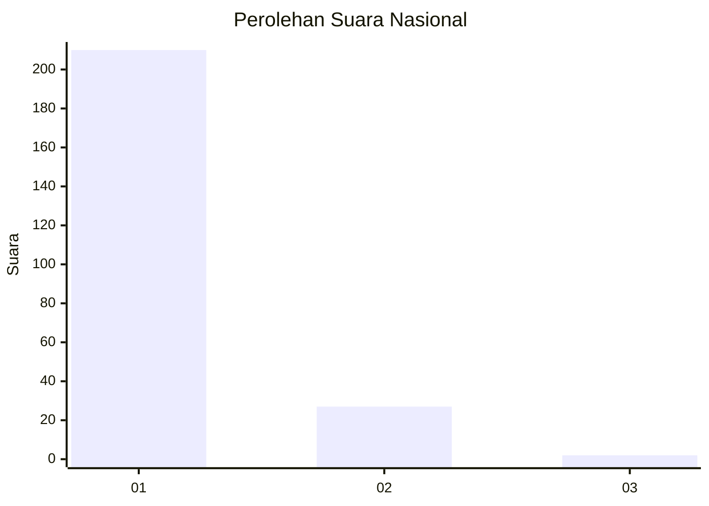
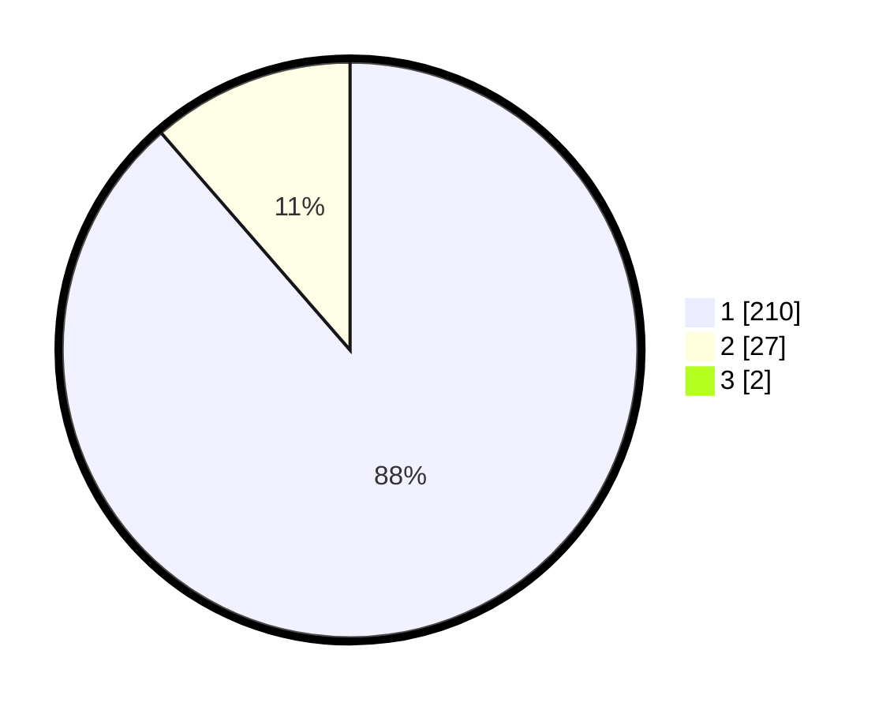

# Hasil

## Grafik

## Tabel

| No. | Nama Paslon    | Suara | Suara (raw) | Persentase |
|:--- |:-------------- | -----:| -----------:| ----------:|
| 1   | ANIES MUHAIMIN | 210   | [210][p-1]  | 87,87      |
| 2   | PRABOWO GIBRAN | 27    | [27][p-2]   | 11,30      |
| 3   | GANJAR MAHFUD  | 2     | [2][p-3]    | 0,84       |

[p-1]: https://github.com/gigit-pemilu/pemilu-2024/blob/main/pilpres/hitung-suara/sub/11-aceh/sub/18-pidie-jaya/sub/05-meurah-dua/sub/2008-meunasah-raya/sub/003-tps/sub/paslon-1.txt
[p-2]: https://github.com/gigit-pemilu/pemilu-2024/blob/main/pilpres/hitung-suara/sub/11-aceh/sub/18-pidie-jaya/sub/05-meurah-dua/sub/2008-meunasah-raya/sub/003-tps/sub/paslon-2.txt
[p-3]: https://github.com/gigit-pemilu/pemilu-2024/blob/main/pilpres/hitung-suara/sub/11-aceh/sub/18-pidie-jaya/sub/05-meurah-dua/sub/2008-meunasah-raya/sub/003-tps/sub/paslon-3.txt

## Foto C Plano

https://sirekap-obj-formc.kpu.go.id/aa3e/pemilu/ppwp/11/18/05/20/08/1118052008003-20240214-235015--e0cc00af-625e-4346-b7a8-80db09493eaf.jpg

https://sirekap-obj-formc.kpu.go.id/aa3e/pemilu/ppwp/11/18/05/20/08/1118052008003-20240214-231931--1203430a-26ff-4644-994c-abc9c457514d.jpg

https://sirekap-obj-formc.kpu.go.id/aa3e/pemilu/ppwp/11/18/05/20/08/1118052008003-20240214-232200--f651e1fc-2744-499a-a418-4ce9b58a5479.jpg

## Metadata

| Key        | Value               |
| ---------- | ------------------- |
| Time Stamp | 2024-02-15 23:29:50 |

