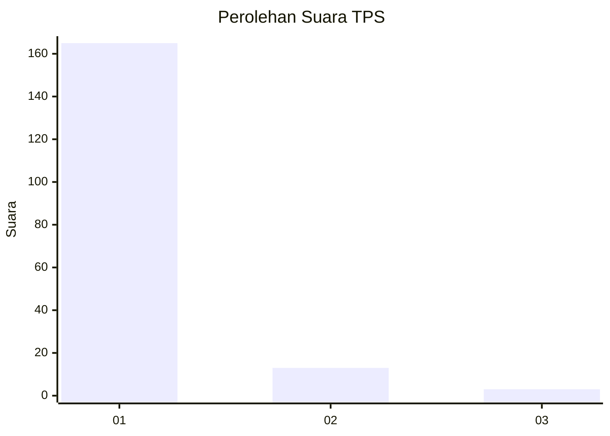
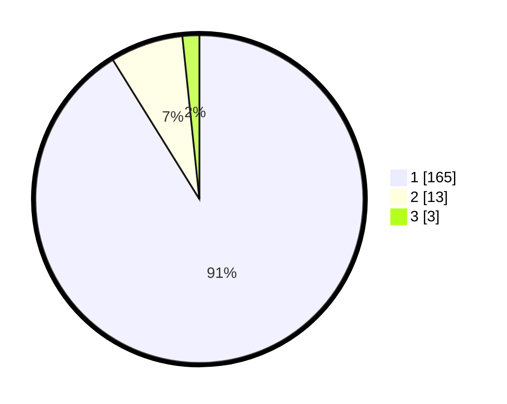

# Hasil

## Grafik

## Tabel

| No. | Nama Paslon    | Suara | Suara (raw) | Persentase |
|:--- |:-------------- | -----:| -----------:| ----------:|
| 1   | ANIES MUHAIMIN | 165   | [165][p-1]  | 91,16      |
| 2   | PRABOWO GIBRAN | 13    | [13][p-2]   | 7,18       |
| 3   | GANJAR MAHFUD  | 3     | [3][p-3]    | 1,66       |

[p-1]: https://github.com/gigit-pemilu/pemilu-2024-11-aceh/blob/main/pilpres/hitung-suara/sub/11-aceh/sub/18-pidie-jaya/sub/05-meurah-dua/sub/2011-blang-cut/sub/002-tps/sub/paslon-1.txt
[p-2]: https://github.com/gigit-pemilu/pemilu-2024-11-aceh/blob/main/pilpres/hitung-suara/sub/11-aceh/sub/18-pidie-jaya/sub/05-meurah-dua/sub/2011-blang-cut/sub/002-tps/sub/paslon-2.txt
[p-3]: https://github.com/gigit-pemilu/pemilu-2024-11-aceh/blob/main/pilpres/hitung-suara/sub/11-aceh/sub/18-pidie-jaya/sub/05-meurah-dua/sub/2011-blang-cut/sub/002-tps/sub/paslon-3.txt

## Foto C Plano

https://sirekap-obj-formc.kpu.go.id/7f49/pemilu/ppwp/11/18/05/20/11/1118052011002-20240215-083348--41f6a932-fe31-4a3c-81f3-b7e4c8713252.jpg

https://sirekap-obj-formc.kpu.go.id/7f49/pemilu/ppwp/11/18/05/20/11/1118052011002-20240215-083617--e5c673e1-ec64-4d3d-9145-4b97144b53f5.jpg

https://sirekap-obj-formc.kpu.go.id/7f49/pemilu/ppwp/11/18/05/20/11/1118052011002-20240215-083820--13911229-061a-41da-a72f-7f8e88613b08.jpg

## Metadata

| Key        | Value               |
| ---------- | ------------------- |
| Time Stamp | 2024-02-15 23:29:50 |

