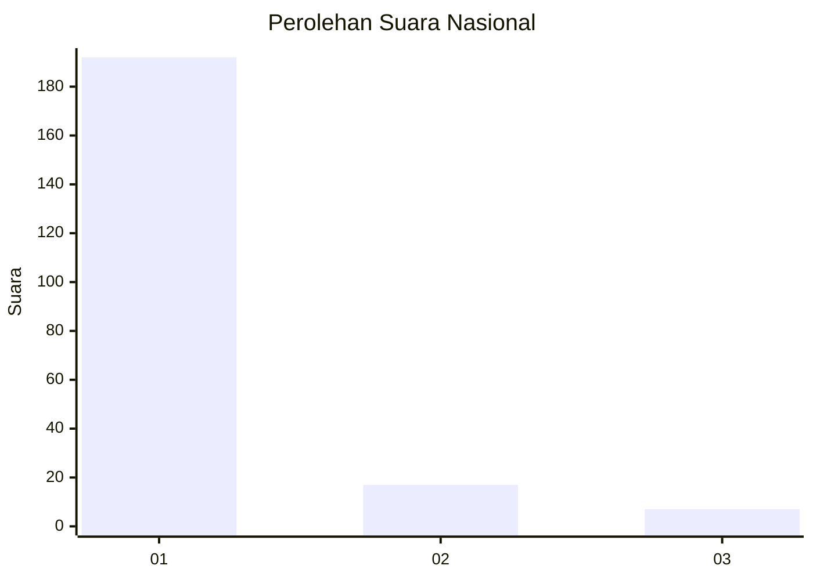
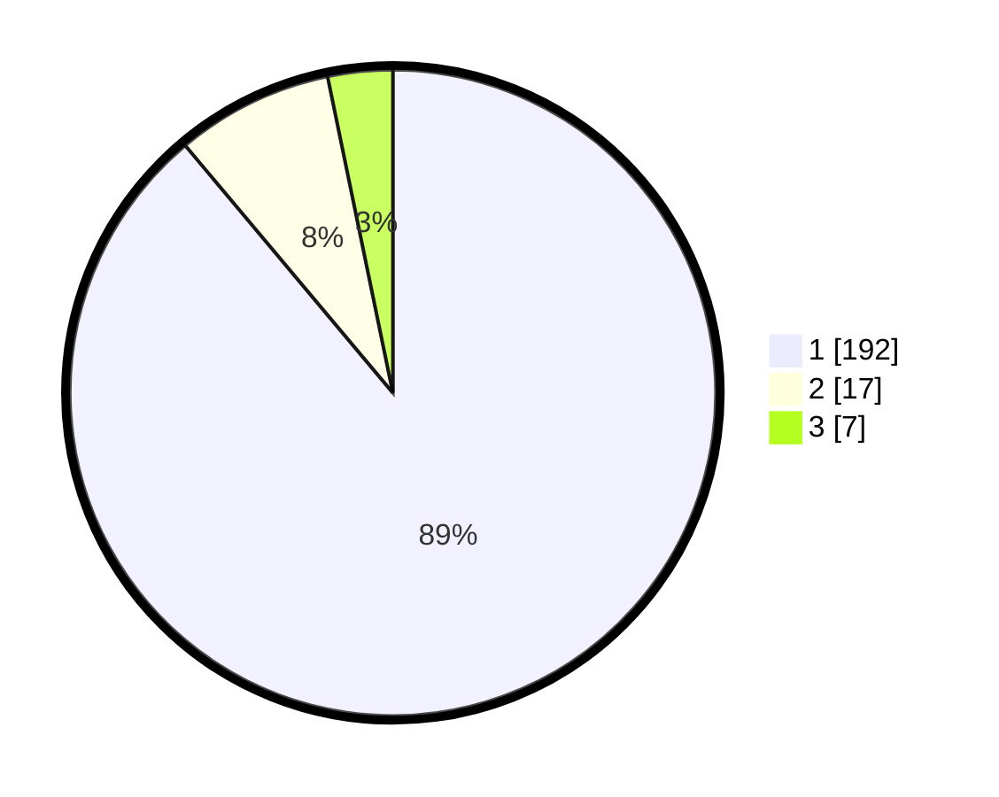

# Hasil

## Grafik

## Tabel

| No. | Nama Paslon    | Suara | Suara (raw) | Persentase |
|:--- |:-------------- | -----:| -----------:| ----------:|
| 1   | ANIES MUHAIMIN | 192   | [192][p-1]  | 88,89      |
| 2   | PRABOWO GIBRAN | 17    | [17][p-2]   | 7,87       |
| 3   | GANJAR MAHFUD  | 7     | [7][p-3]    | 3,24       |

[p-1]: https://github.com/gigit-pemilu/pemilu-2024/blob/main/pilpres/hitung-suara/sub/11-aceh/sub/18-pidie-jaya/sub/05-meurah-dua/sub/2014-dayah-usen/sub/001-tps/sub/paslon-1.txt
[p-2]: https://github.com/gigit-pemilu/pemilu-2024/blob/main/pilpres/hitung-suara/sub/11-aceh/sub/18-pidie-jaya/sub/05-meurah-dua/sub/2014-dayah-usen/sub/001-tps/sub/paslon-2.txt
[p-3]: https://github.com/gigit-pemilu/pemilu-2024/blob/main/pilpres/hitung-suara/sub/11-aceh/sub/18-pidie-jaya/sub/05-meurah-dua/sub/2014-dayah-usen/sub/001-tps/sub/paslon-3.txt

## Foto C Plano

https://sirekap-obj-formc.kpu.go.id/5f9f/pemilu/ppwp/11/18/05/20/14/1118052014001-20240215-065111--9f104af7-ab11-464f-9e5b-26d91e1c8084.jpg

https://sirekap-obj-formc.kpu.go.id/5f9f/pemilu/ppwp/11/18/05/20/14/1118052014001-20240215-065215--90a7bb79-f5f2-4fa5-8e6d-5be6aa1428eb.jpg

https://sirekap-obj-formc.kpu.go.id/5f9f/pemilu/ppwp/11/18/05/20/14/1118052014001-20240215-065257--177e7569-a377-42de-8b66-ce12f4f7dba8.jpg

## Metadata

| Key        | Value               |
| ---------- | ------------------- |
| Time Stamp | 2024-02-15 23:29:50 |

