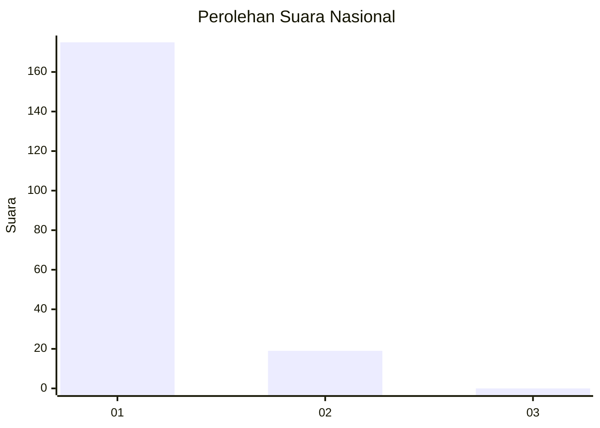
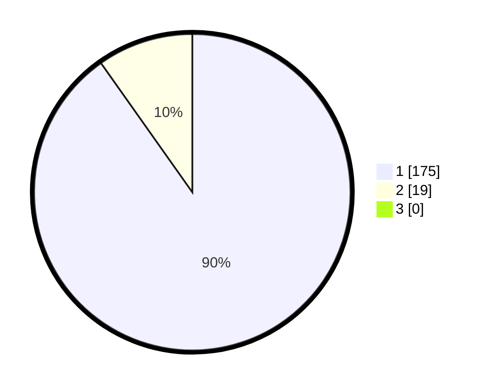

# Hasil

## Grafik

## Tabel

| No. | Nama Paslon    | Suara | Suara (raw) | Persentase |
|:--- |:-------------- | -----:| -----------:| ----------:|
| 1   | ANIES MUHAIMIN | 175   | [175][p-1]  | 90,21      |
| 2   | PRABOWO GIBRAN | 19    | [19][p-2]   | 9,79       |
| 3   | GANJAR MAHFUD  | 0     | [0][p-3]    | 0,00       |

[p-1]: https://github.com/gigit-pemilu/pemilu-2024/blob/main/pilpres/hitung-suara/sub/11-aceh/sub/18-pidie-jaya/sub/05-meurah-dua/sub/2016-beuringen/sub/002-tps/sub/paslon-1.txt
[p-2]: https://github.com/gigit-pemilu/pemilu-2024/blob/main/pilpres/hitung-suara/sub/11-aceh/sub/18-pidie-jaya/sub/05-meurah-dua/sub/2016-beuringen/sub/002-tps/sub/paslon-2.txt
[p-3]: https://github.com/gigit-pemilu/pemilu-2024/blob/main/pilpres/hitung-suara/sub/11-aceh/sub/18-pidie-jaya/sub/05-meurah-dua/sub/2016-beuringen/sub/002-tps/sub/paslon-3.txt

## Foto C Plano

https://sirekap-obj-formc.kpu.go.id/5dad/pemilu/ppwp/11/18/05/20/16/1118052016002-20240215-080614--cf6855a2-e479-4d37-b7ae-8b9b01506332.jpg

https://sirekap-obj-formc.kpu.go.id/5dad/pemilu/ppwp/11/18/05/20/16/1118052016002-20240215-080738--0f21a863-6067-4940-9668-ecfdb497df8d.jpg

https://sirekap-obj-formc.kpu.go.id/5dad/pemilu/ppwp/11/18/05/20/16/1118052016002-20240215-080912--2ed1790d-5f74-4b2b-8cfb-ef31291e6a66.jpg

## Metadata

| Key        | Value               |
| ---------- | ------------------- |
| Time Stamp | 2024-02-15 23:29:50 |

