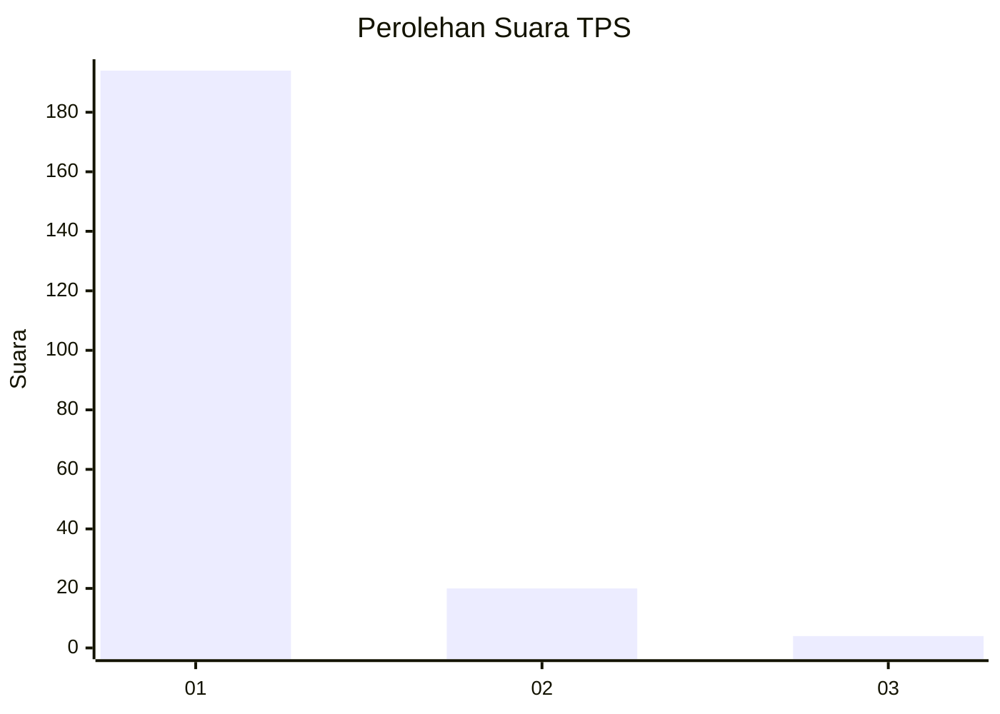
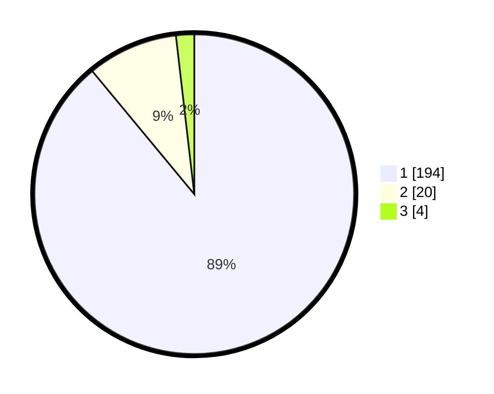

# Hasil

## Grafik

## Tabel

| No. | Nama Paslon    | Suara | Suara (raw) | Persentase |
|:--- |:-------------- | -----:| -----------:| ----------:|
| 1   | ANIES MUHAIMIN | 194   | [194][p-1]  | 88,99      |
| 2   | PRABOWO GIBRAN | 20    | [20][p-2]   | 9,17       |
| 3   | GANJAR MAHFUD  | 4     | [4][p-3]    | 1,83       |

[p-1]: https://github.com/gigit-pemilu/pemilu-2024-11-aceh/blob/main/pilpres/hitung-suara/sub/11-aceh/sub/18-pidie-jaya/sub/05-meurah-dua/sub/2016-beuringen/sub/003-tps/sub/paslon-1.txt
[p-2]: https://github.com/gigit-pemilu/pemilu-2024-11-aceh/blob/main/pilpres/hitung-suara/sub/11-aceh/sub/18-pidie-jaya/sub/05-meurah-dua/sub/2016-beuringen/sub/003-tps/sub/paslon-2.txt
[p-3]: https://github.com/gigit-pemilu/pemilu-2024-11-aceh/blob/main/pilpres/hitung-suara/sub/11-aceh/sub/18-pidie-jaya/sub/05-meurah-dua/sub/2016-beuringen/sub/003-tps/sub/paslon-3.txt

## Foto C Plano

https://sirekap-obj-formc.kpu.go.id/c629/pemilu/ppwp/11/18/05/20/16/1118052016003-20240215-082613--922d3b47-1522-48b1-a80f-0af35081e9a5.jpg

https://sirekap-obj-formc.kpu.go.id/c629/pemilu/ppwp/11/18/05/20/16/1118052016003-20240215-083006--44458145-fcd8-4928-b87a-7b281f0d87b5.jpg

https://sirekap-obj-formc.kpu.go.id/c629/pemilu/ppwp/11/18/05/20/16/1118052016003-20240215-083155--e1198b8c-e86c-4d76-8e71-a1e01915b03b.jpg

## Metadata

| Key        | Value               |
| ---------- | ------------------- |
| Time Stamp | 2024-02-15 23:29:50 |

