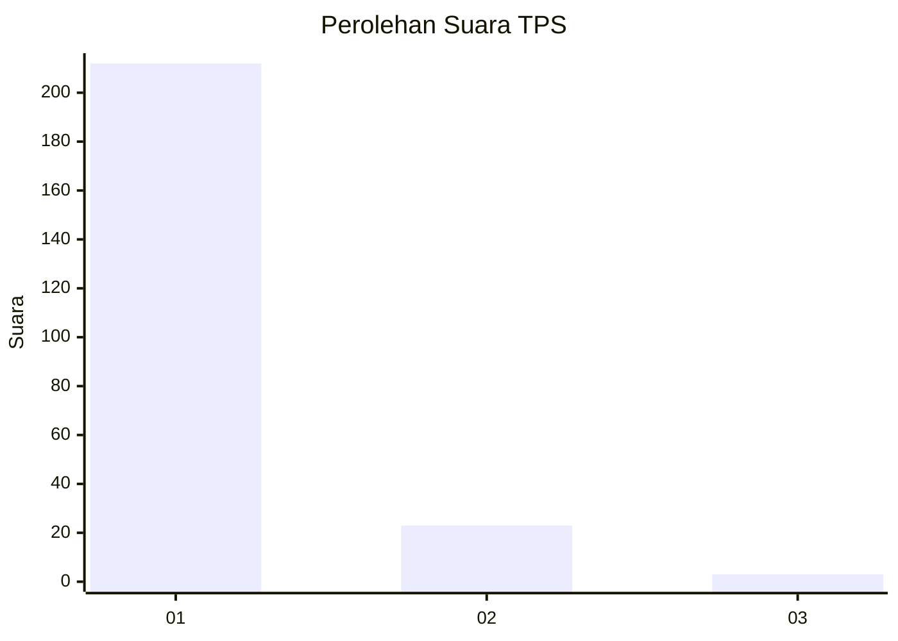
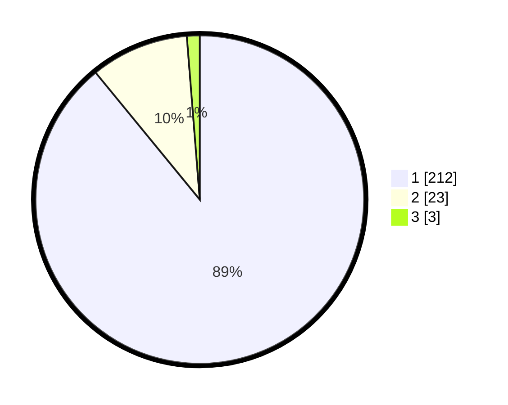

# Hasil

## Grafik

## Tabel

| No. | Nama Paslon    | Suara | Suara (raw) | Persentase |
|:--- |:-------------- | -----:| -----------:| ----------:|
| 1   | ANIES MUHAIMIN | 212   | [212][p-1]  | 89,08      |
| 2   | PRABOWO GIBRAN | 23    | [23][p-2]   | 9,66       |
| 3   | GANJAR MAHFUD  | 3     | [3][p-3]    | 1,26       |

[p-1]: https://github.com/gigit-pemilu/pemilu-2024-11-aceh/blob/main/pilpres/hitung-suara/sub/11-aceh/sub/18-pidie-jaya/sub/05-meurah-dua/sub/2017-buangan/sub/001-tps/sub/paslon-1.txt
[p-2]: https://github.com/gigit-pemilu/pemilu-2024-11-aceh/blob/main/pilpres/hitung-suara/sub/11-aceh/sub/18-pidie-jaya/sub/05-meurah-dua/sub/2017-buangan/sub/001-tps/sub/paslon-2.txt
[p-3]: https://github.com/gigit-pemilu/pemilu-2024-11-aceh/blob/main/pilpres/hitung-suara/sub/11-aceh/sub/18-pidie-jaya/sub/05-meurah-dua/sub/2017-buangan/sub/001-tps/sub/paslon-3.txt

## Foto C Plano

https://sirekap-obj-formc.kpu.go.id/d962/pemilu/ppwp/11/18/05/20/17/1118052017001-20240215-092136--812ea017-c890-494f-9891-d21c81771e28.jpg

https://sirekap-obj-formc.kpu.go.id/d962/pemilu/ppwp/11/18/05/20/17/1118052017001-20240215-092529--3e2e8c95-b239-4da4-9dd5-699d9d94ea22.jpg

https://sirekap-obj-formc.kpu.go.id/d962/pemilu/ppwp/11/18/05/20/17/1118052017001-20240215-095938--814f4a9d-7a5c-422a-9bf0-288102a6eaa4.jpg

## Metadata

| Key        | Value               |
| ---------- | ------------------- |
| Time Stamp | 2024-02-15 23:29:50 |

