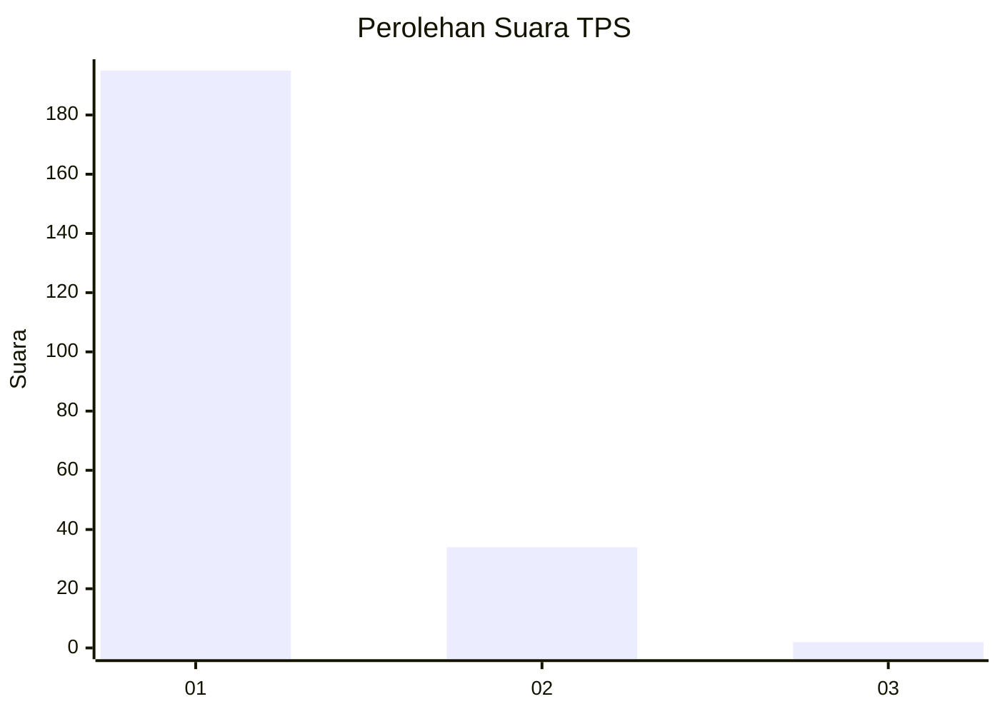
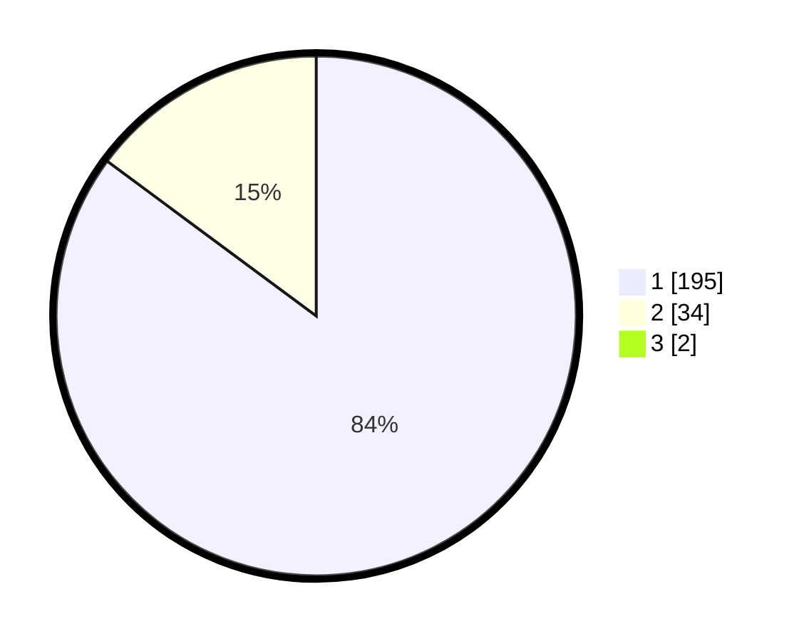

# Hasil

## Grafik

## Tabel

| No. | Nama Paslon    | Suara | Suara (raw) | Persentase |
|:--- |:-------------- | -----:| -----------:| ----------:|
| 1   | ANIES MUHAIMIN | 195   | [195][p-1]  | 84,42      |
| 2   | PRABOWO GIBRAN | 34    | [34][p-2]   | 14,72      |
| 3   | GANJAR MAHFUD  | 2     | [2][p-3]    | 0,87       |

[p-1]: https://github.com/gigit-pemilu/pemilu-2024-11-aceh/blob/main/pilpres/hitung-suara/sub/11-aceh/sub/18-pidie-jaya/sub/05-meurah-dua/sub/2017-buangan/sub/002-tps/sub/paslon-1.txt
[p-2]: https://github.com/gigit-pemilu/pemilu-2024-11-aceh/blob/main/pilpres/hitung-suara/sub/11-aceh/sub/18-pidie-jaya/sub/05-meurah-dua/sub/2017-buangan/sub/002-tps/sub/paslon-2.txt
[p-3]: https://github.com/gigit-pemilu/pemilu-2024-11-aceh/blob/main/pilpres/hitung-suara/sub/11-aceh/sub/18-pidie-jaya/sub/05-meurah-dua/sub/2017-buangan/sub/002-tps/sub/paslon-3.txt

## Foto C Plano

https://sirekap-obj-formc.kpu.go.id/ea7e/pemilu/ppwp/11/18/05/20/17/1118052017002-20240215-093714--742b7d95-0921-46a2-9de0-5177e57508e6.jpg

https://sirekap-obj-formc.kpu.go.id/ea7e/pemilu/ppwp/11/18/05/20/17/1118052017002-20240215-094102--b86ed8f2-d9c5-4a35-ac6e-a828574ea72c.jpg

https://sirekap-obj-formc.kpu.go.id/ea7e/pemilu/ppwp/11/18/05/20/17/1118052017002-20240215-094458--9748c62b-86a0-46ae-b0ef-04337367a2cb.jpg

## Metadata

| Key        | Value               |
| ---------- | ------------------- |
| Time Stamp | 2024-02-15 23:29:50 |

