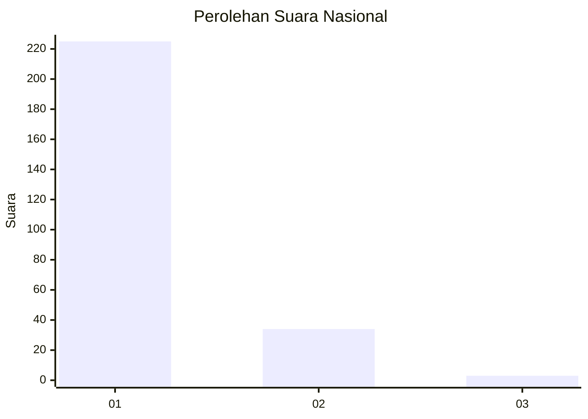
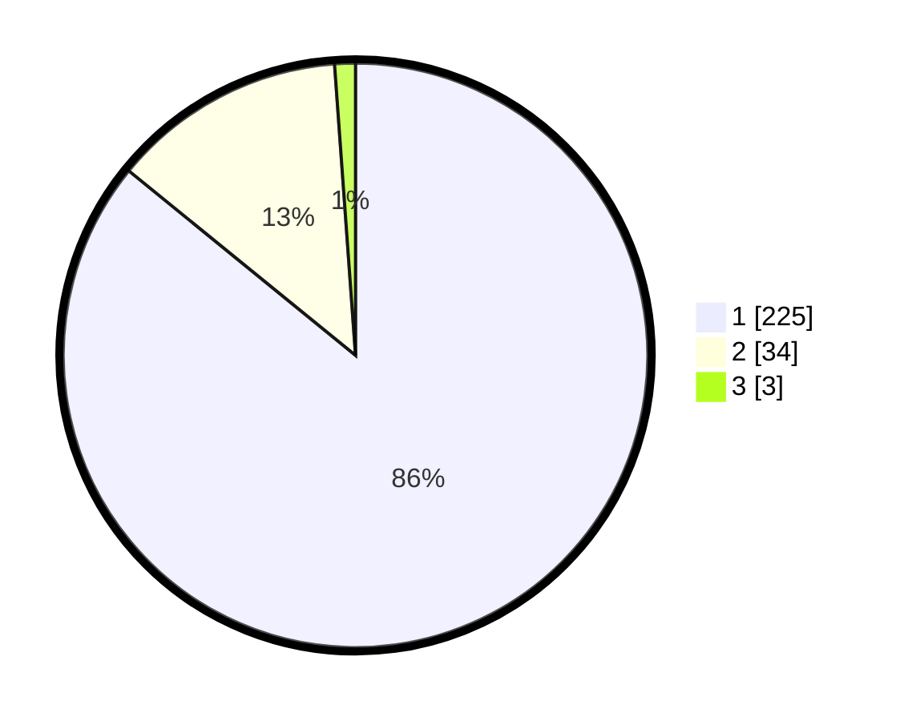

# Hasil

## Grafik

## Tabel

| No. | Nama Paslon    | Suara | Suara (raw) | Persentase |
|:--- |:-------------- | -----:| -----------:| ----------:|
| 1   | ANIES MUHAIMIN | 225   | [225][p-1]  | 85,88      |
| 2   | PRABOWO GIBRAN | 34    | [34][p-2]   | 12,98      |
| 3   | GANJAR MAHFUD  | 3     | [3][p-3]    | 1,15       |

[p-1]: https://github.com/gigit-pemilu/pemilu-2024/blob/main/pilpres/hitung-suara/sub/11-aceh/sub/18-pidie-jaya/sub/05-meurah-dua/sub/2018-meunasah-jurong/sub/003-tps/sub/paslon-1.txt
[p-2]: https://github.com/gigit-pemilu/pemilu-2024/blob/main/pilpres/hitung-suara/sub/11-aceh/sub/18-pidie-jaya/sub/05-meurah-dua/sub/2018-meunasah-jurong/sub/003-tps/sub/paslon-2.txt
[p-3]: https://github.com/gigit-pemilu/pemilu-2024/blob/main/pilpres/hitung-suara/sub/11-aceh/sub/18-pidie-jaya/sub/05-meurah-dua/sub/2018-meunasah-jurong/sub/003-tps/sub/paslon-3.txt

## Foto C Plano

https://sirekap-obj-formc.kpu.go.id/8615/pemilu/ppwp/11/18/05/20/18/1118052018003-20240215-134225--f1e6a84d-86cb-4080-b200-48c39057f5d3.jpg

https://sirekap-obj-formc.kpu.go.id/8615/pemilu/ppwp/11/18/05/20/18/1118052018003-20240215-134539--bdcb91f8-d4b0-4f66-8b3f-1005a9e66f7c.jpg

https://sirekap-obj-formc.kpu.go.id/8615/pemilu/ppwp/11/18/05/20/18/1118052018003-20240215-134722--591a2afa-5cda-4206-a16a-5ec40dd477cd.jpg

## Metadata

| Key        | Value               |
| ---------- | ------------------- |
| Time Stamp | 2024-02-15 22:40:13 |

