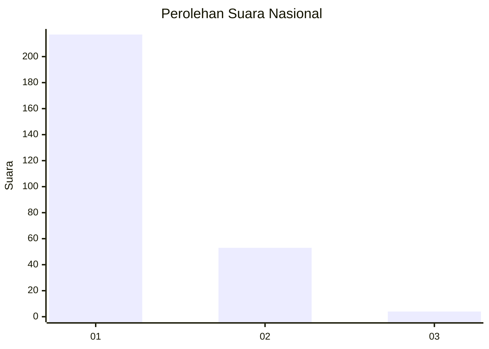
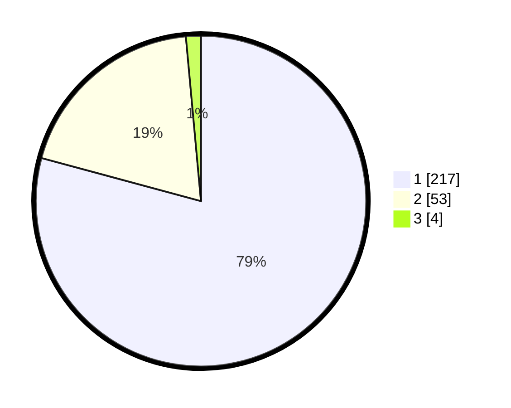

# Hasil

## Grafik

## Tabel

| No. | Nama Paslon    | Suara | Suara (raw) | Persentase |
|:--- |:-------------- | -----:| -----------:| ----------:|
| 1   | ANIES MUHAIMIN | 217   | [217][p-1]  | 79,20      |
| 2   | PRABOWO GIBRAN | 53    | [53][p-2]   | 19,34      |
| 3   | GANJAR MAHFUD  | 4     | [4][p-3]    | 1,46       |

[p-1]: https://github.com/gigit-pemilu/pemilu-2024/blob/main/pilpres/hitung-suara/sub/11-aceh/sub/18-pidie-jaya/sub/05-meurah-dua/sub/2019-pante-beureune/sub/001-tps/sub/paslon-1.txt
[p-2]: https://github.com/gigit-pemilu/pemilu-2024/blob/main/pilpres/hitung-suara/sub/11-aceh/sub/18-pidie-jaya/sub/05-meurah-dua/sub/2019-pante-beureune/sub/001-tps/sub/paslon-2.txt
[p-3]: https://github.com/gigit-pemilu/pemilu-2024/blob/main/pilpres/hitung-suara/sub/11-aceh/sub/18-pidie-jaya/sub/05-meurah-dua/sub/2019-pante-beureune/sub/001-tps/sub/paslon-3.txt

## Foto C Plano

https://sirekap-obj-formc.kpu.go.id/997e/pemilu/ppwp/11/18/05/20/19/1118052019001-20240215-045934--b8d050be-ecf2-45d0-b9a1-68185663e1f2.jpg

https://sirekap-obj-formc.kpu.go.id/997e/pemilu/ppwp/11/18/05/20/19/1118052019001-20240214-220203--bcd71bd1-aec1-499d-a216-690f23a0ec6a.jpg

https://sirekap-obj-formc.kpu.go.id/997e/pemilu/ppwp/11/18/05/20/19/1118052019001-20240214-220730--4f6973ba-1c67-4a5d-8197-38bcb8030584.jpg

## Metadata

| Key        | Value               |
| ---------- | ------------------- |
| Time Stamp | 2024-02-15 15:30:25 |

