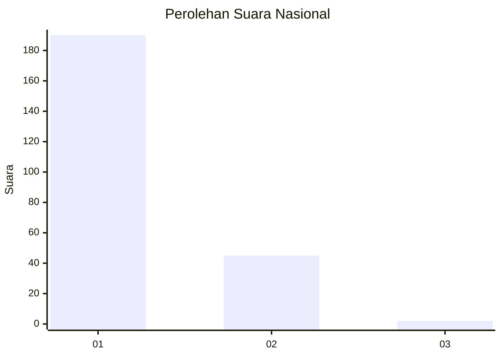
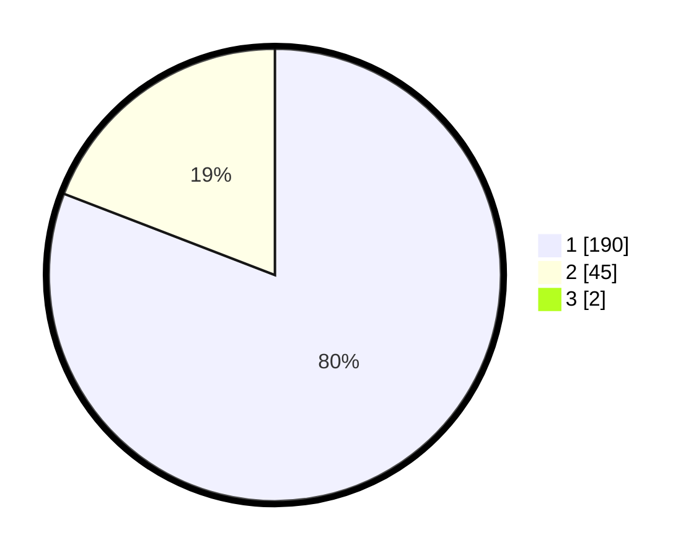

# Hasil

## Grafik

## Tabel

| No. | Nama Paslon    | Suara | Suara (raw) | Persentase |
|:--- |:-------------- | -----:| -----------:| ----------:|
| 1   | ANIES MUHAIMIN | 190   | [190][p-1]  | 80,17      |
| 2   | PRABOWO GIBRAN | 45    | [45][p-2]   | 18,99      |
| 3   | GANJAR MAHFUD  | 2     | [2][p-3]    | 0,84       |

[p-1]: https://github.com/gigit-pemilu/pemilu-2024/blob/main/pilpres/hitung-suara/sub/11-aceh/sub/18-pidie-jaya/sub/06-bandar-baru/sub/2005-dayah-nyong/sub/001-tps/sub/paslon-1.txt
[p-2]: https://github.com/gigit-pemilu/pemilu-2024/blob/main/pilpres/hitung-suara/sub/11-aceh/sub/18-pidie-jaya/sub/06-bandar-baru/sub/2005-dayah-nyong/sub/001-tps/sub/paslon-2.txt
[p-3]: https://github.com/gigit-pemilu/pemilu-2024/blob/main/pilpres/hitung-suara/sub/11-aceh/sub/18-pidie-jaya/sub/06-bandar-baru/sub/2005-dayah-nyong/sub/001-tps/sub/paslon-3.txt

## Foto C Plano

https://sirekap-obj-formc.kpu.go.id/cd98/pemilu/ppwp/11/18/06/20/05/1118062005001-20240215-104728--c20db72b-f7dc-4b10-a7f0-706c028c92e2.jpg

https://sirekap-obj-formc.kpu.go.id/cd98/pemilu/ppwp/11/18/06/20/05/1118062005001-20240215-110323--0a736d78-3b80-4795-bf61-d0fcf438f311.jpg

https://sirekap-obj-formc.kpu.go.id/cd98/pemilu/ppwp/11/18/06/20/05/1118062005001-20240215-110439--ce74878d-4d53-4cd7-99bb-8f984c85d3e4.jpg

## Metadata

| Key        | Value               |
| ---------- | ------------------- |
| Time Stamp | 2024-02-19 06:16:00 |

