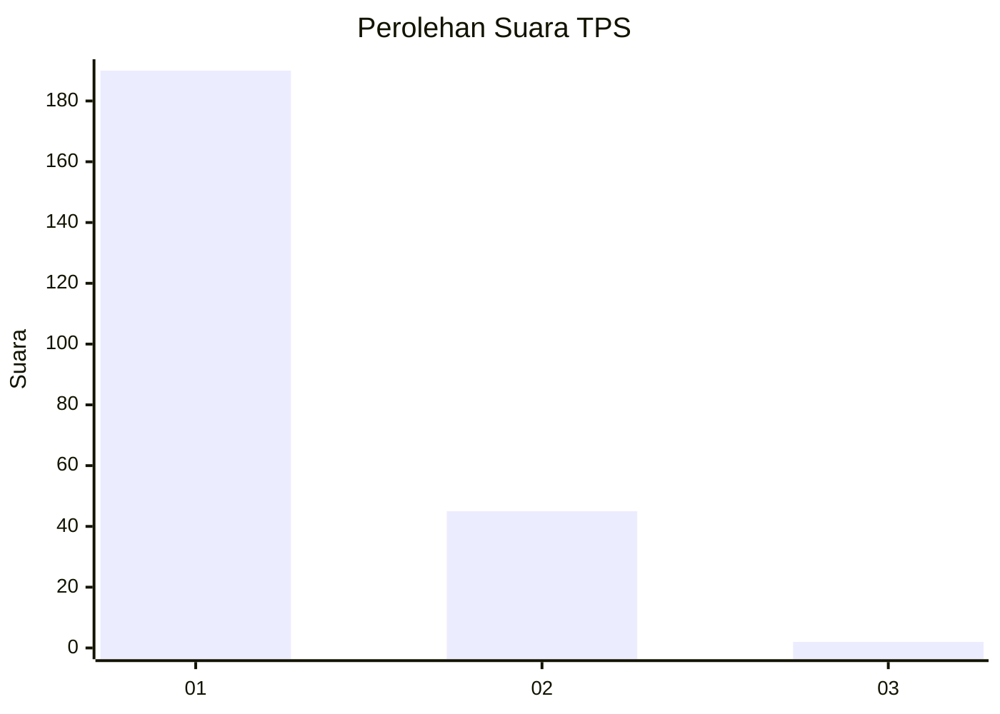
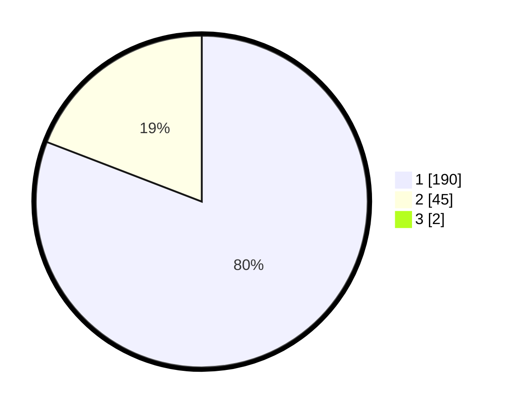

# Hasil

## Grafik

## Tabel

| No. | Nama Paslon    | Suara | Suara (raw) | Persentase |
|:--- |:-------------- | -----:| -----------:| ----------:|
| 1   | ANIES MUHAIMIN | 190   | [190][p-1]  | 80,17      |
| 2   | PRABOWO GIBRAN | 45    | [45][p-2]   | 18,99      |
| 3   | GANJAR MAHFUD  | 2     | [2][p-3]    | 0,84       |

[p-1]: https://github.com/gigit-pemilu/pemilu-2024-11-aceh/blob/main/pilpres/hitung-suara/sub/11-aceh/sub/18-pidie-jaya/sub/06-bandar-baru/sub/2005-dayah-nyong/sub/002-tps/sub/paslon-1.txt
[p-2]: https://github.com/gigit-pemilu/pemilu-2024-11-aceh/blob/main/pilpres/hitung-suara/sub/11-aceh/sub/18-pidie-jaya/sub/06-bandar-baru/sub/2005-dayah-nyong/sub/002-tps/sub/paslon-2.txt
[p-3]: https://github.com/gigit-pemilu/pemilu-2024-11-aceh/blob/main/pilpres/hitung-suara/sub/11-aceh/sub/18-pidie-jaya/sub/06-bandar-baru/sub/2005-dayah-nyong/sub/002-tps/sub/paslon-3.txt

## Foto C Plano

https://sirekap-obj-formc.kpu.go.id/8a2f/pemilu/ppwp/11/18/06/20/05/1118062005002-20240215-120220--b889dc45-4551-4e1b-9c46-ffb9f423192c.jpg

https://sirekap-obj-formc.kpu.go.id/8a2f/pemilu/ppwp/11/18/06/20/05/1118062005002-20240215-105559--4dd99962-d8ac-4cb2-9f52-400ecec3ff9f.jpg

https://sirekap-obj-formc.kpu.go.id/8a2f/pemilu/ppwp/11/18/06/20/05/1118062005002-20240215-120437--cb7c1864-74f4-4194-b192-d77107e0c9c4.jpg

## Metadata

| Key        | Value               |
| ---------- | ------------------- |
| Time Stamp | 2024-02-21 12:00:00 |

