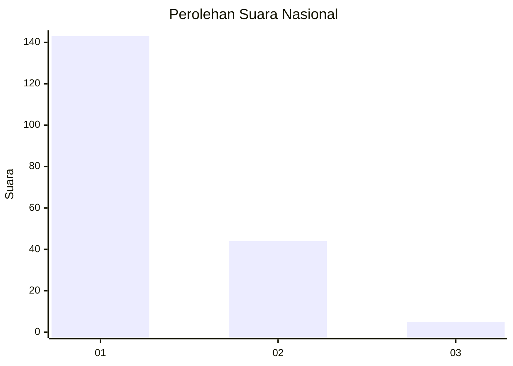
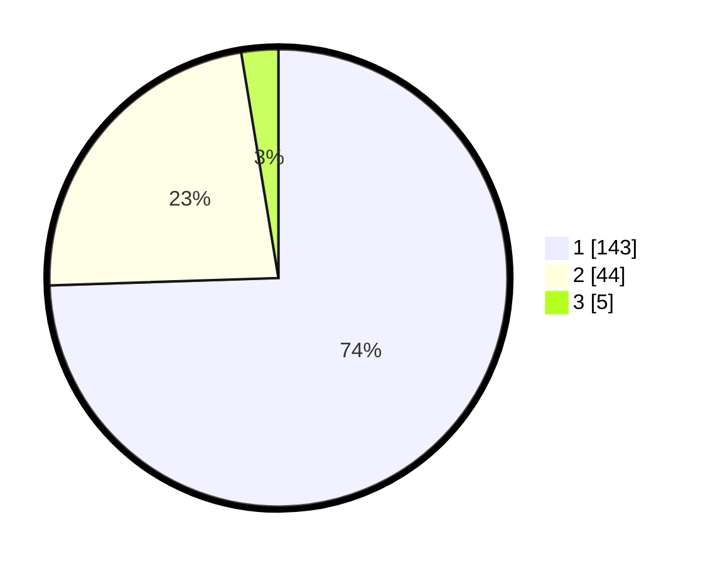

# Hasil

## Grafik

## Tabel

| No. | Nama Paslon    | Suara | Suara (raw) | Persentase |
|:--- |:-------------- | -----:| -----------:| ----------:|
| 1   | ANIES MUHAIMIN | 143   | [143][p-1]  | 74,48      |
| 2   | PRABOWO GIBRAN | 44    | [44][p-2]   | 22,92      |
| 3   | GANJAR MAHFUD  | 5     | [5][p-3]    | 2,60       |

[p-1]: https://github.com/gigit-pemilu/pemilu-2024/blob/main/pilpres/hitung-suara/sub/11-aceh/sub/18-pidie-jaya/sub/06-bandar-baru/sub/2012-keude-lueng-putu/sub/001-tps/sub/paslon-1.txt
[p-2]: https://github.com/gigit-pemilu/pemilu-2024/blob/main/pilpres/hitung-suara/sub/11-aceh/sub/18-pidie-jaya/sub/06-bandar-baru/sub/2012-keude-lueng-putu/sub/001-tps/sub/paslon-2.txt
[p-3]: https://github.com/gigit-pemilu/pemilu-2024/blob/main/pilpres/hitung-suara/sub/11-aceh/sub/18-pidie-jaya/sub/06-bandar-baru/sub/2012-keude-lueng-putu/sub/001-tps/sub/paslon-3.txt

## Foto C Plano

https://sirekap-obj-formc.kpu.go.id/be11/pemilu/ppwp/11/18/06/20/12/1118062012001-20240215-080727--ed030462-5e14-4431-b158-49a18f3a5b15.jpg

https://sirekap-obj-formc.kpu.go.id/be11/pemilu/ppwp/11/18/06/20/12/1118062012001-20240215-080923--6d0c92c5-6604-416f-9c43-697f23aebe2e.jpg

https://sirekap-obj-formc.kpu.go.id/be11/pemilu/ppwp/11/18/06/20/12/1118062012001-20240215-081116--a357fbba-011a-4c82-84f2-3d4620a712cd.jpg

## Metadata

| Key        | Value               |
| ---------- | ------------------- |
| Time Stamp | 2024-02-15 21:30:27 |

