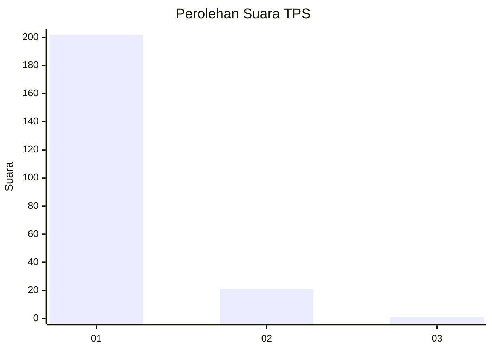
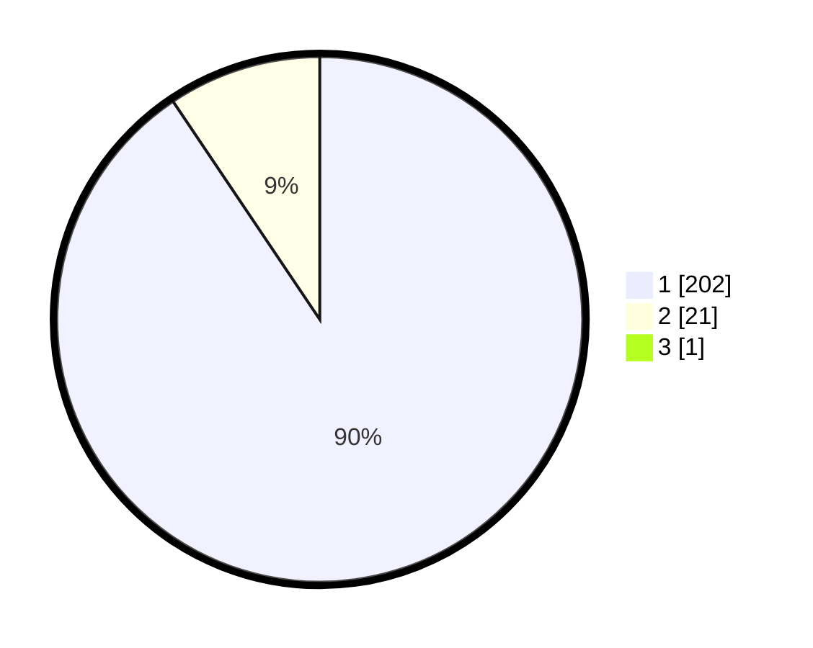

# Hasil

## Grafik

## Tabel

| No. | Nama Paslon    | Suara | Suara (raw) | Persentase |
|:--- |:-------------- | -----:| -----------:| ----------:|
| 1   | ANIES MUHAIMIN | 202   | [202][p-1]  | 90,18      |
| 2   | PRABOWO GIBRAN | 21    | [21][p-2]   | 9,38       |
| 3   | GANJAR MAHFUD  | 1     | [1][p-3]    | 0,45       |

[p-1]: https://github.com/gigit-pemilu/pemilu-2024-11-aceh/blob/main/pilpres/hitung-suara/sub/11-aceh/sub/18-pidie-jaya/sub/06-bandar-baru/sub/2012-keude-lueng-putu/sub/002-tps/sub/paslon-1.txt
[p-2]: https://github.com/gigit-pemilu/pemilu-2024-11-aceh/blob/main/pilpres/hitung-suara/sub/11-aceh/sub/18-pidie-jaya/sub/06-bandar-baru/sub/2012-keude-lueng-putu/sub/002-tps/sub/paslon-2.txt
[p-3]: https://github.com/gigit-pemilu/pemilu-2024-11-aceh/blob/main/pilpres/hitung-suara/sub/11-aceh/sub/18-pidie-jaya/sub/06-bandar-baru/sub/2012-keude-lueng-putu/sub/002-tps/sub/paslon-3.txt

## Foto C Plano

https://sirekap-obj-formc.kpu.go.id/4999/pemilu/ppwp/11/18/06/20/12/1118062012002-20240215-130320--11bb6b09-722a-4a24-88ee-0ec3de43e68c.jpg

https://sirekap-obj-formc.kpu.go.id/4999/pemilu/ppwp/11/18/06/20/12/1118062012002-20240215-130359--a510c082-b211-4203-a878-117d48e94147.jpg

https://sirekap-obj-formc.kpu.go.id/4999/pemilu/ppwp/11/18/06/20/12/1118062012002-20240215-130435--75962120-671f-4e02-8b78-4cdd0bcbe478.jpg

## Metadata

| Key        | Value               |
| ---------- | ------------------- |
| Time Stamp | 2024-02-15 22:30:27 |

