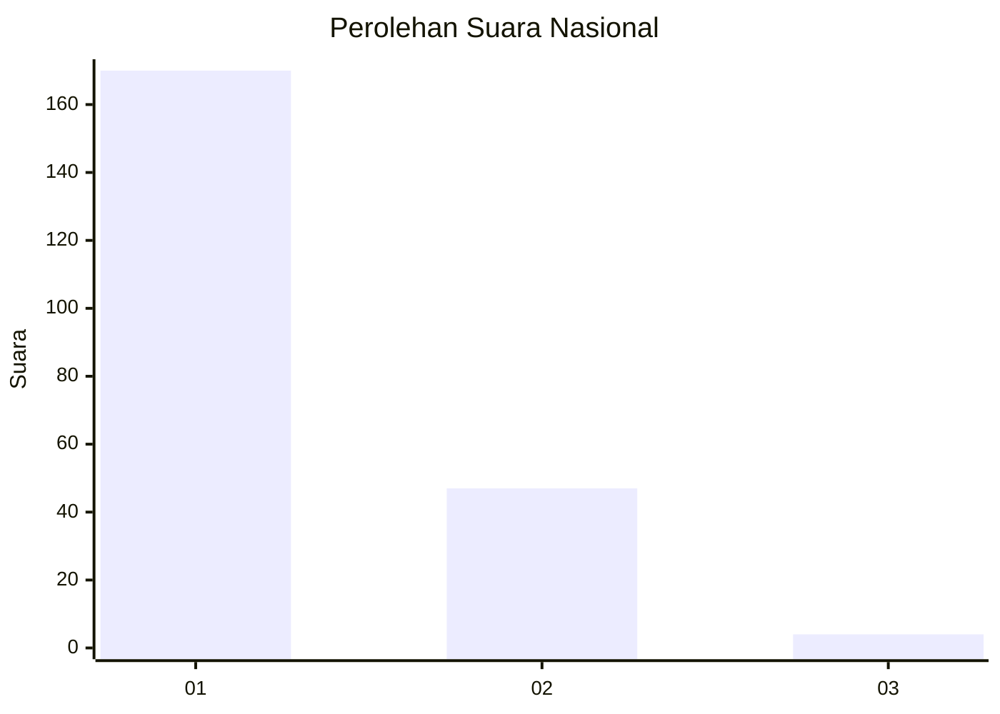
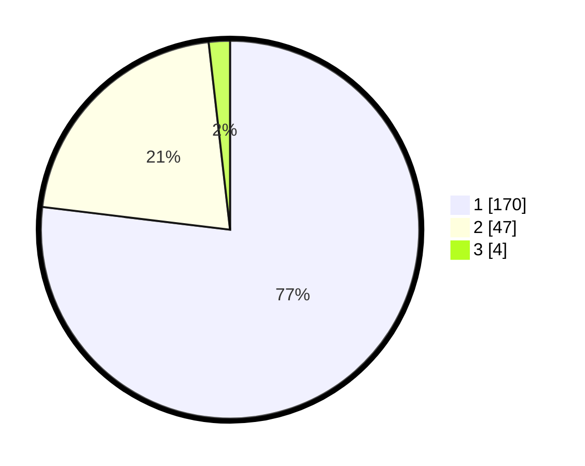

# Hasil

## Grafik

## Tabel

| No. | Nama Paslon    | Suara | Suara (raw) | Persentase |
|:--- |:-------------- | -----:| -----------:| ----------:|
| 1   | ANIES MUHAIMIN | 170   | [170][p-1]  | 76,92      |
| 2   | PRABOWO GIBRAN | 47    | [47][p-2]   | 21,27      |
| 3   | GANJAR MAHFUD  | 4     | [4][p-3]    | 1,81       |

[p-1]: https://github.com/gigit-pemilu/pemilu-2024/blob/main/pilpres/hitung-suara/sub/11-aceh/sub/18-pidie-jaya/sub/06-bandar-baru/sub/2012-keude-lueng-putu/sub/003-tps/sub/paslon-1.txt
[p-2]: https://github.com/gigit-pemilu/pemilu-2024/blob/main/pilpres/hitung-suara/sub/11-aceh/sub/18-pidie-jaya/sub/06-bandar-baru/sub/2012-keude-lueng-putu/sub/003-tps/sub/paslon-2.txt
[p-3]: https://github.com/gigit-pemilu/pemilu-2024/blob/main/pilpres/hitung-suara/sub/11-aceh/sub/18-pidie-jaya/sub/06-bandar-baru/sub/2012-keude-lueng-putu/sub/003-tps/sub/paslon-3.txt

## Foto C Plano

https://sirekap-obj-formc.kpu.go.id/bdc9/pemilu/ppwp/11/18/06/20/12/1118062012003-20240215-044147--76d23b3a-7c21-4b13-b98f-6dd335d1e6b4.jpg

https://sirekap-obj-formc.kpu.go.id/bdc9/pemilu/ppwp/11/18/06/20/12/1118062012003-20240215-024153--e0c21b7b-9ad2-4b9a-ae2f-1c921b28355f.jpg

https://sirekap-obj-formc.kpu.go.id/bdc9/pemilu/ppwp/11/18/06/20/12/1118062012003-20240215-044309--6d83ba00-a0c4-4b0c-a128-998bcc991560.jpg

## Metadata

| Key        | Value               |
| ---------- | ------------------- |
| Time Stamp | 2024-02-15 22:30:27 |

