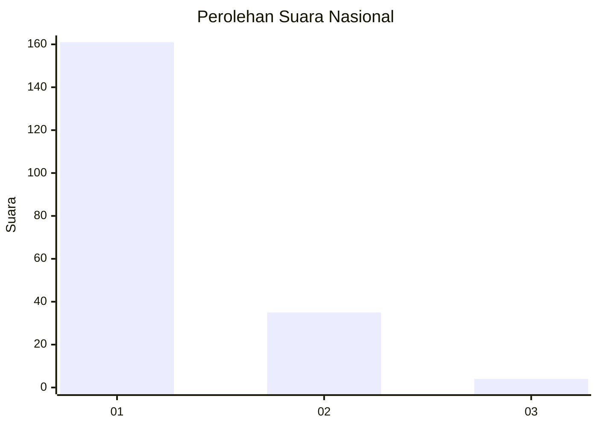
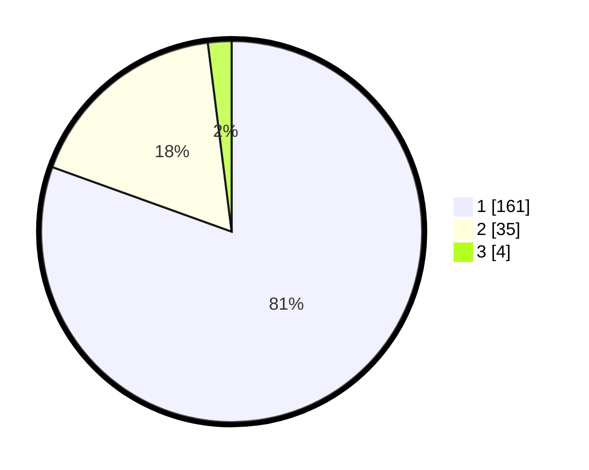

# Hasil

## Grafik

## Tabel

| No. | Nama Paslon    | Suara | Suara (raw) | Persentase |
|:--- |:-------------- | -----:| -----------:| ----------:|
| 1   | ANIES MUHAIMIN | 161   | [161][p-1]  | 80,50      |
| 2   | PRABOWO GIBRAN | 35    | [35][p-2]   | 17,50      |
| 3   | GANJAR MAHFUD  | 4     | [4][p-3]    | 2,00       |

[p-1]: https://github.com/gigit-pemilu/pemilu-2024/blob/main/pilpres/hitung-suara/sub/11-aceh/sub/18-pidie-jaya/sub/06-bandar-baru/sub/2012-keude-lueng-putu/sub/004-tps/sub/paslon-1.txt
[p-2]: https://github.com/gigit-pemilu/pemilu-2024/blob/main/pilpres/hitung-suara/sub/11-aceh/sub/18-pidie-jaya/sub/06-bandar-baru/sub/2012-keude-lueng-putu/sub/004-tps/sub/paslon-2.txt
[p-3]: https://github.com/gigit-pemilu/pemilu-2024/blob/main/pilpres/hitung-suara/sub/11-aceh/sub/18-pidie-jaya/sub/06-bandar-baru/sub/2012-keude-lueng-putu/sub/004-tps/sub/paslon-3.txt

## Foto C Plano

https://sirekap-obj-formc.kpu.go.id/c48a/pemilu/ppwp/11/18/06/20/12/1118062012004-20240215-023147--57774a43-2265-444a-b481-02f28d2de9b2.jpg

https://sirekap-obj-formc.kpu.go.id/c48a/pemilu/ppwp/11/18/06/20/12/1118062012004-20240215-023507--d0e88d3c-6948-4fa4-a204-7f312606653d.jpg

https://sirekap-obj-formc.kpu.go.id/c48a/pemilu/ppwp/11/18/06/20/12/1118062012004-20240215-023717--0ed22c47-1b63-448f-9e9c-0feef2f85d58.jpg

## Metadata

| Key        | Value               |
| ---------- | ------------------- |
| Time Stamp | 2024-02-15 22:30:27 |

