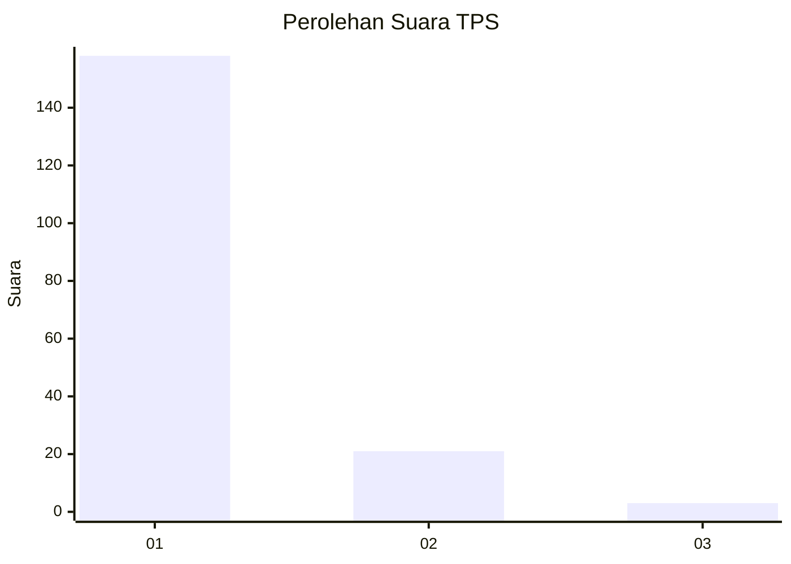
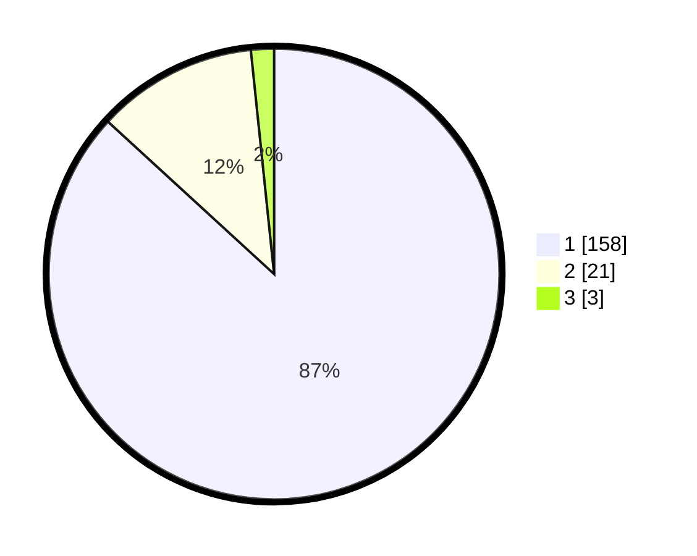

# Hasil

## Grafik

## Tabel

| No. | Nama Paslon    | Suara | Suara (raw) | Persentase |
|:--- |:-------------- | -----:| -----------:| ----------:|
| 1   | ANIES MUHAIMIN | 158   | [158][p-1]  | 86,81      |
| 2   | PRABOWO GIBRAN | 21    | [21][p-2]   | 11,54      |
| 3   | GANJAR MAHFUD  | 3     | [3][p-3]    | 1,65       |

[p-1]: https://github.com/gigit-pemilu/pemilu-2024-11-aceh/blob/main/pilpres/hitung-suara/sub/11-aceh/sub/18-pidie-jaya/sub/06-bandar-baru/sub/2012-keude-lueng-putu/sub/005-tps/sub/paslon-1.txt
[p-2]: https://github.com/gigit-pemilu/pemilu-2024-11-aceh/blob/main/pilpres/hitung-suara/sub/11-aceh/sub/18-pidie-jaya/sub/06-bandar-baru/sub/2012-keude-lueng-putu/sub/005-tps/sub/paslon-2.txt
[p-3]: https://github.com/gigit-pemilu/pemilu-2024-11-aceh/blob/main/pilpres/hitung-suara/sub/11-aceh/sub/18-pidie-jaya/sub/06-bandar-baru/sub/2012-keude-lueng-putu/sub/005-tps/sub/paslon-3.txt

## Foto C Plano

https://sirekap-obj-formc.kpu.go.id/ca06/pemilu/ppwp/11/18/06/20/12/1118062012005-20240215-024139--0cf50ba3-21f3-47e4-8d12-dd76cb12e8af.jpg

https://sirekap-obj-formc.kpu.go.id/ca06/pemilu/ppwp/11/18/06/20/12/1118062012005-20240215-024342--a653514a-ed91-4443-a4de-2cf6135347f5.jpg

https://sirekap-obj-formc.kpu.go.id/ca06/pemilu/ppwp/11/18/06/20/12/1118062012005-20240215-035518--ba77ed3b-67b5-49b4-aa85-83d85bba59dd.jpg

## Metadata

| Key        | Value               |
| ---------- | ------------------- |
| Time Stamp | 2024-02-15 21:30:27 |

