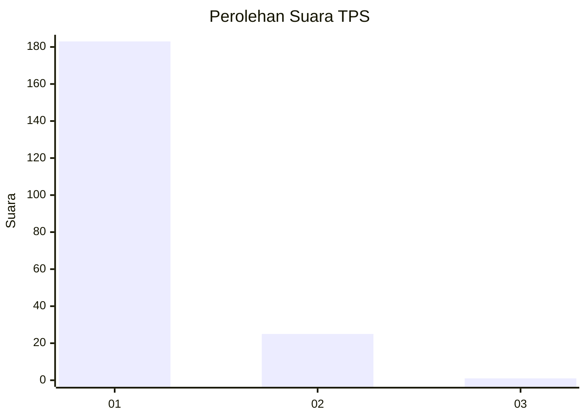
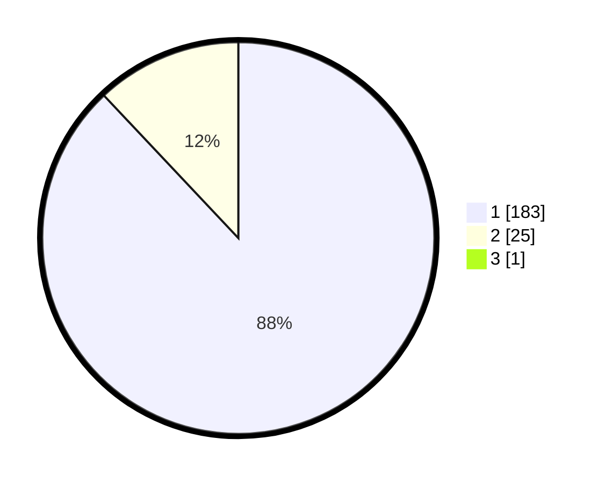

# Hasil

## Grafik

## Tabel

| No. | Nama Paslon    | Suara | Suara (raw) | Persentase |
|:--- |:-------------- | -----:| -----------:| ----------:|
| 1   | ANIES MUHAIMIN | 183   | [183][p-1]  | 87,56      |
| 2   | PRABOWO GIBRAN | 25    | [25][p-2]   | 11,96      |
| 3   | GANJAR MAHFUD  | 1     | [1][p-3]    | 0,48       |

[p-1]: https://github.com/gigit-pemilu/pemilu-2024-11-aceh/blob/main/pilpres/hitung-suara/sub/11-aceh/sub/18-pidie-jaya/sub/06-bandar-baru/sub/2013-peub-lueng-nibong/sub/001-tps/sub/paslon-1.txt
[p-2]: https://github.com/gigit-pemilu/pemilu-2024-11-aceh/blob/main/pilpres/hitung-suara/sub/11-aceh/sub/18-pidie-jaya/sub/06-bandar-baru/sub/2013-peub-lueng-nibong/sub/001-tps/sub/paslon-2.txt
[p-3]: https://github.com/gigit-pemilu/pemilu-2024-11-aceh/blob/main/pilpres/hitung-suara/sub/11-aceh/sub/18-pidie-jaya/sub/06-bandar-baru/sub/2013-peub-lueng-nibong/sub/001-tps/sub/paslon-3.txt

## Foto C Plano

https://sirekap-obj-formc.kpu.go.id/3ef9/pemilu/ppwp/11/18/06/20/13/1118062013001-20240215-045037--a21f67c5-6a1f-4a85-b4b6-e4dc00ac9dd0.jpg

https://sirekap-obj-formc.kpu.go.id/3ef9/pemilu/ppwp/11/18/06/20/13/1118062013001-20240215-045220--9b30638d-90e5-4072-9263-06874de633dc.jpg

https://sirekap-obj-formc.kpu.go.id/3ef9/pemilu/ppwp/11/18/06/20/13/1118062013001-20240215-045315--79f27f3f-2391-4bb5-a861-84195c28dfeb.jpg

## Metadata

| Key        | Value               |
| ---------- | ------------------- |
| Time Stamp | 2024-02-15 22:30:27 |

