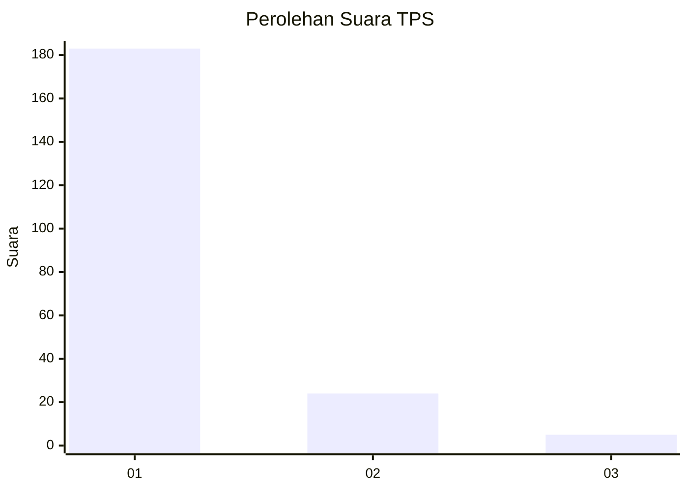
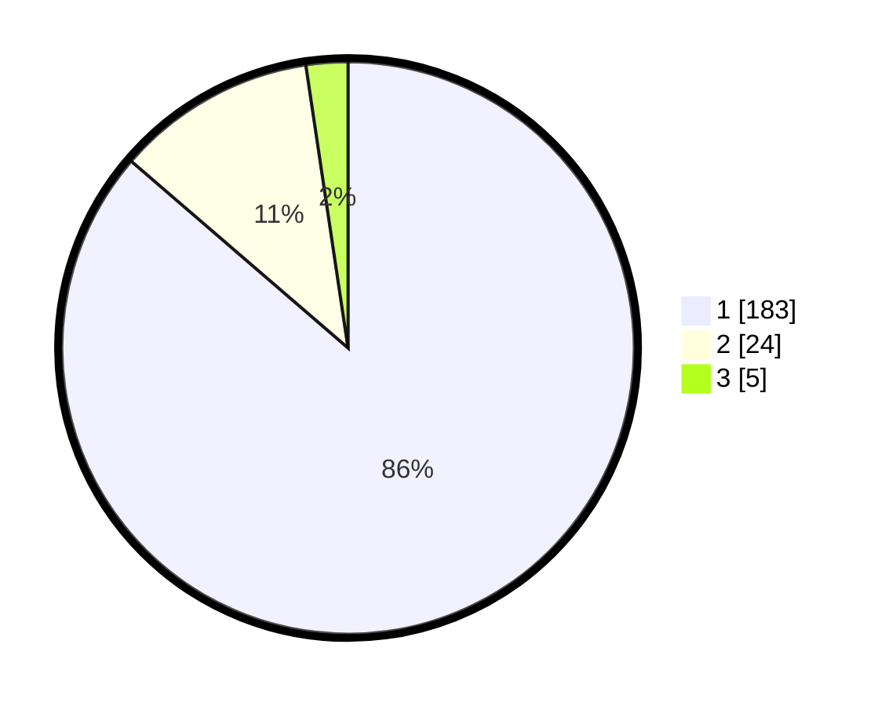

# Hasil

## Grafik

## Tabel

| No. | Nama Paslon    | Suara | Suara (raw) | Persentase |
|:--- |:-------------- | -----:| -----------:| ----------:|
| 1   | ANIES MUHAIMIN | 183   | [183][p-1]  | 86,32      |
| 2   | PRABOWO GIBRAN | 24    | [24][p-2]   | 11,32      |
| 3   | GANJAR MAHFUD  | 5     | [5][p-3]    | 2,36       |

[p-1]: https://github.com/gigit-pemilu/pemilu-2024-11-aceh/blob/main/pilpres/hitung-suara/sub/11-aceh/sub/18-pidie-jaya/sub/06-bandar-baru/sub/2013-peub-lueng-nibong/sub/002-tps/sub/paslon-1.txt
[p-2]: https://github.com/gigit-pemilu/pemilu-2024-11-aceh/blob/main/pilpres/hitung-suara/sub/11-aceh/sub/18-pidie-jaya/sub/06-bandar-baru/sub/2013-peub-lueng-nibong/sub/002-tps/sub/paslon-2.txt
[p-3]: https://github.com/gigit-pemilu/pemilu-2024-11-aceh/blob/main/pilpres/hitung-suara/sub/11-aceh/sub/18-pidie-jaya/sub/06-bandar-baru/sub/2013-peub-lueng-nibong/sub/002-tps/sub/paslon-3.txt

## Foto C Plano

https://sirekap-obj-formc.kpu.go.id/3232/pemilu/ppwp/11/18/06/20/13/1118062013002-20240215-040300--057bcdf6-2163-41bc-b4ba-c60690daba3d.jpg

https://sirekap-obj-formc.kpu.go.id/3232/pemilu/ppwp/11/18/06/20/13/1118062013002-20240215-040433--e9411ea3-1ab5-48e9-9d52-96fe7df16f59.jpg

https://sirekap-obj-formc.kpu.go.id/3232/pemilu/ppwp/11/18/06/20/13/1118062013002-20240215-040600--7ad697c2-8d68-4c71-90e5-f3d59a58db21.jpg

## Metadata

| Key        | Value               |
| ---------- | ------------------- |
| Time Stamp | 2024-02-15 22:30:27 |

